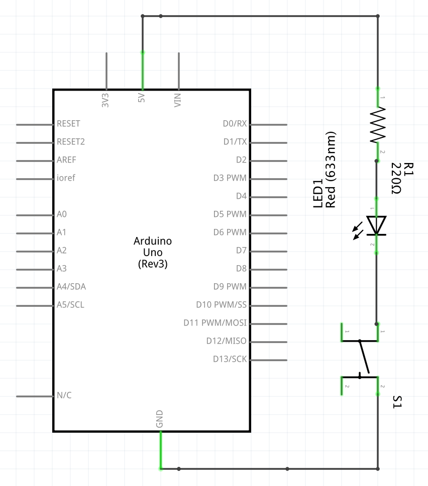
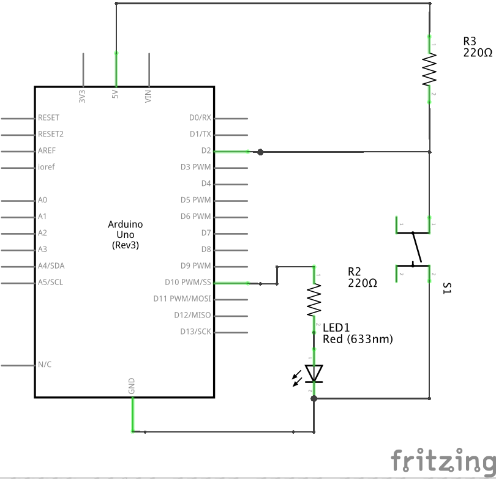
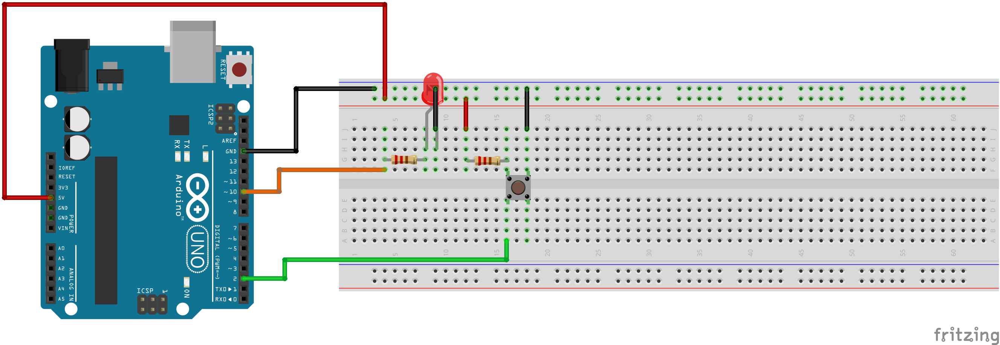
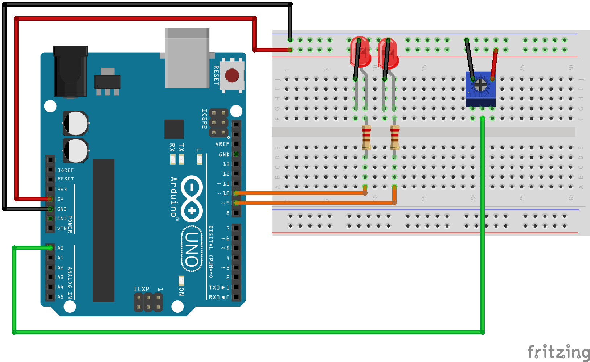

# Module 03 - Programmation des entrées

NOTES:

- Utilisez le tapis de protection pour étaler les pièces nécessaires à chaque montage,
- Débranchez toujours l'alimentation avant de modifier un circuit.

## Exercice 1 - Bouton-poussoir avec sorties numériques

**Dans cet exercice, l'arduino ici ne sert que d'alimentation : vous n'aurez pas de code à faire**

### Objectif Contrôler une DEL sur action du bouton-poussoir

### Étape 1 - Branchement du circuit

- Effectuez le montage en vous inspirant du schéma suivant :




### Étape 2 - Alimentation multiple

- Sur papier, dessinez un schéma équivalent pour illustrer l'alimentation de 2 DELs en parallèle et alimentées par la *même résistance*.

- Quel effet cela devrait produire d'après vous ?

<details>
    <summary>Solution</summary>

La luminosité diminuée car l'énergie est partagée.

</details>

- Effectuez le montage de votre schéma.

- Sur papier, dessinez un schéma pour illustrer l'alimentation des 2 DELs en parallèle, mais de façon à ce que chaque DEL soit alimentées par *sa propre résistance*. L'alimentation 5 V est commune.

<details>
    <summary>Solution</summary>

Les deux DELs sont énergétiquement indépendantes et s'illuminent comme avant.

</details>

### Question de réflexion

L'oeil perçoit-il l'éclairage plus intense ou moins intense avec 2 DELs en parallèle ? Pouvez-vous expliquer ce comportement ?

<details>
    <summary>Solution</summary>

Dans le dernier montage, l'oeil ne perçoit pas de différence car les deux DELs illuminent comme avant. Si les DELs sont proches, la luminosité peut sembler plus forte.

</details>

## Exercice 3 - bouton poussoir avec Pull-up

Dans ce montage, le bouton poussoir sera alimenté par la borne No 2, la DEL sera alimentée par la borne No 10.

### Étape 1 - Montage du circuit

- Effectuez le montage en vous inspirant du schéma suivant.





### Étape 2 - Programmation

- Codez le sketch **PullUp.ino* : à chaque pression du bouton, la DEL passe d'un état allumé à éteint et inversement.

- Modifiez le sketch pour que la DEL changent d'intensité de 25 % à chaque fois qu'on appuie sur le bouton. Après 4 appuis successifs, l'intensité doit s'inverser de 25 % et ainsi de suite.

<details>
    <summary>Indice intensité</summary>

Retournez voir le module 2 sur les sorties au niveau de la section sur le MLI (PWM)

</details>

### Étape 3 - Ajout d'un deuxième bouton (Optionnel)

- Ajoutez un nouveau bouton qui permet de lire les pressions sur la borne 4.
- Créez un nouveau sketch pour que la luminosité diminue par pas de 25 % en cas de pression sur le bouton de la borne 2 et augment de 25 % en cas de pression sur le bouton de la borne 4.

## Exercice 4 - Bruits parasites

Dans cet exercice, vous utilisez une borne analogique.

- Branchez un fil de connexion de 6cm ou plus sur la borne A5 de l'Arduino.

- Écrire le sketch *Antenne.ino* pour déclarer la borne A5 comme "borneSensible" et qui affiche l'effet généré par les bruits parasites à la console à toutes les demi-secondes. Pour cela, ajoutez les instructions suivantes dans la méthode "setup" :

```cpp
void setup() {
    Serial.begin(9600);

    // ...
}
```

Pour faire les affichages sur la console série, utilisez la méthode "println" de la variable globale "Serial" :

```cpp
Serial.println(<valeur>);
```

- Validez votre sketch

- Touchez légèrement l'extrémité de l'"antenne" pendant 3 secondes

<details>
    <summary>Solution</summary>

Vous devriez voir une variation modeste de l'ordre de 100 / 200 dépendamment de ce qui vous entoure et du taux d'humidité.

</details>

- À partir des valeurs obtenues à la console, expliquez le comportement de la borne A5.

<details>
    <summary>Solution</summary>

La borne est dite flottante et se comporte comme une antenne.

</details>

## Exercice 5 - Potentiomètre

### Étape 1 : Montage du circuit

- Effectuez le montage du potentiomètre blue branché de la façon suivante:




### Étape 2 : Programmation

Pour réaliser ce sketch, vous aurez besoin de la [fonction map() d'Arduino](https://www.arduino.cc/reference/en/language/functions/math/map/).

- Codez le sketch *PotentiometreBase.ino* pour implanter la logique suivante:

 La DEL1 est éteinte et la DEL2 s'allume au maximum lorsque le curseur du potentiomètre est en position "1" (minimum).

La DEL1 s'illumine inversement proportionnellement à la DEL2 :

- Quand la valeur est proche de la position 1, la DEL1 est illuminée au maximum, la DEL2 est éteinte
- Quand la valeur est proche de la position 3, la DEL2 est illuminée au maximum, la DEL1 est éteinte

- Sur l'écran de la console, affichez les valeurs lues au potentiomètre et les valeurs correspondantes à la borne numérique de DEL1. (Voir exercice précédent)

### Question de réflexion

1. Quelle est l'intervalle de valeurs produites par une borne analogique?

2. Pouvez-vous affirmer que la résistance variable du potentiomètre suit une courbe linéaire? Justifiez votre réponse.
