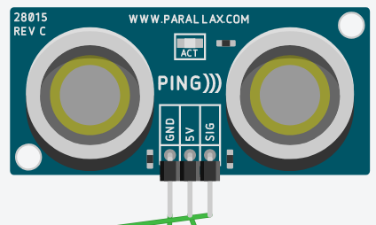
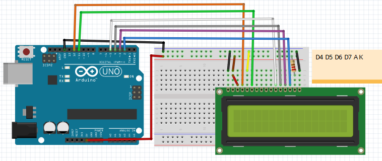
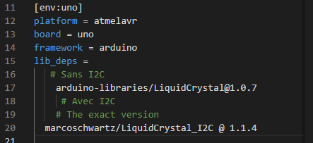

# Module 13 - Afficheur à cristaux liquides (LCD)

## Exercice 1 - Programmes de test

### Étape 1 - Utiliser la librairie LiquidCrystal.h

### Matériel

- TinkerCad avec le programme [420-W48-SF Base LCD - Pub](https://www.tinkercad.com/things/6aCJ66So2yC)
- Exécutez le programme en faisant varier le rétro-éclairage avec le potentiomètre.

### Étape 2 - Méthodes disponibles pour la librairie LiquidCrystal.h

### Matériel

- [420-W48-SF méthodes de l'objet LCD](https://www.arduino.cc/en/Reference/LiquidCrystal)
- Établissez la liste des méthodes disponibles de la librairie "LiquidCrystal.h", leur rôle, et leurs paramètres d'entrée offrant une variété d'affichage
- Quelles sont les deux méthodes à utiliser pour faire clignoter le cursur à une position donnée de l'écran ?
- Quelles méthodes offrent le déroulement horizontal du texte?

## Exercice 2 - Promotion dans nos boutiques

### Matériel

- TinkerCad avec le programme [420-W48-SF Base LCD - Pub](https://www.tinkercad.com/things/6aCJ66So2yC)

### Étape 1 - Affichage latéral

- Sauvegardez le programme sous le nom "balayage horizontal"
- Faites dérouler le texte "Bienvenue! (première ligne) aux visiteurs" (deuxième ligne) de gauche à droite. Le texte doit apparaître comme une banderolle circulaire, le début du texte réapparaissant à droite.
- Après un déroulement complet de la banderolle, le texte se déroule dans le sens inverse.

### Étape 2 - Affichage vertical

- Sauvegardez le programme sous le nom "balayage vertical"
- Faites dérouler le texte "Bienvenue! (première ligne) aux visiteurs" (deuxième ligne) vers le haut, en faisant apparaître la promotion "Rabais:15% (première ligne) dans nos boutiques ***" (deuxième ligne). Le texte doit apparaître comme une banderolle circulaire verticale.
- Le texte clignote 4 fois pendant 500 milisecondes. Une pause de 100 milisecondes est nécessaire pour stabiliser l'affichage.

## Exercice 3 - Attention ! Collisions?

### Matériel

- TinkerCad avec le programme [420-W48-SF Base LCD - Pub](https://www.tinkercad.com/things/6aCJ66So2yC)
- Composant "capteur de distance par ultrasons"

Le capteur par ultrasons utilise l'écho pour déterminer la distance séparant les objets.
C'est un composant équipé d'un émetteur et d'un récepteur à ultrason. Par intermittances, un signal est émis. Le temps écoulé juusqu'à la détection de l'écho permet de calculer la distance avec un obstacle éventuel.

### Étape 1 - Affichage de distances

- Sauvegardez le programme sous le nom "AffichageDistances"
- Ajoutez un composant "capteur de distance par ultrasons"

- Branchez la sonde du capteur sur la borne No7 d'Arduino. Polarisez le capteur aves ses bornes + et -

- Établissez une équation permettant d'afficher la distance entre l'obstacle et la sonde.
La vitesse du son est de 340m/s.

- Affichez la distance en cm et en pouce sur l'écran LCD

- Affichez la distance calculée sur l'écran LCD

- Allumez une DEL rouge ou verte selon des limites de distance que vous établissez (optionnel)

### Étape 2 - Affichage en bascule (optionnel)

- Ajoutez un bouton poussoir. Quand le bouton n'est pas appuyé, l'écran affiche la distance en cm. Tant que le bouton est appuyé, l'affichage montre la distance en pouces.

## Exercice 4 - Gestion de librairies

Dans cet exercice, vous  installerez  l'exercice précédent ("balayage horizontal") dans PlateformIO avec Arduino

### Matériel

- Arduino
- Afficheur LCD
- PlateformIO configuré

### Étape 1 - configuration du programme

- Installez le composant LCD sur la breadboard

- Créez un projet PlateformIO en important le programme "balayage horizontal" de l'exercice précédent
- Installez les librairies suivantes dans platformio.ini selon les directives suivantes
- [420-W48-SF Installation librairies LCD](https://platformio.org/lib/show/887/LiquidCrystal/installation).

## Exercice 5 - Caractères fantaissistes (optionnel)

Dans cet exercice, vous pourrez fabriquer vos propres symboles ou vos émo-logos que vous afficherez sur l'écran LCD.

### Matériel

- https://omerk.github.io/lcdchargen/

- https://www.arduino.cc/en/Reference/LiquidCrystalCreateChar
