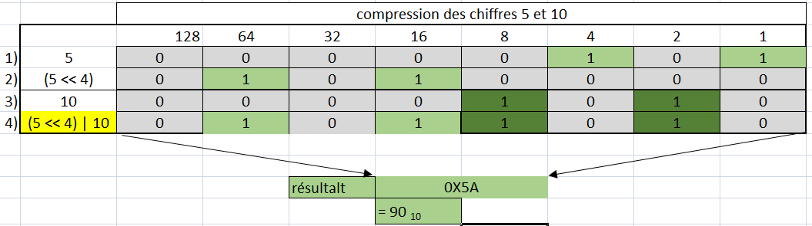

## Exercice 3 -  Opérateurs de décalage de bits en mémoire

### Étape 1 - Décalage à droite

- La réponse de ```80 >> 3``` est ```8```

- La réponse équivaut à  ```80  /(2^3) ``` 

- La réponse de  ```140 >> 4``` est ```8```  

- Certains bits ont été perdus.

### Étape 2 - Décalage à gauche

- La réponse de ```43 << 2``` est ```172```  

- La réponse équivaut à ```43 *(2^2)``` 

- La réponse de  ```13 << 3``` est ```104```  

- La réponse équivaut à ```13 *(2^3)``` 

- La réponse de  ```141 << 3``` est ```8```  

- Certains bits ont été perdus.

### Étape 3 - Compression de données

Résultat = (premier_chiffre << 4) | deuxiême_chiffre

- Appliquez cette fonction pour compresser les chiffres 5 avec 10


