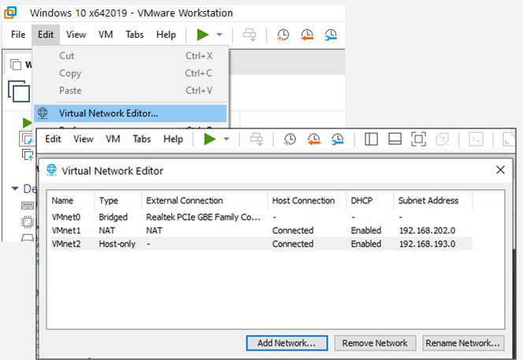
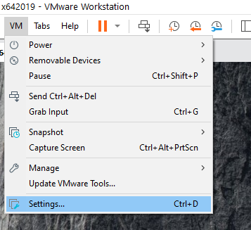
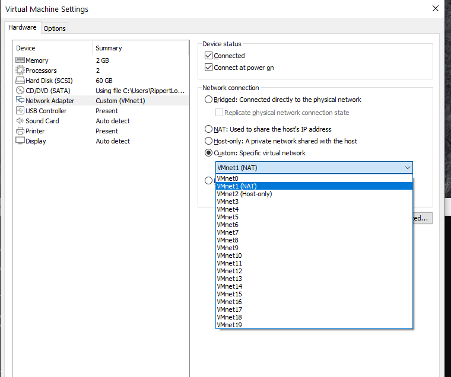

# Mise à niveau 02 - Configuration et Dépannage de Réseaux 

Objectifs:

- distinguer adresse IP locale et adresse IP publique
- déterminer l'adresse IP de périphériques sur le réseau local ou sur le réseau publique
- configurer une VM sur un réseau en mode Bridged et NAT

 NOTE: afin de simplifier la lecture, l'expression PC désigne soit votre PC de table ou votre PC portable.

## Exercice 1 - Déterminer l'adresse IP du poste sur le réseau local

- utilisez une commande appropriée pour déterminer les valeurs suivantes de votre carte Ethernet (filée (RJ-45) ou sans-fil).
- adresse IP du poste = ??????
- masque de sous-réseau = ?????
- adresse IP de la passerelle par défaut = ?????
- adresse IP  du serveur DHCP (si connu) = ?????
- adresse IP  du serveur DNS de premier niveau (si connu) = ?????

## Exercice 2 - Déterminer l'adresse IP publique du poste

- utilisez une commande appropriée pour déterminer l'adresse IP publique de votre poste sur Internet. 
- adresse IP publique du poste = ??????

## Exercice 3 - Configuration de réseaux pour une VM

Les images présentées dans cet exercice utilisent le logiciel ```VMware Workstation```. L'usage du logiciel ```Oracle VM Virtualbox``` est possible; les images sont différentes mais les fonctions semblables.

### Exercice 3.1 - Configuration des modes Bridged et NAT

- sur le PC hôte, démarrez le logiciel  ```VMware Workstation```. Configurez 2 modes de connexion Réseau: ```Bridged``` et ```NAT```. 

<details>
    <summary>configuration des réseaux </summary>



</details>

Pour le mode "Bridged", choisir la carte Ethernet de votre PC. Ne PAS utiliser la valeur AUTOMATIQUE. 

- pour Le mode NAT,  configurez le réseau ```192.168.202.0```. Activez le protocole DHCP pour propager des adresses dans l'intervalle ```50 à 254```.

### Exercice 3.2 - Connexion de la VM en mode NAT

- démarrez votre VM  dans VMworkstation.
- configurez la carte virtuelle de votre VM en mode NAT, en 2 étapes.

<details>
    <summary>configuration des réseaux sur la VM</summary>




</details>

- sur votre VM, Utilisez une commande appropriée pour déterminer l'adresse IP reçu par le protocole DHCP. Une valeur correspondante dans le réseau 192.202.0 devrait apparaître. Sinon, reprendre cet exercice 4 au début.

### Exercice 3.3 - Connexion de la VM en mode NAT

- configurez la carte virtuelle de votre VM en mode Bridged. Utilisez les images précédentes pour vous aider.
- sur votre VM, Utilisez une commande appropriée pour déterminer son adresse IP. 
- l'adresse IP de la VM devrait être sur le même réseau que le PC hôte. Comment procéder pour démontrer cela?

## Exercice 4 - Rejoindre un périphérique sans-fil sur le réseau local (optionnel)

### Exercice 4.1 - Rejoindre une tablette ou un cellulaire

- déterminez l'adresse IP locale de votre tablette ou cellulaire.
- adresse IP locale du périphérique = ??????
- utilisez une commande du PC pour rejoindre cet appareil. Passez en mode Avion. Le PC peut-il servir à déterminer la présence de l'appareil?

- comment pouvez-vous affirmer que le périphérique est sur le même réseau que votre PC ?

### Exercice 4.2 - Rejoindre un site Internet sur une tablette ou un cellulaire

- installez le logiciel ```network ping lite``` sur votre tablette ou votre cellulaire
- utilisez la fonction  ```ping``` du logiciel pour tracer la route jusqu'à google.com. Combien de sauts a-t-il fallut?
- quelle est l'adresse IP publique de ce site web de Google?
- utilisez la fonction  ```Port scanning``` du logiciel pour déterminer les ports TCP écoutés par google.com