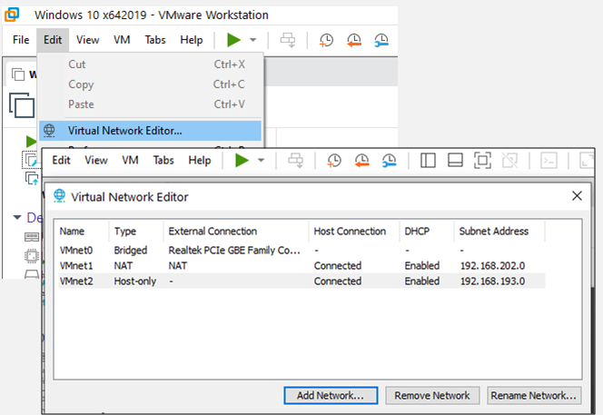
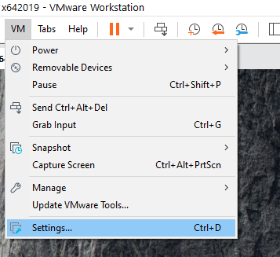
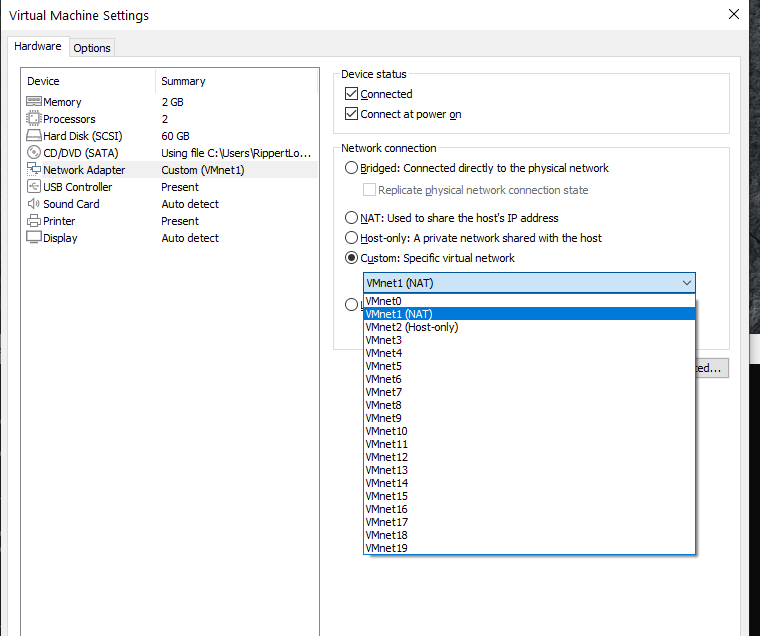

# Mise à niveau 02 - Configuration et dépannage de réseaux

## Ce qui sera vu

- Distinguer une adresse IP locale d'une adresse IP publique.
- Relever l'adresse, le masque, la passerelle, le serveur DHCP et le serveur DNS d'un poste.
- Vérifier que deux périphériques appartiennent au même réseau et tester leur accessibilité.
- Comparer les modes NAT et pont (`bridged`) d'une machine virtuelle.
- Configurer et diagnostiquer la connexion réseau d'une machine virtuelle.
- Réaliser, en extension optionnelle, quelques vérifications depuis un appareil mobile.

## Prérequis

- Cette mise à niveau est une **remédiation ciblée** : les réseaux ont déjà été étudiés dans les cours précédents.
- Connaître les notions d'adresse IP, masque, passerelle, DHCP, DNS et routage.
- Savoir utiliser un terminal et les commandes réseau usuelles de son système d'exploitation.
- Disposer d'une machine virtuelle fonctionnelle et d'un hyperviseur déjà installé.
- Avoir l'autorisation d'utiliser le réseau de laboratoire; ne pas analyser un réseau ou un appareil sans autorisation.

***NOTE: afin de simplifier la lecture, l'expression PC désigne soit votre PC de table ou votre PC portable.***

## Exercice 1 - Déterminer l'adresse IP du poste sur le réseau local

- Utilisez une commande appropriée pour déterminer les valeurs suivantes de votre carte Ethernet (filée (RJ-45) ou sans-fil) :
  - Adresse IP du poste = ??????
  - Masque de sous-réseau = ?????
  - Adresse IP de la passerelle par défaut = ?????
  - Adresse IP  du serveur DHCP (si connu) = ?????
  - Adresse IP  du serveur DNS de premier niveau (si connu) = ?????

## Exercice 2 - Déterminer l'adresse IP publique du poste

- Utilisez une commande appropriée pour déterminer l'adresse IP publique de votre poste sur Internet.
  - Adresse IP publique du poste = ??????

## Exercice 3 - Configuration de réseaux pour une VM

Les images de cet exercice utilisent le logiciel `VMware Workstation`. Vous pouvez aussi utiliser `Oracle VM VirtualBox`; les images seront différentes, mais les fonctions sont semblables.

### Exercice 3.1 - Configuration des modes Bridged et NAT

- Sur le PC hôte, démarrez `VMware Workstation`. Configurez deux modes de connexion réseau : pont (`bridged`) et NAT.

<details>
    <summary>Configuration des réseaux </summary>



</details>

Pour le mode pont (`bridged`), choisissez la carte Ethernet de votre PC. N'utilisez pas la valeur automatique.

- Pour le mode NAT, configurez le réseau `192.168.202.0`. Activez le protocole DHCP pour attribuer des adresses dans l'intervalle de 50 à 254.

### Exercice 3.2 - Connexion de la VM en mode NAT

- Démarrez votre VM  dans VMworkstation.
- Configurez la carte virtuelle de votre VM en mode NAT, en 2 étapes.

<details>
    <summary>Configuration des réseaux sur la VM</summary>




</details>

- Dans votre VM, utilisez une commande appropriée pour déterminer l'adresse IP reçue par DHCP. Une adresse du réseau `192.168.202.0` devrait apparaître. Sinon, reprenez cet exercice depuis le début.

### Exercice 3.3 - Connexion de la VM en mode Bridged

- Configurez la carte virtuelle de votre VM en mode Bridged. Utilisez les images précédentes pour vous aider.
- Sur votre VM, Utilisez une commande appropriée pour déterminer son adresse IP.
- L'adresse IP de la VM devrait être sur le même réseau que le PC hôte. Comment procéder pour démontrer cela ?

## Exercice 4 - Rejoindre un périphérique sans-fil sur le réseau local (optionnel)

### Exercice 4.1 - Rejoindre une tablette ou un cellulaire

- Déterminez l'adresse IP locale de votre tablette ou cellulaire.
- Adresse IP locale du périphérique = ??????
- Utilisez une commande du PC pour rejoindre cet appareil. Passez en mode Avion. Le PC peut-il servir à déterminer la présence de l'appareil ?
- Comment pouvez-vous affirmer que le périphérique est sur le même réseau que votre PC ?

### Exercice 4.2 - Rejoindre un site Internet sur une tablette ou un cellulaire

- Installez le logiciel `Network Ping Lite` sur votre tablette ou votre téléphone.
- Utilisez la fonction `ping` du logiciel pour tracer la route jusqu'à `google.com`. Combien de sauts a-t-il fallu?
- Quelle est l'adresse IP publique de ce site de Google ?
- Utilisez la fonction  ```Port scanning``` du logiciel pour déterminer les ports TCP écoutés par google.com
