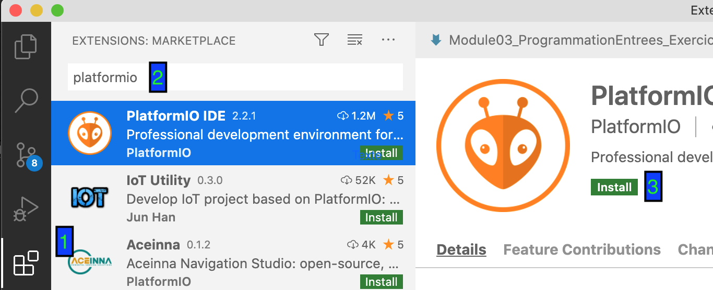
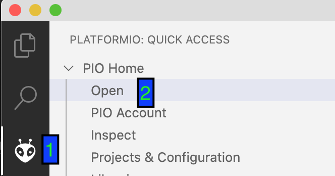
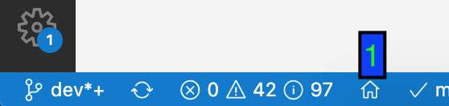
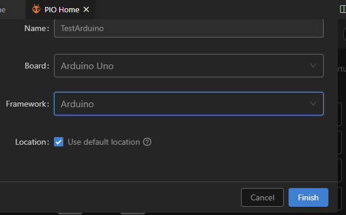
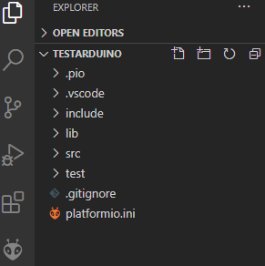
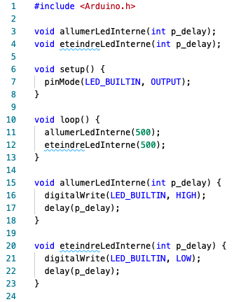
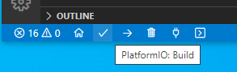
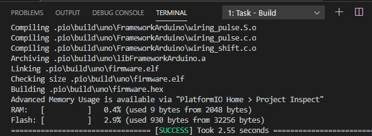
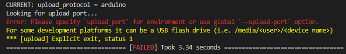
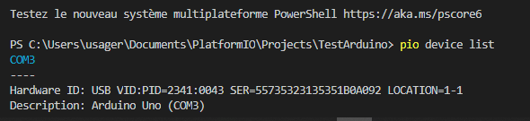

# Module 01 - Introduction

## Ce qui sera vu

- Préparer un projet Arduino UNO dans Visual Studio Code avec PlatformIO.
- Compiler un programme, interpréter le résultat de compilation et corriger les erreurs simples.
- Téléverser un programme sur la carte et vérifier son comportement avec la DEL intégrée.
- Modifier des temporisations pour produire différents motifs lumineux, dont un SOS en morse.
- Repérer la définition de constantes et de macros fournies par `Arduino.h`.

## Prérequis

- Savoir naviguer dans les fichiers d'un projet et utiliser un éditeur de code.
- Posséder les bases de la programmation en C++ : variables, fonctions et appels de fonctions.
- Disposer d'un poste permettant l'installation de Visual Studio Code et de PlatformIO.
- Avoir une carte Arduino UNO, un câble USB de données et les droits nécessaires pour utiliser le port série.

---
Avant chaque manipulation de votre Arduino, touchez une pièce métallique mise à la terre, **mais surtout pas une partie métallique de la carte**.

Pour chaque montage électronique, placez **uniquement** la carte Arduino et les pièces nécessaires sur la surface de travail. Disposez les pièces de façon à bien les aligner et les identifier avant le montage.

Ces précautions protégeront vos montages, faciliteront vos vérifications en cas d’erreur et un service plus rapide des animateurs pour vous dépanner au besoin.

---

## Préalable - Installation de la plateforme de développement

### Étape 1 - Installer Visual Studio Code

Si Visual Studio Code est déjà installé, rendez-vous à l'étape 2.

- Accédez au site de [VisualStudio Code](https://code.visualstudio.com)

- Découvrez les avantages de cet environnement de développement

- Installez VS Code sur votre PC

### Étape 2 - Installer PlatformIO IDE



1. Ouvrez le gestionnaire d'extensions de Visual Studio Code.
2. Cherchez "platformio"
3. Installez PlatformIO IDE.

NOTE : pour simplifier, nous abrégeons PlatformIO par *PIO*.

## Exercice 1 - Développer un programme Arduino dans PIO

### Étape 1 - Créer un programme Arduino dans PlatformIO

- Ouvrez PlatformIO :

  

  1. Cliquez sur l'icône PlatformIO dans la liste des extensions, dans la partie gauche de l'écran de VS Code.

  2. Cliquez sur "Open"

  Ou :

  

  1. Cliquez sur la « maison » présente dans la barre d'état.

- Créez un nouveau projet pio

- Remplissez les cases demandées


- Cliquez sur Finish

La structure suivante a été générée :



- Cliquez sur le dossier *src*. Vous obtenez un fichier *main.cpp* qui contiendra le code Arduino.

- Remplacez tout le code par :



### Étape 2 - Compiler un programme Arduino dans pio

- Compilez le code par le bouton *Build*



- Dans la console, vous constaterez peut-être des erreurs de compilation. Et c'est normal à cette étape-ci ! Corrigez vos erreurs et Compilez le code à nouveau
- Observez la console *pio*. Elle donne un état de cette action.

Le message « SUCCESS » doit apparaître avant de poursuivre!



### Étape 3 - Téléverser le code dans Arduino

- Branchez le câble USB entre la carte et le PC

- Le bouton **Upload** permet de téléverser le code binaire dans l'Arduino.

- Vous devriez pouvoir identifier le port série (COMx) associé à l'Arduino

<details>
    <summary>Dépannage 01</summary>

DANS CERTAINS CAS, *pio* ne détecte pas le pilote du câble USB de téléchargement



1. Assurez-vous que le câble USB est fonctionnel
2. Port non détecté

Parfois, PIO ne trouve pas automatiquement le pilote associé au port de la carte Arduino. Il faut alors passer en mode manuel de la façon suivante :

- Ouvrez un "Terminal" par l'onglet TERMINAL (bas de l'écran)
- Tapez la commande ```pio device list```

 

1. De retour dans Visual Studio Code, cliquez sur le fichier `platformio.ini` dans l'arborescence du projet.
2. Repérez la structure  "\[env:uno]"
3. Ajouter l'instruction suivante :

```ini
upload_port = com [*noPort*]
```

4. Sauvegardez le fichier plarformIO.ini
5. Tentez le téléchargement à nouveau !  
  
Le téléversement doit avoir réussi !
  
</details>

<details>
    <summary>Dépannage 02 - Si le syndrome persiste ou que le port n'est pas détecté !</summary>
  
Allez à l'adresse suivante : [https://learn.sparkfun.com/tutorials/how-to-install-ch340-drivers/all](https://learn.sparkfun.com/tutorials/how-to-install-ch340-drivers/all) et suivez les instructions d'installation et recommencez le téléversement.
  
</details>

- Demandez de l'aide au besoin !

À la fin, la DEL numéro 13 clignote.

Bravo!

Vous avez réussi à interfacer pio avec Arduino !

## Exercice 2 - Variation de motifs

Faites différentes version de votre programme pour que :

- La DEL s'allume pendant 1 seconde et s'éteint pendant 0,5 seconde.
- La DEL s'allume pendant 0,5 seconde, s'éteint pendant 1 seconde, s'allume pendant 1 seconde, puis s'éteint pendant 0,5 seconde.

## Exercice 3 - Persistance rétinienne

Créez un nouveau programme qui allume et éteint la DEL à une fréquence suffisante pour que vos yeux ne perçoivent plus les changements d'état en raison de la `persistance rétinienne`. Notez cette valeur.

## Exercice 4 - SOS en morse

Créez un programme qui utilise la DEL pour produire la séquence `SOS`, représentée en morse par `... --- ...`. Un tiret dure trois fois plus longtemps qu'un point. La pause entre deux lettres dure trois points. Considérez qu'un point dure *0,2 seconde*.

## Exercice 5 - D’où viennent les valeurs LED_BUILTIN, HIGH, LOW, etc.

À partir de votre fichier "main.cpp", faites un clic droit sur la consigne "#include <Arduino.h>" et choisissez "Go to definition".

**!!!EXPLOREZ sans sauvegarder!!!**

- Observez le contenu du fichier **sans le modifier**.
- Notez les valeurs des constantes suivantes :
  - HIGH
  - LOW
- Retournez dans votre fichier `main.cpp`, placez-vous sur la constante `LED_BUILTIN`, choisissez **Go to Definition** et notez sa valeur.
- Lisez la déclaration de la macro  ```sq```, notez ses paramètres et son algorithme.

Les programmes en C/C++ compilés avec PlatformIO demandent d'inclure l'instruction ```#include <Arduino.h>```. Cette consigne informe le compilateur que des informations incluses dans le fichier <Arduino.h> sont nécessaires au programme. C'est le cas pour les constantes HIGH, LOW et bien d'autres.

Les fichiers comme `Arduino.h` sont des fichiers d'en-tête (*header files*). Les mots comme `HIGH` sont des constantes symboliques. Elles sont écrites en majuscules pour faciliter leur repérage dans le code.

La compilation de votre programme C/C++ passe par une phase préalable appelée précompilation.

Une des actions de la précompilation consiste à rechercher certains symboles dans le code source et à les remplacer par la valeur définie dans le fichier d'en-tête (`HIGH` devient `1`).
