# Module 02 - Introduction au C++

Pour l'ensemble de ces exercices, vous allez utiliser :

- Visual studio code avec PlatformIO
- Votre plaquette de développement Arduino UNO
- Son câble USB
- Un café ou thé
- De la patience ;)

## Exercice 1 - Création de vos premières fonctions et manipulation de la structure du projet

### Exercice 1.1 - Séparation des déclarations et définitions

Dans cet exercice, nous allons reprendre le code de votre premier programme Arduino et nous allons l'intégrer dans la structure de base d'un projet PIO en utilisant les bases du langage C++. 

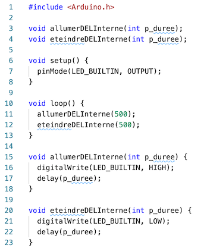

Nous allons chercher à séparer correctement les déclarations des fonctions "allumerDELInterne" et "eteindreDELInterne" en déclarations et en définitions. Nous allons ensuite utiliser ce code dans la fonction "main" qui se situe dans le fichier "main.cpp".

Dans PIO, tous vos fichiers d'en-tête (ou de déclarations) doivent se situer dans le répertoire "include". Ils seront accessibles grâce aux instructions de précompilation ```#include "Nom du fichier"```. Les fichiers d'en-tête du système ou des bibliothèques que vous utiliserez plus tard sont accessibles grâce aux instructions de prépomcpilation ```#include <Nom du fichier>``` comme par exemple la bibliothèque "Arduino" avec les instructions ```#include <Arduino.h>```.

***Version courte :***

- Créez les fichiers "GestionDELInterne.h" et "GestionDELInterne.cpp" en les plaçant respectivement dans les répertoires "include" et "src".
- Répartissez les déclarations et définitions des fonctions (allumer/eteindre)DELInterne dans les deux fichiers précédemment créés.
- Dans le fichier "main.cpp", incluez le fichier d'en-tête et appeler les fonctions (allumer/eteindre)DELInterne afin d'avoir un fonctionnement équivalent au code de votre premier programme Arduino.

***Version longue :***

- Ajoutez le fichier d'en-tête "GestionDELInterne.h" dans le répertoire "include"
  - Dans ce fichier, ajoutez les déclarations des fonctions "allumerDELInterne" et "eteindreDELInterne" (N'oubliez pas d'ajouter la directive d'inclusion unique à la première ligne de votre fichier d'en-tête)
- Ajoutez le fichier de définitions "GestionDELInterne.cpp" dans le répertoire "src"
  - Grâce à la directive de précompilation, incluez le fichier d'en-tête précédemment créé
  - Déclarez vos deux fonctions
- Ouvrez le fichier "main.cpp"
  - Grâce à la directive de précompilation, incluez le fichier d'en-tête précédemment créé
  - Placez-vous dans la fonction "loop" et appelez les fonctions "allumerDELInterne" et "eteindreDELInterne" comme dans votre premier programme Arduino

Dans toutes les versions, corrigez les erreurs de compilation, connectez la carte Arduino sur votre station de développement, téléversez et testez votre programme.

### Exercice 1.2 - Un peu de constance dans ce monde de brutes

Si vous avez suivi les étapes fournies, votre programme principal contient des "valeurs magiques" qui sont utilisées comme paramètres des appels aux fonctions (allumer/eteindre)DELInterne.

Nous allons modifier le code afin de supprimer les deux valeurs numériques "500". Ces deux valeurs représentent respectivement la durée de l'éclairage de la DEL et la durée d'extinction de la DEL.

On utilise principalement deux façons en C/C++ pour déclarer des constantes :

- En utilisant des directives de pré-compilation : les "constantes" sont remplacées avant le processus de compilation. En fait, on définit une macro qui sera exécuté durant la phase de pré-compilation
- En utilisant le mot clef "const" : la variable déclarée est constante donc son contenu est immuable

#### Exercice 1.2.1 - Déclaration de macro

Pour déclarer une macro, il suffit d'écrire le nom de la macro suivi de caractères de type espace/tabulation suivi de la macro. Vous avez vu des exemples de telles déclarations dans le fichier "Arduino.h".

Pour déclarer une macro sans paramètre, utilisez la syntaxe suivante ```#define MA_CONSTANTE 1234```.

Pour distinguer une macro, la règle d'écriture en majuscules est recommandée.

- Dans votre projet, créez le fichier "Configuration.h"
- Dans ce fichier, déclarez les macros/constantes "DUREE_DEL_ALLUMEE" et "DUREE_DEL_ETEINTE"
- Dans votre programme principal, remplacez les valeurs magiques par les macros/constantes

#### Exercice 1.2.2 - Déclaration de constantes

Pour déclarer une constante, il vous suffit de la déclarer et de la définir dans un fichier d'en-tête. Pour cela vous pouvez utiliser la syntaxe suivante : ```const int MaConstante = 1234```.

- Dans le fichier "Configuration.h", déclarez les constantes "dureeDELAllumee" et "dureeDELEteinte"
- Dans votre programme principal, remplacez les appels de macro par les constantes

#### Exercice 1.2.3 - Déclaration d'une macro avec paramètres

Pour déclarer une macro de précompilation avec des paramètres, la syntaxe est très similaire à la syntaxe des fonctions : ajoutez simplement des paramètres après le nom de la macro. Les parenthèses contiennent les noms des paramètres séparés par une virgule. Les paramètres des macros n'ont pas de type.

Exemple extrait du fichier "Arduino.h" : ```#define sq(x) ((x)*(x))```

Dans cet exemple l'utilisation du paramètre ```x``` est encadrée par des parenthèses car ```x``` pourrait contenir une expression complexe du type ```3 + 4```.

- Créez le fichier d'en-tête "MesMacros.h"
- En vous basant sur cet exemple, écrivez les macros "calculerMinimum" et "calculerMaximum" qui prennent chacune deux paramètres qui renvoient respectivement la plus petit et la plus grande valeur.
- Ouvrez le fichier "Arduino.h" et validez que vos macros sont comparables aux macros "min" et "max".

### Exercice 1.3 - S.O.S.

- En suivant les mêmes principes qu'énoncés précédemment, créez les fonctions :
  - AfficherSEnMorse et AfficherOEnMorse : qui affichent respectivement le signal lumineux du "S" et du "O" sur la DEL interne
  - AfficherSOSEnMorse : qui affiche le mot "SOS"
- Modifiez votre programme principal afin qu'il affiche le mot "SOS" suivi d'un délai d'une seconde en boucle.

## Exercice 2 - Tu tires ou tu pointes ?

Dans cet exercice, vous allez jouer avec les références et les pointeurs afin de mieux comprendre de quoi il en retourne.

### Exercice 2.1 - Préambule - Affichage d'information sur le moniteur série

Afin d'afficher de l'information, nous allons écrire du texte sur le port série simulé par votre Arduino. Avant de pouvoir écrire sur votre port série, vous devez configurer la vitesse de connexion du port série. Pour cela, dans la fonction "setup", appelez la méthode "begin" de l'objet accessible à partir de la variable globale "Serial". Pour cela, ajoutez l'instruction suivante ```Serial.begin(9600)```.

À partir du moment où le port est initialisé, vous pouvez utiliser les méthodes ```print``` et ```println``` accessible à partir de la variable globale ```Serial```.

Exemple :

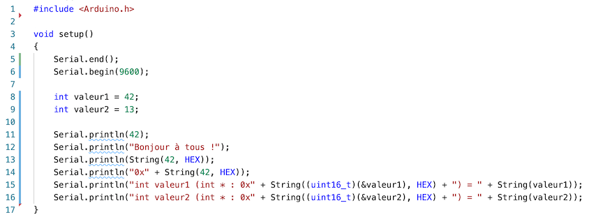

- Créez le projet "AMOC_Module02_EssaisPortSerie"
- Tapez le code de l'exemple, corrigez les erreurs et téléversez le programme compilé dans votre Arduino
- Allez visionner le résultat sur la console du port série. Pour cela cliquez sur l'icône en forme de prise qui se situe à côté du bouton de téléversement du code ([1]). Cela va ouvrir une console où les textes vont s'afficher ([2]) :

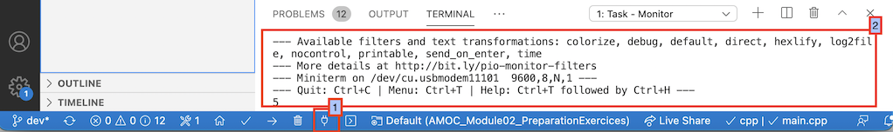

- Vous devriez obtenir un résultat proche de l'image suivante :

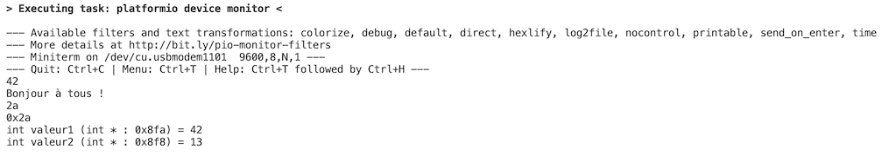

- À partir de votre résultat, en vous concentrant sur les deux derniers entiers qui sont affichés, validez la taille d'un entier.

<details>
    <summary>Indice #1</summary>

Faites la soustraction des deux adresses correspondantes aux entiers.

</details>

### Exercice 2.2 - Observations

- Ajoutez la fonction suivante en répartissant la déclaration et la définition dans les fichiers "passageParametres.(cpp/h)"

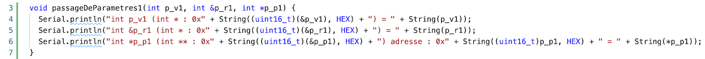

- Modifiez le code de l'exercice précédent afin d'y intégrer l'appel à votre nouvelle fonction

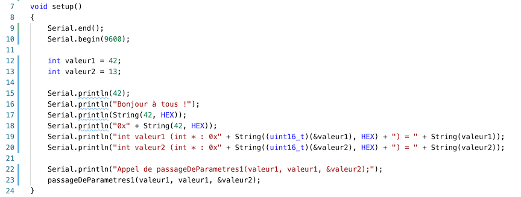

- Vous devriez avoir un affichage similaire au suivant :

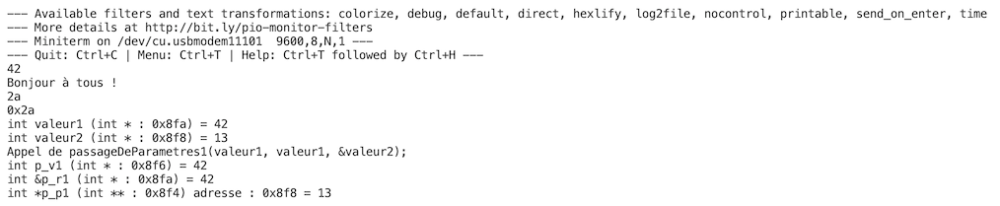

- Dessinez la mémoire et surtout ici la pile en vous basant sur les adresses affichées

- Qu'observez-vous pour :
  - La variable passée par copie
  - La variable passée par référence
  - La variable passée par copie de pointeur

### Exercice 2.3 - À vous !

- Écrivez la fonction "passageDeParametres2" qui prend en paramètres :
  - Une référence de pointeur et qui modifie le pointeur en créant un nouvel entier sur le tas
  - Un pointeur de pointeur et modifie le pointeur pointé en créant un nouvel entier sur le tas
- Écrivez un appel à cette fonction :
  - Affichez les valeurs avant l'appel
  - Durant l'appel
  - Après l'appel

## Exercice 3 - On programme avec classe, c'est l'objet de l'exercice !

Dans vos projet PIO, nous vous demandons d'avoir une classe par couple de fichiers. Le nom d'une classe débute par une majuscule. Les noms de fichiers sont, par convention, "NomClasse.cpp" et "NomClasse.h".

### Exercice 3.1 - Classe Flasher

### Exercice 3.1.1 - Déclaration

- Reprenez la classe Flasher du cours avec les ajouts proposés ici et implantez la

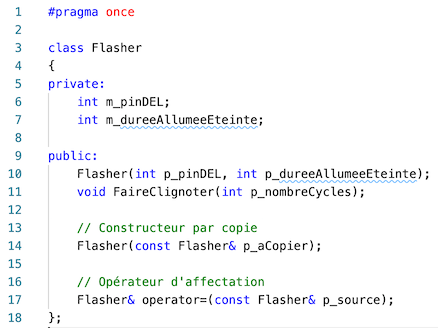

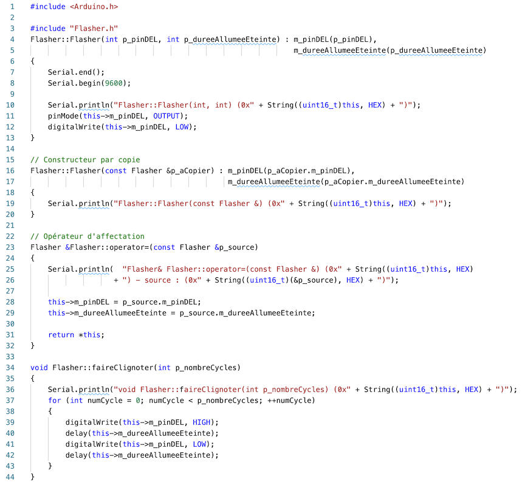

- Testez votre classe en déclarant la variable "flasher" avec le type "Flasher" en dehors de toute fonction

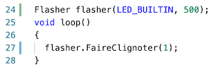

- Quels sont les constructeurs / opérateurs / méthodes appelées ?
- Déplacez la déclaration de la variable "flasher" avant la fonction "setup"
- Dans la fonction "setup", ajoutez la creation de la variable "flasherDuSetup" avec la même DEL mais 200ms de temporisation :

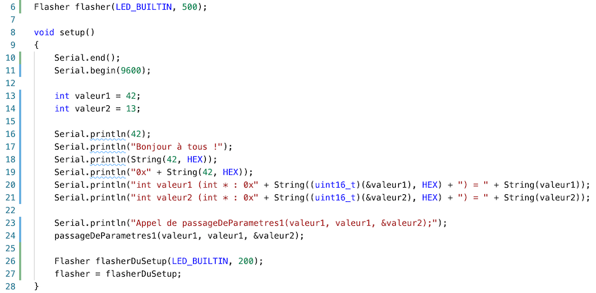

- Quels sont les constructeurs / opérateurs / méthodes appelées ?

### Exercice 3.1.2 - Passe par copie

- Dans les fichiers "passageParametres", créez la fonction "passageDeParametresCopie" qui prend le type "Flasher" en paramètres (pas de pointeur ou de référence ici)
- Dans cette fonction, affichez l'adresse du paramètre. Comparez là à celle de l'objet passé en paramètre avant son appel
- Quels sont les constructeurs / opérateurs / méthodes appelées ?

### Exercice 3.1.3 - Passe par référence

- Dans les fichiers "passageParametres", créez la fonction "passageDeParametresReference" qui prend le type "Flasher" en paramètres (pas de pointeur ou de référence ici)
- Dans cette fonction, affichez l'adresse du paramètre. Comparez là à celle de l'objet passé en paramètre avant son appel
- Quels sont les constructeurs / opérateurs / méthodes appelées ?

### Exercice 3.1.4 - Passe par pointeur

- Dans les fichiers "passageParametres", créez la fonction "passageDeParametresPointeur" qui prend le type "Flasher" en paramètres (pas de pointeur ou de référence ici)
- Dans cette fonction, affichez l'adresse passée en paramètres. Comparez là à celle de l'objet passé en paramètre avant son appel
- Quels sont les constructeurs / opérateurs / méthodes appelées ?

<details>
    <summary>Exemple d'affichage à la fin de cette partie</summary>

```
Flasher::Flasher(int, int) (0x4cc)

Tests de l'affichage sur la console
42
Bonjour à tous !
2a
0x2a
int valeur1 (int * : 0x8fa) = 42
int valeur2 (int * : 0x8f8) = 13

Appel de passageDeParametres1(valeur1, valeur1, &valeur2);
int p_v1 (int * : 0x8f6) = 42
int &p_r1 (int * : 0x8fa) = 42
int *p_p1 (int ** : 0x8f4) adresse : 0x8f8 = 13

Déclaration d'un objet local et affectation à l'objet global
Flasher::Flasher(int, int) (0x8ee)
Flasher& Flasher::operator=(const Flasher &) (0x4cc) - source : (0x8ee)

Appel des fonctions avec différents mode de passage avec flasher
flasher (flasher * : 0x4cc)
Flasher::Flasher(const Flasher &) (0x8e8)
passageDeParametresCopie - Flasher p_flasher (Flasher* : 0x8e8)
passageDeParametresReference - Flasher& p_flasher (Flasher* : 0x4cc)
passageDeParametresPointeur - Flasher* p_flasher (Flasher* : 0x4cc)
void Flasher::FaireClignoter(int p_nombreCycles) (0x4cc)
void Flasher::FaireClignoter(int p_nombreCycles) (0x4cc)
[...]
```

</details>

### Exercice 3.2 - Classe DEL - À vous !

- Créez la classe "DEL"

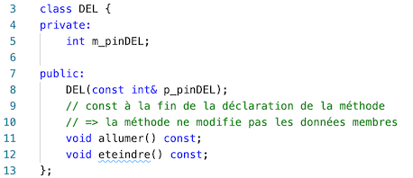

- Testez-la

### Exercice 3.3 - Après la morsure, l'héritage !

En C++, vous devez indiquer qu'une méthode peut-être redéfinie en précédent sa déclaration par le mot clef "virtual". Ce mot clef n'est pas présent au moment de la définition. Le caractère virtuel d'une méthode est automatiquement hérité : il n'est alors pas obligatoire de le spécifier dans les déclarations des méthodes dans les classes filles. Cependant, comme bonne pratique, nous allons toujours l'indiquer de manière explicite.

Une méthode peut être considérée comme abstraite si elle est virtuelle et que sa déclaration se termine par "= 0". On parle alors de méthode virtuelle pure. Une méthode abstraite n'est jamais définie. Une classe contenant une méthode abstraite est abstraite. Une classe abstraite ne peut pas être instanciée.

Contrairement à d'autres langage, C++ ne permet pas de définir des interfaces. La classe abstraite est donc le plus haut niveau d'abstraction.

Exemple de déclaration : ```virtual maMethode() = 0```.

Pour hériter d'une classe en C++, il vous suffit de l'indiquer à la déclaration de votre classe comme ceci : ```class MaClasseFille : public MaClasseMere```. En C++, l'héritage peut être soit ```public```, ```protected``` ou ```private```. ```public``` ne modifie pas les modifieurs d'accès de la classe mère. ```protected``` restreint l'accès de tous les membres à au moins ```protected```, c'est à dire que si la classe mère à des membres ```public```, à partir de la classe fille, ils auront un accès de type ```protected```. Il en va de même pour ```private```.

#### Exercice 3.3.1 - Classe Morse

- Créez la classe abstraite ```Morse``` :
  - Un constructeur qui contient la durée du point : base de tout (entre deux lettres un durée d'un point, un trait est d'une durée de trois points)
  - ```+ void afficherPoint()``` : méthode virtuelle pure
  - ```+ void afficherTrait()``` : méthode virtuelle pure
  - ```+ void afficherSOS()``` : méthode qui appelle les deux précédentes afin d'afficher son message
  - ```+ int getDureePoint() const``` : accesseur qui renvoie la durée d'un point

#### Exercice 3.3.2 - Classe MorseSerie

- Créez la classe concrète ```MorseSerie``` :
  - Elle hérite de la classe Morse
  - Elle redéfinit les méthodes ```afficherPoint``` et ```afficherTrait``` : elles affichent respectivement un point et un trait sur la console série

#### Exercice 3.3.3 - Classe MorseDEL

- Créez la classe concrète ```MorseDEL``` :
  - Elle hérite de la classe Morse
  - Elle a un constructeur d'initialisation qui prend la pin d'une DEL pour l'affichage
  - Elle redéfinit les méthodes ```afficherPoint``` et ```afficherTrait``` : la durée d'allumage de la DEL détermine si c'est un point ou un trait

#### Exercice 3.3.4 - Utilisons nos classes

- Dans la fonction ```setup```, déclarez la variable globale ```morse``` de type pointeur de ```Morse```
- Toujours dans la fonction ```setup```, créez un objet de type ```MorseSerie``` sur le tas (new) et affectez le à la variable ```morse```
- Testez l'affichage du SOS
- Modifiez la création de l'objet pour créer un objet de type ```MorseDEL```
- Testez l'affichage du SOS
