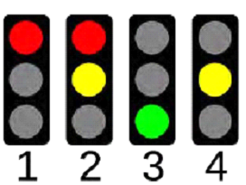

# Module 02 - Programmation des sorties

## Exercice

### Objectifs

- Controller plusieurs DELs avec des durées variables

### Environnement et matériel

- Arduino UNO
- Une platine d’essais
- Une ampoule DEL rouge, ampoule DEL jaune et une ampoule DEL verte
- 3 résistances de  220 Ohms
- Coffret de pièces et outils
Directives :
-Toujours étaler les articles sur le tapis de protection avant de débuter.
Attention : 

### Introduction
