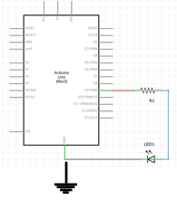
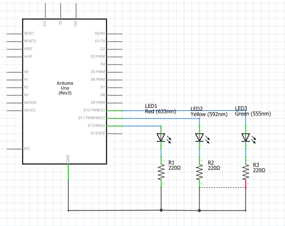

# Module 02 - Programmation des sorties

## Exercice 1

### Objectif

- Étiqueter les bandes de résistance.

### Environnement et matériel

- bandes de résistances

À l'aide du code de couleurs, étiquetez les bandes de résistances de votre ensemble expérimental.
Utilisez un multimètre, en position Ohm, pour tester vos valeurs.

## Exercice 2

### Objectif

- Controller la luminosité d'une DEL avec la LMI

### Environnement et matériel

- Arduino UNO
- Une platine d’essais
- Une ampoule DEL rouge
- 1 résistance de 220 Ohms
- Coffret de pièces et outils

- Directives :
   -Toujours étaler les articles sur le tapis de protection avant de débuter.

### Introduction

Les entrées numériques peuvent simuler une entrée analogique grâce à la tehcnologie LMI.

 

La fonction analogWrite(NoBorne, valeur) permet cette fonctionnalité.
Les valeurs possibles sont de 0 à 255. La valeur 0 équivaut à 0% d'intensité, la valeur 255 équivaut à l'éclairage maximal.

### Sketch Fade.ino

#### Montage du circuit

 

- représentation physique

 

- représentation shcématique

-Vérifiez SANS brancher

- Démarrez une nouvelle application Arduino. Nommez-la MLI.ino
Programmez MLI.ino comme représentée dans la présentation PowerPoint. Si le sketch ne fonctionne pas, débranchez le câble USB.-

##### Dépannage

1. Avez-vous polarisé la DEL dans le bon sens?
2. La valeur des résistances est-elle 220 Ohms?
3. Le fil noir est-il branché sur la borne GND (mise à la terre)?
    - par convention, le fil noir se branche à la terre
    le fil rouge à l'alimentation

##### Usage de la structure for()
Remplacez la structure if par la structure for ()
Consultez la rubrique 
https://www.arduino.cc/reference/en/ pour vous aider

##### Questions de réflexion

- Quelle est la valeur de la période du cycle pour fadeAmount= 5 ?  
- Quelle doit être la valeur de fadeAmount pour une période de cycle de 75 % ?
- Quel effect se produit-il si la période de cycle est de 75 %?

## Exercice 3 - Feux de circulation

L’exercice présenté ici représente un carrefour urbain simple contrôlé par un système de signalisation: Rouge, Jaune, Verte.

Le système passe périodiquement de Rouge au vert avec une transition préalable au jaune. Les durées sont différentes. Selon le tableau suivant,

### Objectif

Controller plusieurs DELs avec des durées variables

### Environnement et matériel

- Arduino UNO
- Une platine d’essais
- Une ampoule DEL rouge, ampoule DEL jaune et une ampoule DEL verte
- 3 résistances de  220 Ohms
- Coffret de pièces et outils

- Directives :
   -Toujours étaler les articles sur le tapis de protection avant de débuter.

### Sketch FeuDeCirculation.ino

L’image suivante donne la séquence d’éclairage des feux de circulation. Votre tâche consiste à programmer l’Arduino pour reproduire cette séquence en respectant les durées suivantes.
 

|Séquence  |Image|Durées|Rouge   |Jaune   |Vert    |
|:--------:|-----|------|--------|--------|--------|
|startup() |1    |3 sec.|allumé  |éteinte |éteinte |
|loop()	   |2	 |5 sec.|éteinte |allumé  |éteinte |
|          |3    |3 sec.|éteinte |éteinte |allumé  |
|          |4    |2 sec.|allumé	 |allumé  |éteinte |
|          |1    |3 sec.|allumé	 |éteinte |éteinte |

### Montage du circuit

- TOUJOURS débrancher la carte Arduino lorsque vous modifiez votre circuit

- Branchez le circuit de la façon suivante :
 
- représentation physique

 

-représentation schématique

Les bornes 12, 11 et 10 sont utilisées.
Vérifiez SANS brancher

- Démarrez une nouvelle application Arduino. Nommez-la FeuDeCirculation.ino
Programmez FeuDeCirculation.ino selon les délais prescrits dans le tableau plus haut.
Si le sketch ne fonctionne pas, débranchez le câble USB.

    
Dépannage circuit

Vérifiez votre circuit attentivement avec les points cités au-dessus.

### Tests par partie

Utilisez la technique suivante :

- Remplacez le sketch par le sketch Blink.ino
- Changez LED_BUILTIN par la valeur 12. Téléversez le sketch. La DEL rouge doit clignoter, sinon dépannez cette partie du circuit.
- Faites de même pour les bornes 11 et 10.
