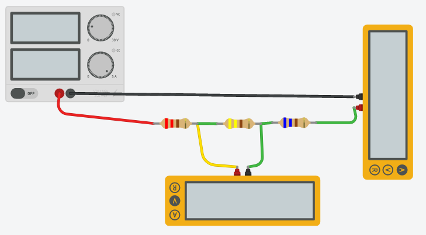
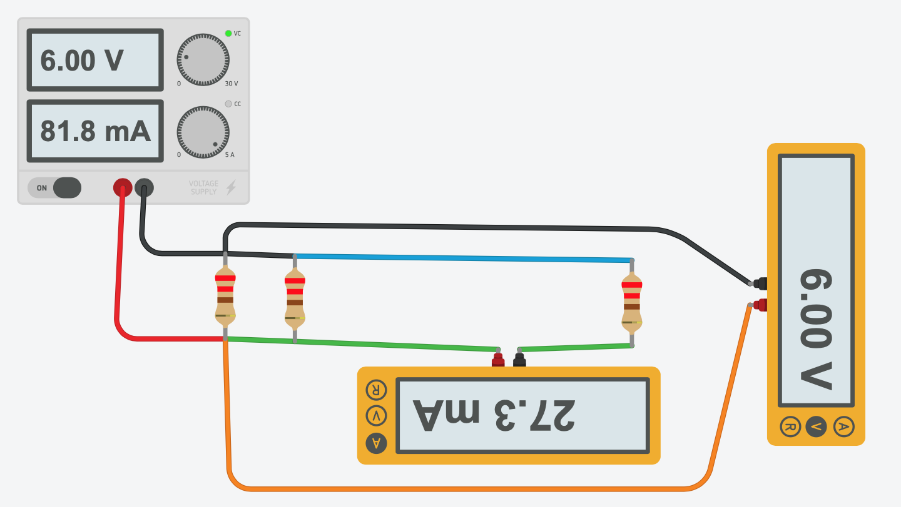

# Module 03 - Notions d'électricités

Exercices supplémentaires à garder si le temps le permet.

## Exercice 4 - Simulation TInkerCad

### Objectif Simuler divers circuits

- Dans cet exercice, vous pourrez observer la valeur du courant et de la tension dans divers circuits série ou parallèle

### Montage du circuit

- Matériel
  - bloc d'alimentation
  - 2 multimètres
  - ensembles de résistances: 220 Ω, 440 Ω, 660 Ω

- Mettre en oeuvre le montage illustré dans TinkerCad
- Placez la tension du bloc d'alimentation à 6 V
- Placez le courant maximum à 1 Ampère

### Étape 1 - 3 Résistances en série

- Insérez les 3 résistances du schéma dans le circuit TinkerCad
- Placez le voltmètre aux bornes de la première résistance.
- Démarrez la simulation. Notez la valeur.
- Placez successivement le voltmètre aux bornes des autres résistances et notez les valeurs.
- La tension mesurée devrait correspondre aux valeurs que vous avez calculées dans les exercices précédents.

### Étape 2 - 3 Résistances en parallèle

- Modifiez votre circuit pour représenter le schéma.
- Placez  l'ampèremètre dans  voltmètre sur chacune des résistances.
- La tension mesurée devrait correspondre aux valeurs que vous avez calculées dans les exercices précédents, sinon revoir vos calculs.

    
Solution

## Exercice 5 - Courbe de tension d'une del

### Objectifs

1. Déterminer la tension de seuil
2. Déterminer la tension de claquage

Dans cet exercice, vous pourrez tracer la courbe de la fiche technique d'une del rouge, déterminer la tension de seuil et la tension de claquage sans risque!

### Montage du circuit

    circuit de test pour une del

- Matériel
  - Bloc d'alimentation
  - 2 multimètres
  - DEL de couleur rouge
  - Résistance de 220 Ω

### Étape 1 - Tension de seuil

- Mettre en oeuvre le montage illustré dans TinkerCad
- Placez la tension d'alimentation à 0 V
- Placez le courant maximum à 1 A
- Tournez progressivement le bouton de tension jusqu'à ce que la del s'allume. Notez la valeur de la tension de seuil.
- Pour une plus grande précision, utilisez la fenêtre de contrôle pour fixer la tension délivrée; utilisez un pas de 0,2 V entre chaque lecture.

### Étape 2 - Tension de claquage

- Tournez progressivement le bouton de tension, avec un pas de 0.5 V, jusqu'à ce que TinkerCad fasse apparaître un message d'alerte

- Notez la tension de claquage

### Question

- Avec une résistance de charge de 440 Ω :

1. La tension de seuil change-t-elle ?
2. La tension de claquage change-t-elle ?

- Avec une résistance de charge  de 440 Ω la tension de seuil change-t-elle ?

    
Solution

Non les tensions de seuil et de claquage dépendent uniquement de la fabrication du matériau.

