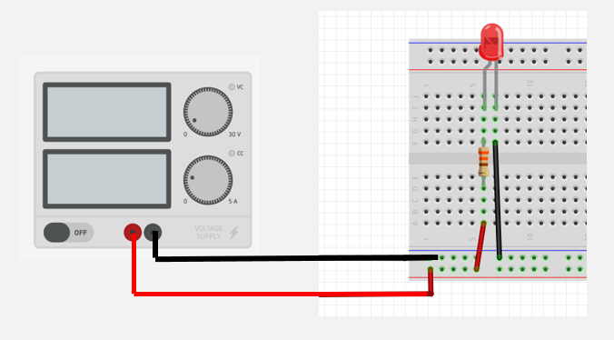
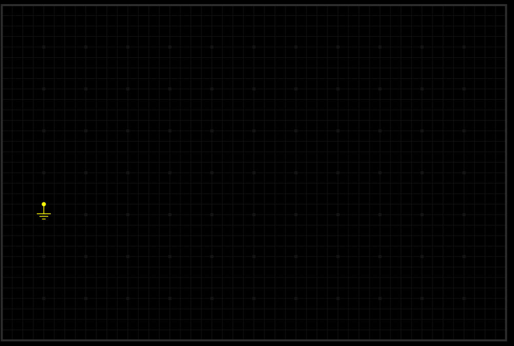
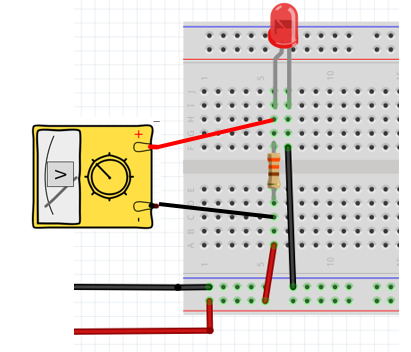
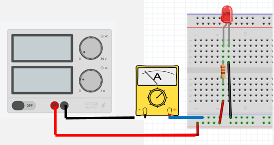
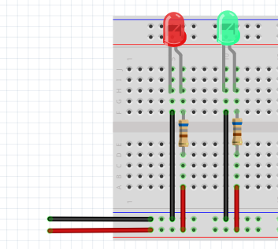
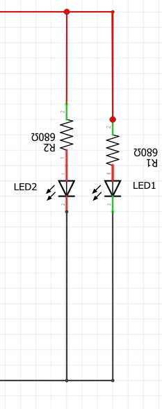

# Module 03 - Notions d'électricité - Laboratoire #1 - U = RI

Objectifs :

- Assembler des circuits sur une breadbord
- Mesurer les valeurs de résistances, de courant et de tensions à l'aide du multimètre

## Exercice 1 - Assemblage d'un circuit

### Matériel

- Bloc d'alimentation variable et ses accessoires
- 1 multimètre et ses accessoires
- 1 carré de mousse
- 1 mini breadbord
- Ensemble de câbles de couleurs et longueurs variées
- 2 résistances de 680 &#8486;
- 1 DEL de couleur rouge
- 1 DEL de couleur verte

### Étape 1 - Calibration du bloc d'alimentation

- Rassemblez les pièces et fixez-les sur un carré de mousse
- Branchez les connecteurs "alligator" rouge et noir dans les fiches du bloc d'alimentation
- Tournez les boutons de tension au minimum
- Tournez les boutons de courant au minimum
- Branchez le bloc d'alimentation dans une prise du secteur
- Tournez les boutons de tension jusqu'à atteindre une valeur de 5 Volts (à plus ou moins 0,05 Volt)
- Court-circuitez les deux connecteurs rouge et noir, puis tournez le bouton du courant jusqu'à atteindre une valeur de 0,5 A (500 mA). NE PAS DÉPASSER
- Éteindre le bloc d'alimentation
- Débranchez les deux connecteurs rouge et noir

### Étape 2 - Circuit avec une DEL

Dans cette étape, vous allez construire un circuit pour alimenter une DEL et mesurer le courant qui circule dans le circuit.

- Branchez les deux connecteurs à prise alligator sur le bloc d'alimentation comme dans l'exercice précédent.
- Construisez le circuit d'alimentation de la DEL en série avec une résistance de 680 &#8486; sur la Breadboard.
- Alimentez le circuit; la DEL doit s'allumer, sinon dépannez votre circuit.

    
schéma du circuit sur papier

- Reproduisez le circuit dans un schéma sur papier quadrillé.

**Schéma de Pièces électroniques** sur : https://everycircuit.com/circuit/5388164933615616

### Étape 3 - Mesure de la tension

- Sur le multimètre, tournez le sélecteur en position V-CC (V-DC) (**non** sur V-AC).

- Branchez le multimètre entre les 2 bornes de la résistance à l'aide de connecteurs de type crochets.

    
Branchement du Voltmètre

- Alimentez le circuit; la DEL doit s'allumer, sinon dépannez votre circuit.
- Notez la valeur de la tension dans votre cahier de laboratoire.
- Fermez l'alimentation.
- Débranchez le multimètre.
- Calculez le courant avec la loi d'Ohm.

### Étape 4 - Mesure du courant

La vidéo https://youtu.be/nh9mXn2TT9U doit avoir été visionnée auparavant.

- Configurez le multimètre en mode ampèremètre.
- Branchez-le **en série**. avec la borne négative du bloc d'alimentation

    
Mesure du courant

- Alimentez le circuit.
- Notez la valeur du courant total dans votre cahier de laboratoire.
- Fermez l'alimentation.

### Étape 5 - Calculs de la loi d'Ohm et conclusion

-La valeur mesurée est-elle comparable à la valeur calculée à l'étape précédente? Expliquez.

## Exercice 2 - Assemblage d'un circuit à deux DELs

### Étape 1 - Circuit avec 2 DELs

- Ajoutez un autre circuit composée de la  DEL verte et d'une résistance de 680 &#8486;
- Testez le circuit (les deux DELs doivent s'allumer)

    
Schéma du circuit

### Étape 2 - Mesure du courant

- Notez la valeur du courant total dans votre cahier de laboratoire.
- Mesurez le courant du circuit de la DEL verte seule.
- Notez la valeur du courant dans votre cahier de laboratoire.
- Comparez la valeur du courant total avec les valeurs du courant du circuit des DELs rouge et verte. Quelle conclusion pouvez-vous tirer?
