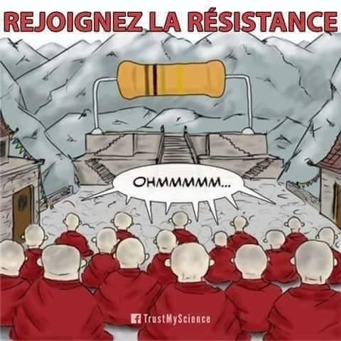
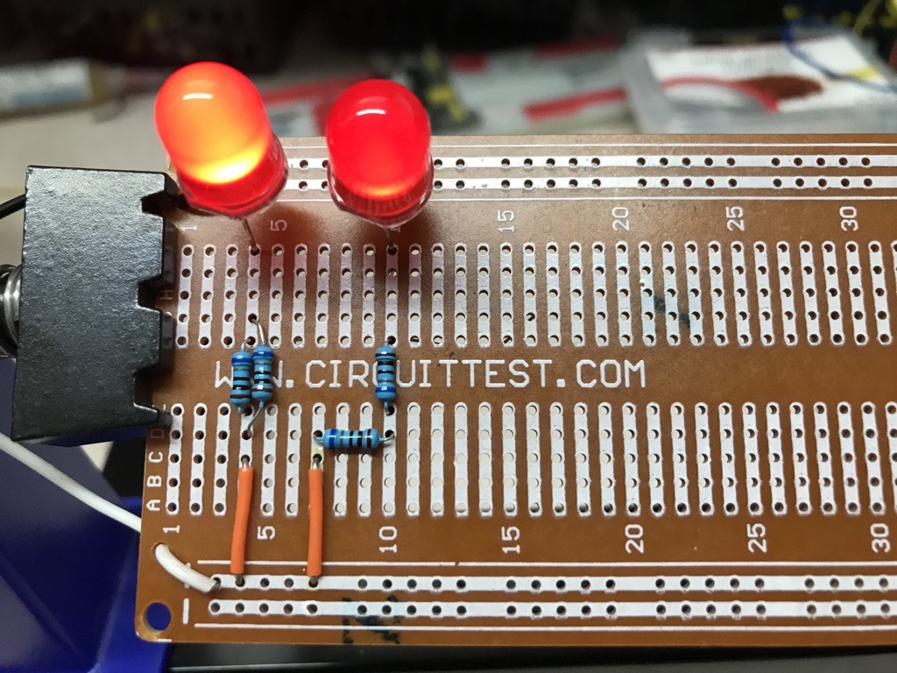
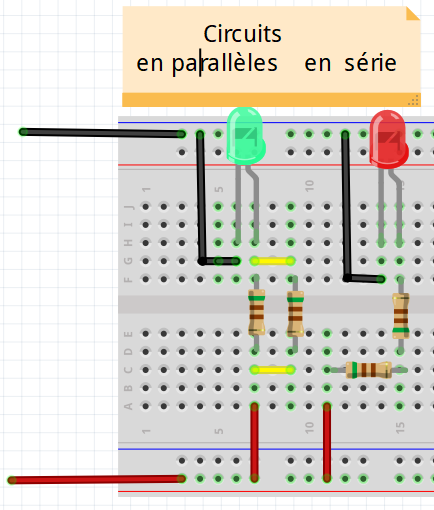
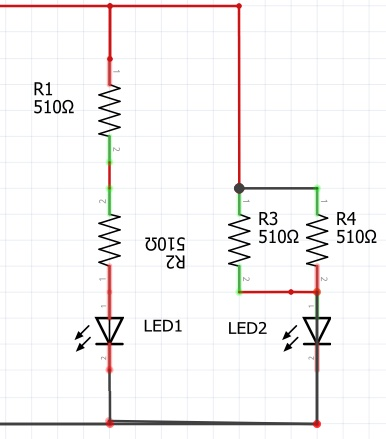

# Module 03 - Notions d'Électricité - Laboratoire #2 - Vive la résistance !

Objectifs :

- Assembler des circuits de résistances en série, en parallèle ou en circuits combinés
- Mesurer les valeurs de résistance équivalente
- Comparer les valeurs mesurées aux valeurs calculées

(Auteur inconnu : image Facebook)

## Vue globale du montage final à la fin des exercices

La première image montre un circuit de résistances en série et en parallèle sur une plaquette soudée.

La deuxième image représente le montaque que vous allez effectuer.
La troisième image représente le **schéma du montage** tel qu'il est documenté. 

Résistances soudées

Sur Breadboard 

Schéma de circuits  

## Préparation des prochains exercices

### Matériel

- Bloc d'alimentation variable et ses accessoires
- 1 multimètre et ses accessoires
- 1 carré de mousse
- 1 mini breadbord
- Ensemble de câbles connecteurs de couleurs et longueurs variées
- 4 résistances de 510 &#8486;
- 2 DELs de couleur rouge

### Calibration du bloc d'alimentation

- Rassemblez les pièces et fixez-les sur un carré de mousse
- Branchez les connecteurs "alligator" rouge et noir dans les fiches du bloc d'alimentation
- Tournez le bouton de tension au minimum
- Tournez le bouton de courant au minimum
- Branchez le bloc d'alimentation dans une prise du secteur
- Tournez le bouton de tension jusqu'à une valeur de 5 Volt
- Court-circuitez les deux connecteurs, puis tournez le bouton du courant jusqu'à une valeur de 0,5 A (500 mA). **NE PAS DÉPASSER**
- Fermez l'alimentation
- Débranchez les deux connecteurs

## Exercice 1 - Circuit de résistances en série

### Étape 1 -  Assemblage du circuit

Dans cette étape, vous allez construire un circuit de résistances en série pour alimenter une DEL. Aidez-vous des images précédentes.

- Sur la breadboard, construire le circuit de 2 résistances de 510 &#8486; branchées en série.
- Ajoutez une DEL rouge.

### Étape 2 - Mesure de la résistance

- Sur votre cahier de laboratoire, dessinez le **schéma du montage** et calculez la valeur de la résistance équivalente.

- Avec l'Ohmmètre, mesurez la valeur de la résistance totale des 2 résistances ensemble. Notez cette valeur dans votre cahier de laboratoire.

- Obtenez-vous le même résultat?

### Étape 3 - Mesure du courant

- Sur votre cahier de laboratoire, calculez la valeur théorique du courant qui passe dans le circuit pour une tension de 5 Volts.

- Aidez-vous du laboratoireNo1 pour brancher le multimètre en mode ampèremètre.

- Alimentez le circuit. Notez cette valeur dans votre cahier de laboratoire.
- Obtenez-vous le même résultat?

## Exercice 2 - Circuit de résistances en parallèle

### Étape 1 - Assemblage du circuit

Dans cette étape, vous allez construire un circuit avec 2 résistances en parallèle. Aidez-vous des images précédentes.

- Sur la breadboard, construire le circuit de 2 résistances de 510 &#8486; branchées en parallèle. 
- Ajoutez une DEL verte.

### Étape 2 - Mesure de la résistance

- Sur votre cahier de laboratoire, dessinez le **schéma du montage** et calculez la valeur de la résistance équivalente.

- Avec l'Ohmmètre, mesurez la valeur de la résistance totale des 2 résistances montées en //. Notez cette valeur dans votre cahier de laboratoire.

- Obtenez-vous le même résultat?

### Étape 3 - Mesure du courant

- Sur votre cahier de laboratoire, calculez la valeur théorique du courant qui passe dans le circuit pour une tension d'alimentation de 5 Volts.

- Aidez-vous du laboratoireNo1 pour brancher le multimètre en mode ampèremètre.

- Alimentez le circuit. Notez cette valeur dans votre cahier de laboratoire.
- Obtenez-vous le même résultat?

### Étape 4 - Discussion

- Comment expliquez-vous que l'éclairage des 2 DELs soient si différents? Discutez-en en équipe. Auriez-vous eu une façon théorique de le découvrir ? 

Si oui, expliquez le cheminement.
