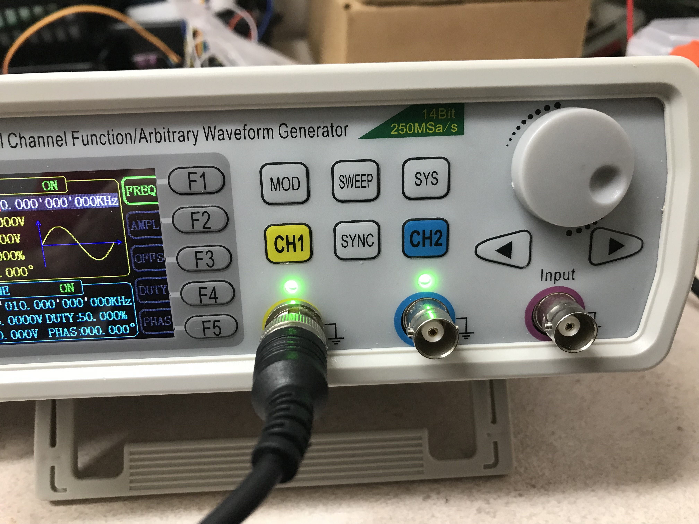
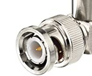
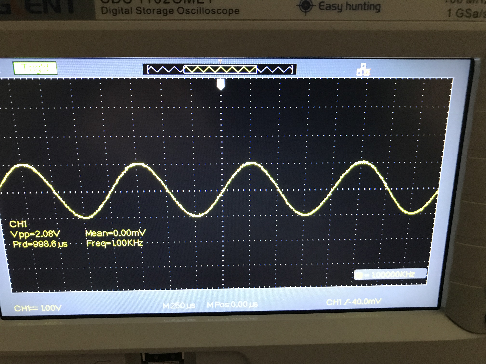
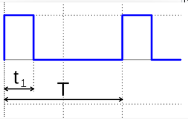
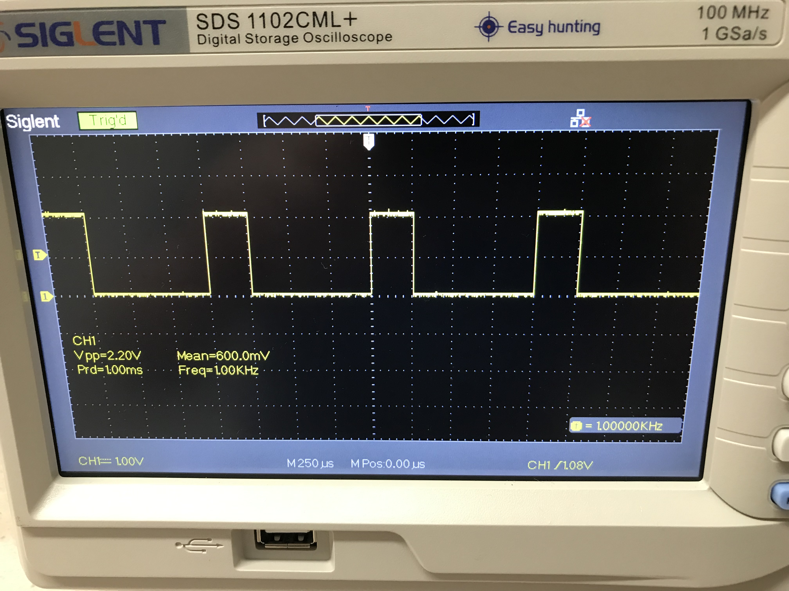

# Module 03 - Notions d'Électricité

Objectifs :

- Manipuler le générateur de basses fréquences
- Contrôler les ondes émises, en forme, fréquence et amplitude
- Mesurer différents rapports cycliques d'une onde carrée

## Matériel

- Générateur de basses fréquences Modèle FeelTech FY6600 et ses accessoires
- Oscilloscope Modèle Siglent et ses accessoires

    
Générateur de basses fréquences

## Exercice 1 - Générateur de basses fréquences (GbF)

### Étape 1 - Valeurs par défaut  

- Allumez le GbF.
- Notez les valeurs par défaut:
  - Forme de l'onde
  - Fréquence
  - Tension maximale
  - Rapport cyclique

Dans ce laboratoire, nous explorerons ces quatre fonctions en usage sur le canal CH1. De nombreuses autres activités sont possibles, mais sont remises à plus tard.

Pour faciliter les observations, vous allez "camoufler" le canal CH2. Procédez comme suit

- Appuyez sur **_CH2_**. Le canal CH2 bascule au niveau de sa configuraton. Cliquez à nouveau sur CH2; le témoin lumineux s'éteind; de cette façon, la borne n'envoie aucun signal de sortie.
- Appuyez sur **_WAVE_**. Tournez 3 fois la molette. Le format **_DC_** s'affiche. Une ligne droite parcoure l'axe horizontal.

En tout temps, fermez l'appareil pour obtenir la configuration de base du GbF.

### Étape 2 -  Configuration d'ondes

Dans cette étape, vous utiliserez les boutons WAVE, F1, F2 et F4 pour obtenir une onde sinusoidale, de 1 000 Hz (1 KHz), avec une tension maximale de 2 Volt.

- Appuyez sur **_CH1_**. Le canal CH1 bascule au niveau de sa configuraton.
- Changez la fréquence pour 1 000 Hz en appuyant sur F1. Appuyez 4 fois au centre de la molette pour faire passer successivement l'unité de fréquence de Khz à Hz. Utilisez les boutons **_>_** et **_<_** pour changer le chiffre de l'unité de mesure.
- Diminuez la tension de l'onde pour une valeur de 2 Volt.  

### Étape 3 -  Usage de l'oscilloscope

Vous utiliserez l'oscilloscope pour mesurer les valeurs de tensions et de période d'une onde produite par le GbF.

- Branchez l'oscilloscope dans le secteur.
- Branchez un câble BNC mâle-mâle  entre la sortie **_CH1_** du GbF et l'entrée jaune de l'oscilloscope. C'est un accessoire du GbF.

#### Fins ajustements

- Sur l'oscilloscope, appuyez sur les boutons bleus "Default Setup" et "Auto". Une onde sinusoïdale stable doit apparaître sur le moniteur.
- Tournez la molette supérieure du balayage horizontal pour obtenir 4 cycles d'onde à l'écran. L'indicateur doit donner la valeur **_MPos_** seconde, sinon tournez la molette inférieure.
- Tournez la minimolette verticale du canal jaune. Un menu temporaire apparaît à l'écran. La valeur  **_Volts Pos=0,00mV_** donne la bonne position.
- Tournez la molette verticale supérieure du canal jaune pour obtenir une graduation de 1,00 V par carreau.

Avec ces ajustements, un cycle de l'onde débute aux croissement des axes X et Y et se termine 4 carreaux plus loin. L'indicateur "T" (trigger) est positionné sur l'axe Y. L'indicateur jaune "1" est positionné sur l'axe "X".

    
Onde sinusoïdale

- Répondez aux questions suivantes:
  - Quelle est l'unité de temps représentant un carreau?
  - Combien de temps dure un cycle complet?
  - Quelle est la valeur de la tension après 500 **_u_** secondes?

## Exercice 2 - Rapport cyclique

Le rapport cyclique joue un rôle important dans le contrôle des périphériques. Plus le rapport cyclique est faible, moins de courant circule dans les équipements. C'est ainsi qu'on contrôle la vitesse de moteurs, l'éclairage de DELs, etc.

Sur l'image suivante, le rapport de cycle est t1 / T :

### Étape 1 - Rapport cyclique

- Modifiez le type d'ondes du GbF pour produire la forme "CMOS".
- Modifiez le rapport cyclique (DUTY) pour une valeur de 25 %.
- Rafraîchissez l'écran de l'oscilloscope; appuyez sur les boutons bleus "Default Setup" et  "Auto".

    
Example de rapport cyclique de 25 %

  
- Répondez aux questions suivantes:
  - Pendant combien de temps, la sortie du Gbf est-elle à 2 V?
  - Pendant combien de temps, la sortie du Gbf est-elle à 0 V?
  - Combien de temps dure un cycle complet?
  - Vérifier que le rapport de cycle est correct.

### Étape 2 - Autres rapports cycliques

- Ajustez l'appareil pour obtenir un rapport cyclique à 75 %
- ajuster l'appareil pour obtenir un rapport cyclique à 90 %

Fin du laboratoire
