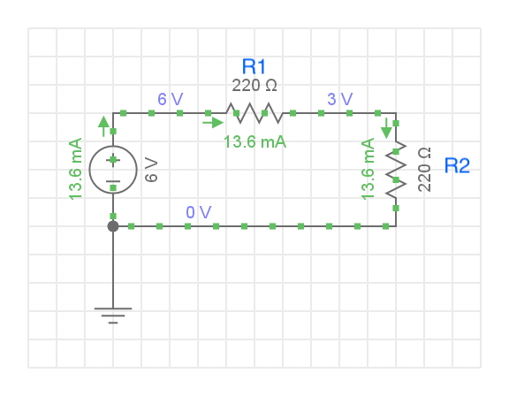
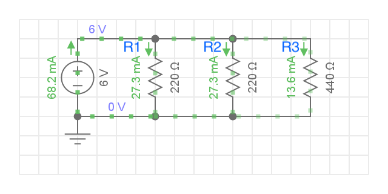

# Module 03 - Notions d'Électricité

Dans ce module vous allez calculer les valeurs d'intensité, tension et résistances dans certains montages.

## Exercice 1 - Résistances en série

### Étape 1 - 2 Résistances en série

À l'aide de l'illustration

- Effectuez le calcul de la résistance équivalente
- Calculez le courant I qui circule dans le circuit
- Calculez la tension aux bornes de chaque résistance

    
Solution

Rt = 220 + 220 = 440 &#8486;  
U1 = 220 * 13,43 = 3 V  
U2 = 220 * 13,43 = 3 V  
It = 6 / 440 = 13,6 mA

### Étape 2 - 3 Résistances en série

À l'aide de l'illustration

- Effectuez le calcul de la résistance équivalente
- Calculez le courant I qui circulera dans le circuit
- Calculez la tension aux bornes de chaque résistance

    
Solution

Rt = 220 + 440 + 660 = 1320 &#8486;  
U1 = 4,6 * 220 = 1 V  
U2 = 4,6 * 440 = 2 V  
U3 = 4,6 * 660 = 3 V  
It = 6 / 1320 = 4,6 mA

### Qestions

- Quel est le rapport de tensions entre la résistance de 660 Ω et de 220 Ω?

## Exercice 2 - Résistances en parallèle

### Exercice 2.1 - 3 Résistances en parallèle

À l'aide de l'illustration

- Effectuez le calcul de la résistance équivalente
- Calculez le courant I total qui alimente le circuit
- Calculez les 3 courants qui circulent dans chaque résistance

    
Solution

1 / Rt = 1 / 220 + 1 / 220 + 1 / 220 = 3 / 220 => Rt = 73,3 &#8486;  
U1 = U2 = U3 = 6 V  
It = 6 / 73,3 = 81,9 mA  
I1 = I2 = I3 = 27,3 mA  

### Exercice 2.2 - 3 Résistances en parallèle

À l'aide de l'illustration

- Effectuez le calcul de la résistance équivalente
- Calculez le courant I total qui alimente le circuit
- Calculez les 3 courants qui circulent dans chaque résistance

    
Solution

1 / Rt = 1 / 220 + 1 / 220 + 1 / 440 = 5 / 440 => Rt = 88 &#8486;  
U1 = U2 = U3 = 6 V  
It = 6 / 88 = 68,2 mA  
I1 = 27,3 mA  
I2 = 27,3 mA  
I3 = 13,6 mA

## Exercice 3 - Circuits combinés (Optionnel)

### Exercice 3.1 - 3 Résistances

À l'aide de l'illustration

- Effectuez le calcul de la résistance équivalente totale Ret pour le circuit complet

    
Indices 1 / 2

1. Effectuez le calcul de la résistance équivalente en parallèle Rep pour les 2 résistances en parallèle

2. La résistance Ret totale est donné par la  résistance de 220 Ω en série avec la résistance Rep

- Calculez le courant It total qui circule dans le circuit
- Calculez la tension aux bornes de la résistance de 220 Ω

- Calculez la tension aux bornes des résistances de 440 Ω en parallèle

    
Indices 2 / 2

1. la tension aux bornes de résistances en parallèle est la même. La tension peut être déduite de la tension totale et de la tension U aux bornes de la résistance de 220 Ω

2. le courant est calculé à partir de la formule U / R2 et U /R3

    
Solution

1 / Re1 = 1 / 440 + 1 / 440 = 1 / 220 => Re1 = 220 &#8486;  
Rt = 440 &#8486;  
It = 6 / 440 = 13,6 mA  
U1 = 220 * 0.0136 = 3V  
U2 = U3 = 220 * 0.0136 = 3V  
I2 = 3 / 440 = 6,8 mA   
I3 = 3 / 440 = 6,8 mA

### Exercice 3.2 - 5 Résistances

    Circuit combiné, 5 résistances

À l'aide de l'illustration

- Effectuez le calcul de la résistance équivalente totale Ret pour le circuit complet
- Calculez le courant I total qui alimente le circuit
- Calculez le courant qui circule dans chaque résistance

    
Solution

Re1 = 180.33 &#8486;  
Rt = 580 + 220 + 180.33 = 980.33  
It = 6 / 980.33 = 6.1 mA  
U1 = 580 * 0.0061 = 3,54 V  
U2 = 220 * 0.0061 = 1.34 V V  
Ue1 = U3 = U4 = U5 = 180.33 * 0.0061 = 1.1 V  
I3 = I4 = 1.1 / 440 = 2.5mA  
I5 = 1.1/1000 = 1.1 mA 

