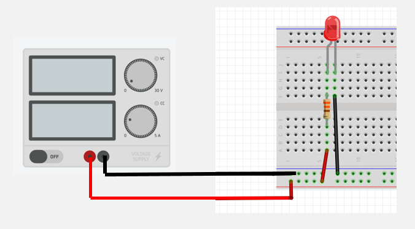
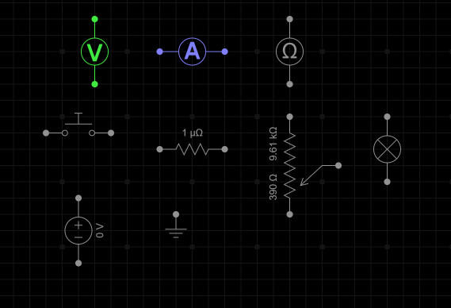
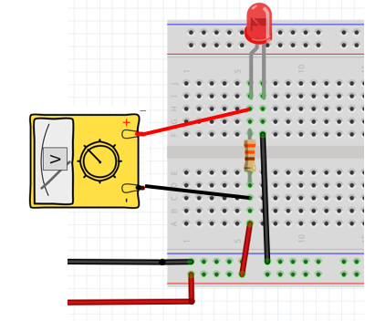
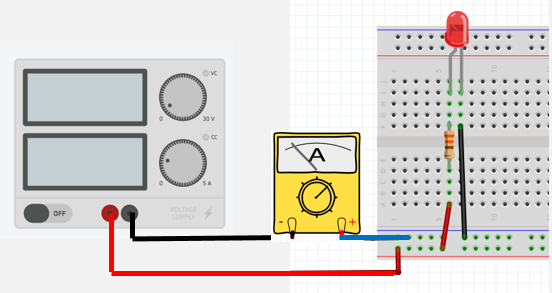
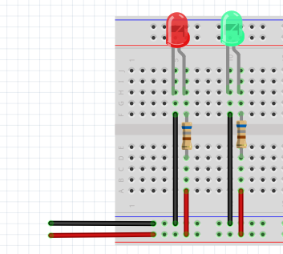
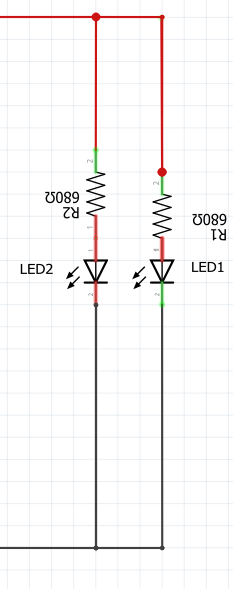

# Module 03 - Notions d'électricité - Laboratoire #1 - U = RI

## Ce qui sera vu

- Assembler sur une plaquette d'expérimentation un circuit comportant une résistance et une ou deux DEL.
- Régler une alimentation à 5 V et limiter son courant à 0,5 A.
- Mesurer la tension et le courant avec un multimètre branché correctement.
- Appliquer la loi d'Ohm et comparer les résultats calculés aux mesures.
- Documenter le montage et formuler une courte conclusion à partir des observations.

## Prérequis

- Connaître les grandeurs tension, courant et résistance ainsi que leurs unités.
- Savoir appliquer la relation `U = RI` et convertir des ampères en milliampères.
- Reconnaître la polarité d'une DEL et le branchement en série.
- Avoir lu les règles de sécurité du laboratoire et faire vérifier le montage avant de l'alimenter.
- Disposer du bloc d'alimentation, du multimètre, de la plaquette et des composants indiqués dans la section Matériel.

## Exercice 1 - Assemblage d'un circuit

### Matériel

- Bloc d'alimentation variable et ses accessoires

- 1 multimètre et ses accessoires

- 1 carré de mousse

- 1 mini-plaquette d'expérimentation
- Ensemble de câbles de couleurs et longueurs variées
- 2 résistances de 680 &#8486;
- 1 DEL de couleur rouge
- 1 DEL de couleur verte

### Étape 1 - Calibration du bloc d'alimentation

- Rassemblez les pièces et fixez-les sur un carré de mousse
- Branchez les connecteurs "alligator" rouge et noir dans les fiches du bloc d'alimentation
- Tournez les boutons de tension au minimum
- Tournez les boutons de courant au minimum
- Branchez le bloc d'alimentation dans une prise du secteur
- Tournez les boutons de tension jusqu'à atteindre 5 V (à plus ou moins 0,05 V).
- Court-circuitez les deux connecteurs rouge et noir, puis tournez le bouton du courant jusqu'à atteindre une valeur de 0,5 A (500 mA). NE PAS DÉPASSER
- Éteindre le bloc d'alimentation
- Débranchez les deux connecteurs rouge et noir

### Étape 2 - Circuit avec une DEL

Dans cette étape, vous allez construire un circuit pour alimenter une DEL et mesurer le courant qui circule dans le circuit.

- Branchez les deux connecteurs à prise alligator sur le bloc d'alimentation comme dans l'exercice précédent.
- Construisez sur la plaquette d'expérimentation le circuit d'alimentation de la DEL en série avec une résistance de 680 &#8486;.
- Alimentez le circuit; la DEL doit s'allumer, sinon dépannez votre circuit.

    
schéma du circuit sur papier

- Reproduisez le circuit dans un schéma sur papier quadrillé.

**Schéma de Pièces électroniques** sur : https://everycircuit.com/circuit/5388164933615616

### Étape 3 - Mesure de la tension

- Sur le multimètre, tournez le sélecteur en position V-CC (V-DC) (**non** sur V-AC).

- Branchez le multimètre entre les 2 bornes de la résistance à l'aide de connecteurs de type crochets.

    
Branchement du Voltmètre

- Alimentez le circuit; la DEL doit s'allumer, sinon dépannez votre circuit.
- Notez la valeur de la tension dans votre cahier de laboratoire.
- Fermez l'alimentation.
- Débranchez le multimètre.
- Calculez le courant avec la loi d'Ohm.

### Étape 4 - Mesure du courant

La vidéo https://youtu.be/nh9mXn2TT9U doit avoir été visionnée auparavant.

- Configurez le multimètre en mode ampèremètre.
- Branchez-le **en série** avec la borne négative du bloc d'alimentation.

    
Mesure du courant

- Alimentez le circuit.
- Notez la valeur du courant total dans votre cahier de laboratoire.
- Fermez l'alimentation.

### Étape 5 - Calculs de la loi d'Ohm et conclusion

-La valeur mesurée est-elle comparable à la valeur calculée à l'étape précédente? Expliquez.

## Exercice 2 - Assemblage d'un circuit à deux DEL

### Étape 1 - Circuit avec deux DEL

- Ajoutez un autre circuit composé de la DEL verte et d'une résistance de 680 &#8486;.
- Testez le circuit; les deux DEL doivent s'allumer.

    
Schéma du circuit

### Étape 2 - Mesure du courant

- Notez la valeur du courant total dans votre cahier de laboratoire.
- Mesurez le courant du circuit de la DEL verte seule.
- Notez la valeur du courant dans votre cahier de laboratoire.
- Comparez le courant total aux courants des circuits des DEL rouge et verte. Quelle conclusion pouvez-vous tirer?
