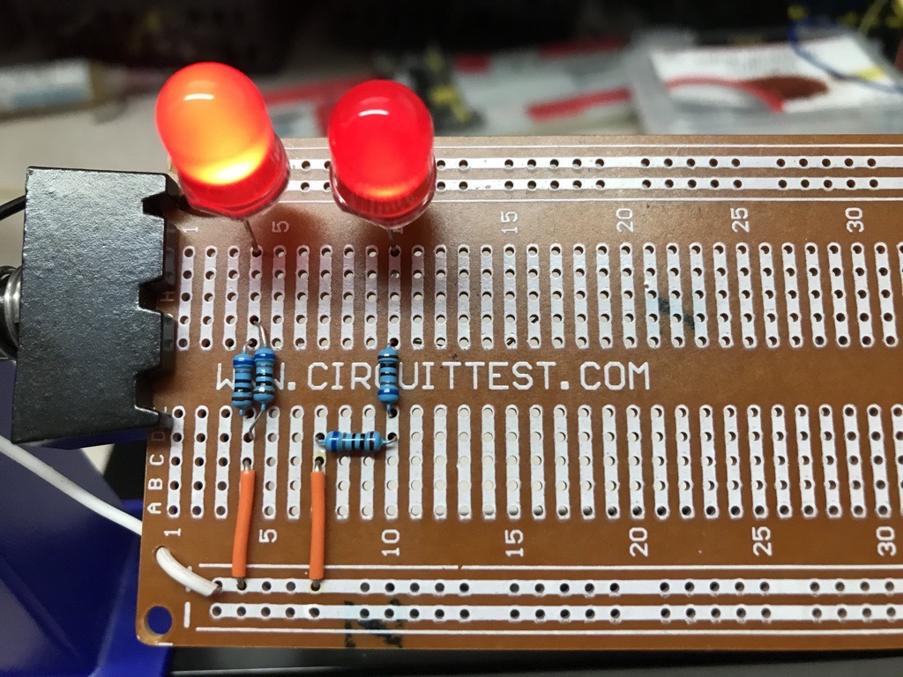
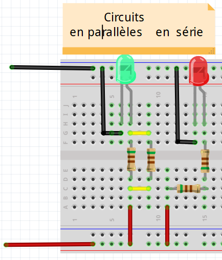
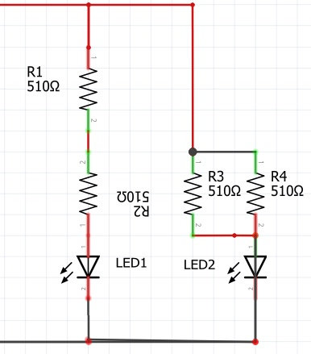

# Module 03 - Notions d'Électricité - Laboratoire #2 - Vive la résistance !

## Ce qui sera vu

- Assembler des circuits de résistances en série, en parallèle et en combinaison.
- Calculer puis mesurer la résistance équivalente de chaque montage.
- Mesurer le courant d'un circuit alimentant une DEL.
- Comparer les valeurs calculées et mesurées en tenant compte de la tolérance des composants.
- Relier un montage physique à son schéma électrique.

## Prérequis

- Avoir réalisé le laboratoire 1 ou maîtriser le réglage sécuritaire de l'alimentation et du multimètre.
- Appliquer la loi d'Ohm et calculer la résistance équivalente d'un circuit en série ou en parallèle.
- Reconnaître la polarité d'une DEL et vérifier un montage avant sa mise sous tension.
- Disposer du matériel indiqué dans la section de préparation.

(Auteur inconnu : image Facebook)

## Vue globale du montage final à la fin des exercices

La première image montre un circuit de résistances en série et en parallèle sur une plaquette soudée.

La deuxième image représente le montage que vous allez effectuer.
La troisième image représente le **schéma du montage** tel qu'il est documenté. 

Résistances soudées

Sur une plaquette d'expérimentation : 

Schéma de circuits  

## Préparation des prochains exercices

### Matériel

- Bloc d'alimentation variable et ses accessoires
- 1 multimètre et ses accessoires
- 1 carré de mousse
- 1 mini-plaquette d'expérimentation
- Ensemble de câbles connecteurs de couleurs et longueurs variées
- 4 résistances de 510 &#8486;
- 2 DEL rouges

### Calibration du bloc d'alimentation

- Rassemblez les pièces et fixez-les sur un carré de mousse
- Branchez les connecteurs "alligator" rouge et noir dans les fiches du bloc d'alimentation
- Tournez le bouton de tension au minimum
- Tournez le bouton de courant au minimum
- Branchez le bloc d'alimentation dans une prise du secteur
- Tournez le bouton de tension jusqu'à une valeur de 5 V.
- Court-circuitez les deux connecteurs, puis tournez le bouton du courant jusqu'à une valeur de 0,5 A (500 mA). **NE PAS DÉPASSER**
- Fermez l'alimentation
- Débranchez les deux connecteurs

## Exercice 1 - Circuit de résistances en série

### Étape 1 -  Assemblage du circuit

Dans cette étape, vous allez construire un circuit de résistances en série pour alimenter une DEL. Aidez-vous des images précédentes.

- Sur la plaquette d'expérimentation, construisez le circuit de deux résistances de 510 &#8486; branchées en série.
- Ajoutez une DEL rouge.

### Étape 2 - Mesure de la résistance

- Sur votre cahier de laboratoire, dessinez le **schéma du montage** et calculez la valeur de la résistance équivalente.

- Avec l'ohmmètre, mesurez la résistance totale des deux résistances. Notez cette valeur dans votre cahier de laboratoire.

- Obtenez-vous le même résultat?

### Étape 3 - Mesure du courant

- Sur votre cahier de laboratoire, calculez la valeur théorique du courant qui passe dans le circuit pour une tension de 5 Volts.

- Aidez-vous du laboratoire 1 pour brancher le multimètre en mode ampèremètre.

- Alimentez le circuit. Notez cette valeur dans votre cahier de laboratoire.
- Obtenez-vous le même résultat?

## Exercice 2 - Circuit de résistances en parallèle

### Étape 1 - Assemblage du circuit

Dans cette étape, vous allez construire un circuit avec 2 résistances en parallèle. Aidez-vous des images précédentes.

- Sur la plaquette d'expérimentation, construisez le circuit de deux résistances de 510 &#8486; branchées en parallèle.
- Ajoutez une DEL rouge.

### Étape 2 - Mesure de la résistance

- Sur votre cahier de laboratoire, dessinez le **schéma du montage** et calculez la valeur de la résistance équivalente.

- Avec l'ohmmètre, mesurez la résistance totale des deux résistances montées en parallèle. Notez cette valeur dans votre cahier de laboratoire.

- Obtenez-vous le même résultat?

### Étape 3 - Mesure du courant

- Sur votre cahier de laboratoire, calculez la valeur théorique du courant qui passe dans le circuit pour une tension d'alimentation de 5 Volts.

- Aidez-vous du laboratoire 1 pour brancher le multimètre en mode ampèremètre.

- Alimentez le circuit. Notez cette valeur dans votre cahier de laboratoire.
- Obtenez-vous le même résultat?

### Étape 4 - Discussion

- Comment expliquez-vous que l'éclairage des deux DEL soit si différent? Discutez-en en équipe. Auriez-vous pu le prévoir par le calcul?

Si oui, expliquez le cheminement.
