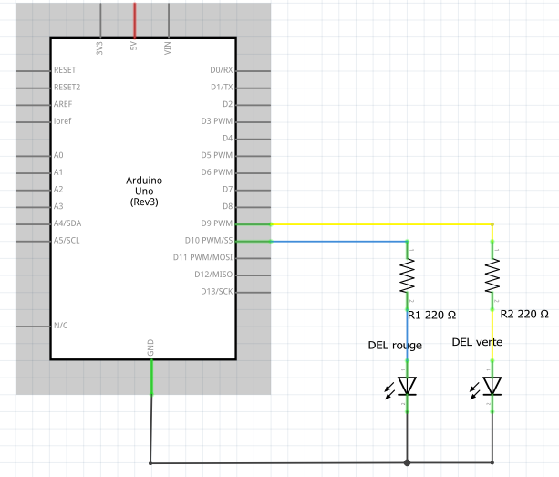
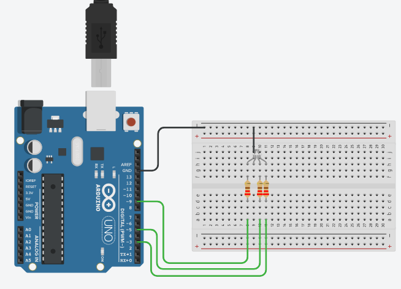

# Module 04 - Langage de programmation pour Arduino

NOTES:

- Utilisez le tapis de protection pour étaler les pièces nécessaires à chaque montage.
- Débranchez toujours l'alimentation avant de modifier un circuit.

## Exercice 1 - lecture à la console

### Objectif Sauvegarder des messages venant de la console

### Étape 1 : Branchement du circuit.

- Effectuez le montage en vous inspirant du schéma suivant.

    Représentation schématique

### Étape 2 : Programmation

- Codez le sketch *LireConsole.ino* qui lit un message provenant de la console et qui l'enregistre en mémoire. Un maximum de 5  messages doivent être conservés et affichés.

- Durant la boucle, si aucun texte est disponible à la console, la DEL verte est allumée.

- Lorsqu'un message est arrivé, la DEL rouge s'allume durant 1 seconde. Le message s'inscrit dans un tableau de 5 occurences.

- Si le message reçu est "Lire", tous les messages enregistrés sont affichés à l'écran de la console. Les messages sont effacés.

- Un temps d'attente de 3 secondes suivra  chaque séquence de lecture.

## Exercice 2 - Programmation de la classe Flasher

### Objectif Programmer la classe Flasher dans Arduino

### Étape 1 : Branchement du circuit

- Effectuez le montage en vous inspirant du schéma suivant.

    Représentation schématique

### Étape 2 : Programmation de la classe Flasher

- A l'aide d'un éditeur de texte, composez les fichiers Flasher.h et Flasher.cpp.
- Sauvegardez vos 2 fichiers.
- Ouvrez un nouveau sketch Arduino.
- Sauvegardez le sous le nom *MaFabuleuseAnimation.ino*.
-Prenez note du chemin de sauvegarde du sketch.
- Déplacez les fichiers Flasher.h et Flasher.cpp dans le même répertoire que le sketch.
- Sur le sketch, cliquez sur le menu Croquis--> Ajouter un fichier...
- Ajoutez le fichier Flasher.h
- Cliquez sur le menu Croquis--> Ajouter un fichier...
- Ajoutez le fichier Flasher.h
- Compilez et corrigez le code au besoin.

### Étape 3 : Tester la classe Flasher

- Testez votre code par quelques appels à la méthode FaireClignoter.
- Faites clignoter la DEL rouge 5 fois.
- Faites  clignoter la DEL verte 8 fois.
- Faites vos propres essais.

## Exercice 3 - Programmation de la classe RBVDEL

### Objectif Programmer l'affichage d'une DEL RGB

Dans cet exercice, vous allez utiliser les opérateurs de décalage de bits pour afficher diverses couleurs combinées sur la DEL RGB.

### Introduction

La DEL RGB est constituée de 4 broches.
Chacune des 3 broches principales alimente une DEL rouge, verte ou bleue intégrées dans l'ampoule.
La quatrième broche est reliée au ground
Chaque composante peut prendre une valeur pouvant varier entre 0 et 255 qui représente une teinte de la couleur.
La couleur apparente est la combinaison des valeurs injectées aux trois broches principales.

    
Valeurs des couleurs primaires

https://www.w3schools.com/colors/colors_picker.asp

### Étape 1 : Branchement du circuit

- Utilisez TinkecCad pour la simulation.
- Effectuez le montage en vous inspirant du schéma suivant.

    Représentation schématique

### Étape 2 : Programmation

Votre tâche consiste à créer une classe nommée RVBDEL et une méthode publique Afficher pour que la DEL reproduise diverses couleurs.

Au moment de la création d'une occurence de la classe, le constructeur fournit les numéros de 3 bornes branchées aux 3 broches qui alimentent la DEL RGB.

La méthode Afficher reçoit une valeur de type long en paramètre. Ce choix est imposé.
Cette valeur pourra être décomposée en 3 nombres pour déterminer la valeur à donner aux 3 bornes qui porduirons une illumination colorée.
DE PLUS, la méthode doit afficher ces 3 valeurs à la console.

-Avec TInkerCad, voici la structure de votre programme. Complétez le code.

    
Structure

// Début -- RVBDEL.h

class RVBDEL {

private:

// Lignes sautées

public:

// Lignes sautées

};

// Fin -- RVBDEL.h

// Début -- RVB.ino

// création d'une instance

void setup()

{

// Lignes sautées

}

void loop()

{

  // DemoRVB();

}

void DemoRVB() {

// exemple d'appels

// afficher la couleur PLEINE ROUGE

// afficher la couleur PLEINE BLEU

// afficher la couleur VIOLETTE

// Lignes sautées

}
// Fin -- RBV.ino

// Début -- RVBDEL.cpp

// Lignes sautées

}

## Exercice 4 - Programmation de la classe Affichage8DELs

### Objectif Programmer l'affichage de 8 DELs 

Dans cet exercice, vous allez utiliser les opérateurs de décalage de bits pour allumer un ou pluusieus DELs pour reproduire une donnée déclarée Byte;  chaque bit de la donnée correspond à une DEL.

Utilisez TinkecCad pour la simulation.

### Étape 1 : Branchement du circuit

- Utilisez TinkecCad pour la simulation.
- Effectuez le montage en vous inspirant du schéma suivant.

    Représentation schématique

TRUC pour faciliter le montage.
Pliez une des broches de la résistance légèrement plus longue que l'autre.
Écartez la broche + de la DEL pour l'insérer dans la planchette d'essais.

     Formes pliées

### Étape 2 : Programmation

Votre tâche consiste à créer une classe nommée Affichage8DELs et une méthode publique Afficher( Byte *nombre*).
Chaque bit du paramètre *nombre* correspond à la position d'une DEL du montage qui doit être allumée.

Au moment de la création d'une occurence de la classe, le constructeur fournit les numéros des 8 bornes branchées aux 8 DELs.

-Avec TInkerCad, voici la structure de votre programme. Complétez le code.

    
Structure

// Début -- Affichage8DELs.h

class Affichage8DELs {

// Lignes sautées

}

;

// Fin -- Affichage8DELs.h

// Début -- AllumerDELs.ino

// création d'une instance

void setup()

// Lignes sautées

{

  ;

}

void loop()

{

   // exemples de tests

  //Compter();  // compte de 0 à 255
  
  //GaucheDroite(); // affiche une seule DEL de droite a gauche et vice-versa
  
// Fin -- AllumerDELs.ino

// Debut de  Affichage8DELs.cpp {

// Lignes sautées

// fin de Affichage8DELs.cpp

}

## Exercice 5 - Programmation optionnelle de la classe Affichage8DELs

### Programmation

- Cette version du code utilise l'héritage pour permettre d'utiliser la classe avec un nombre de DELs pouvant varié de 2 à 8 (exercice 4)