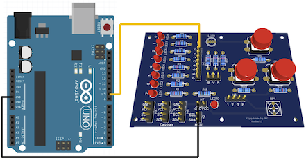
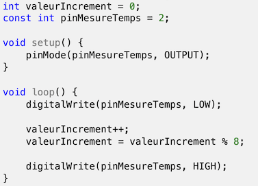
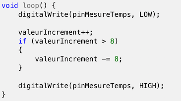
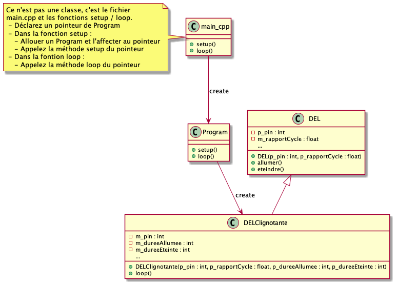

# Module 04 - Programmation des sorties

Objectifs :

- Comprendre la notion de modulation de largeur d'impulsions (PWM) : observation du signal, tension moyenne
- Détourner certains outils pour s'aider à comprendre notre code

## Exercice 1 - Observation du MLI

Les entrées/sorties numériques peuvent simuler une sortie analogique grâce à la technologie MLI. Vous allez observer les sorties des pins de l'arduino à l'oscilloscope.


### Objectif

Observer la MLI à l'oscilloscope. Mesurer les fréquences des E/S des pins supportant la MLI.

### Environnement et matériel

- Arduino UNO
- Coffret de pièces et outils
- Oscilloscope : un sonde

### Observations

- Sur votre Arduino, repérez les 6 bornes digitales qui permettent la MLI (Elles sont identifiées avec un ~)
- Démarrez un nouveau projet PIO. Nommez-le "AMOC_Module04_Observation_MLI"
- Écrivez un programme qui :
  - Configure ces 6 bornes en sorties
  - Envoi un signal carré avec un rapport cyclique de "127" sur chacune des bornes
- Compilez et téléversez le programme sur votre platine Arduino
- À l'aide de l'oscilloscope et de deux fils dupont male-male, un pour la borne GND et l'autre pour une des 6 bornes :
  - Calculez le temps en deux fronts montants :
    - Comptez le nombre de carreaux constituant une période et multipliez cette valeur par l'échelle horizontale que vous avez choisie
    - Validez en utilisant la mesure de l'oscilloscope :
      - Utilisez le bouton "Measure"
      - Sélectionnez "Time"
      - Validez que le type est "Period"
      - Appuyez sur le bouton "Add" : le temps s'affiche en bas à gauche ("Prd")
  - Déduisez-en la fréquence
  - Validez que le rapport cyclique est bien de 50% (temps haut)
  - Sur votre cahier de laboratoire, notez le numéro de la pin, le temps d'une période, le temps haut, le temps bas, ainsi que la fréquence observée
- Modifiez votre programme pour avoir un rapport cyclique de "191"  au niveau de la pin 10
- Validez ce qui a changé à l'affichage dans l'oscilloscope en recalculant le rapport de cycle

## Exercice 2 - Contrôle de l'intensité d'une DEL

### Objectif

Contrôler la luminosité d'une DEL avec la MLI.

### Environnement et matériel

- Arduino UNO
- La platine d'expérimentations que vous avez soudée
- Coffret de pièces et outils

### Directives

**Toujours étaler les articles sur le tapis de protection avant de débuter.**

### Montage du circuit si fait sur la platine d'essais

Représentation physique :



Représentation schématique :


- **AVANT d'alimenter votre circuit** :
  - Connectez la pin GND de votre arduino à la pin GND de votre platine d'expérimentation
  - Connectez la pin 9 de votre arduino à la pin 0 de votre platine d'expérimentations.

- Démarrez un nouveau projet PIO. Nommez-le "AMOC_Module04_VariationMLI"
- Écrivez un programme pour pour faire varier l'intensité de 0 à 255 avec un pas de 5 toute les 500ms
- Envoyez le programme sur votre Arduino
- Validez que l'intensité de la DEL varie

## Exercice 3 - Détournons nos outils de mesure pour observer le temps d'exécution

### Objectif

Observer le temps d'execution d'un code.

### Environnement et matériel

- Arduino UNO
- Coffret de pièces et outils
- Oscilloscope

### Observations

- Démarrez un nouveau projet PIO. Nommez-le "AMOC_Module04_Temps_dexecution"
- Tapez le code suivant dans la méthode loop :



- Téléverser le programme sur votre arduino et mesure le temps d'exécution d'un "tour de boucle" (i.e. d'appel de la fonction loop)
- Notez ce temps dans votre cahier de laboratoire
- Modifiez la fonction loop pour :



- Téléverser le programme sur votre arduino et mesure le temps d'exécution d'un "tour de boucle" (i.e. d'appel de la fonction loop)
- Notez ce temps dans votre cahier de laboratoire
- Écrivez votre hypothèse dans votre cahier de laboratoire

<details>
    <summary><b>Optimisation - Mesure plus proche de la réalité</b>(Optionnel)</summary>

Si vous voulez avoir un temps plus proche de votre code, vous pouvez optimiser le temps d'écriture sur le port de sortie en écrivant directement dans les registres plutôt qu'en passant par la fonction "digitalWrite" de la bibliothèque Arduino. Pour cela, vous pouvez utiliser les macros suivantes qui ont seulement besoin du numéro de la pin :

```cpp
#define etatHaut(pin) ((pin) < 8 ? PORTD |= (1 << (pin)) : PORTB |= (1 << (pin - 8)))
#define etatBas(pin) ((pin) < 8 ? PORTD &= ~(1 << (pin)) : PORTB &= ~(1 << (pin - 8)))
```

Vous pouvez même simplifier encore les macros en écrivant directement :

```cpp
#define debutCode (PORTD &= ~4)
#define finCode (PORTD |= 4)
```

</details>

## Exercice 4 - On évite les boucles

### Exercice 4.1 - On supprime la fonction delay

L'objectif est ici de faire clignoter une DEL sans utiliser la fonction "delay". Pour cela, observez la fonction "delay" :

```cpp
void delay(unsigned long ms)
{
	uint32_t start = micros();

	while (ms > 0) {
		yield();
		while ( ms > 0 && (micros() - start) >= 1000) {
			ms--;
			start += 1000;
		}
	}
}
```

La fonction yield peut-être complexe et permettre par exemple de lire sur un port série, s'occuper des connexions réseau, etc.

Pour l'arduino UNO, la fonction "yield" est définie comme suit (fichier "hooks.c") :

```cpp
void yield(void) __attribute__ ((weak, alias("__empty")));
```

Cette déclaration rend la définition non obligatoire ("weak").

Ce qui réduit la fonction à :

```cpp
void delay(unsigned long ms)
{
	uint32_t start = micros();

	while (ms > 0) {
		while ( ms > 0 && (micros() - start) >= 1000) {
			ms--;
			start += 1000;
		}
	}
}
```

- Sur votre cahier de laboratoire
  - Répondez aux questions suivantes :
    - Que fait la fonction micros ?
    - Il existe aussi une fonction millis. Quelle est sa fonction ?
    - Que représente la variable start ?
    - Que font les deux boucles ?
    - Que fait la fonction durant l'attente ?
    - Votre programme s'exécute directement par le MCU, il n'est pas géré par un système d'exploitation comme un ordinateur. D'après vous, pourquoi faut-il éviter d'utiliser cette fonction ?
  - Écrivez l'algorithme de cette fonction
- En s'inspirant de cette fonction et en considérant que la fonction "loop" est similaire à une boucle, on peut déduire le programme impératif suivant :

```cpp
unsigned long dureeActionMS = 0;
uint32_t dateDernierDecrementdureeActionUs = 0;
int etapeCycle = 0;
int dureeAllumee = 1000;  // ms
int dureeEteinte = 500;   // ms
void setup() {
  pinMode(LED_BUILTIN, OUTPUT);
  dateDernierDecrementdureeActionUs = micros();
}

void loop() {
  while (dureeActionMS > 0 && (micros() - dateDernierDecrementdureeActionUs) >= 1000) {
    dureeActionMS--;
    dateDernierDecrementdureeActionUs += 1000;
  }

  if (dureeActionMS == 0) {
    switch (etapeCycle) {
      case 0:  // allumer
        digitalWrite(LED_BUILTIN, HIGH);
        dureeActionMS = dureeAllumee;
        ++etapeCycle;
        break;
      case 1:  // éteindre
        digitalWrite(LED_BUILTIN, LOW);
        dureeActionMS = dureeEteinte;
        etapeCycle = 0;
      default:
        break;
    }
  }
}
```

- Testez ce code et validez son fonctionnement

### Exercice 4.2 - Classe DELClignotante

Dans cette partie, nous allons créer la classe "DELClignotante" qui aura pour responsabilité de gérer le clignotement d'une DEL sans perturber, outre quelques micro-secondes, le fonctionnement du programme principal. Plusieurs instances de cette classe peuvent exister dans un même programme. Le but à la fin est d'avoir deux DELs qui ont des temps de cycle différents.

- Récupérez votre classe DEL du module 02 et modifiez là pour qu'elle puisse prendre le MLI en charge
- Créez la classe "DELClignotante" qui hérite de la classe DEL et qui implante le code de l'exercice précédent dans les méthodes suivantes (Diagramme de classes ci-après) :
  - Constructeur d'initialisation :
    - prend en paramètre la pin de la DEL
    - prend en paramètre un rapport de cycle en % pour l'intensité de la DEL
    - prend en paramètre la durée où la DEL est allumée
    - prend en paramètre la durée où la DEL est éteinte
    - garde la configuration de rapport de cycle et les durées allumées / éteinte
  - "tick" : qui contrôle s'il faut changer d'étape dans le cycle courant : allumée ou éteinte
- Testez votre classe en créant :
  - Un pointeur global de DELClignotante (ie en dehors des fonctions setup et loop)
  - Dans la fonction setup, créez une instance de DELClignotante que vous affecterez à votre variable globale
  - Dans la fonction loop, appelez simplement la méthode loop de votre instance de DELClignotante
- Branchez maintenant votre arduino à votre platine d'expérimentation :
  - pin 10 de l'arduino sur la DEL 0 de votre platine
  - pin 11 de l'arduino sur la DEL 4 de votre platine
- À partir de votre classe Program, créez deux objets de type DELClignotante :
  - Le premier a une dureeAllumee = 500 et une dureeEteinte = 500
  - Le second a une dureeAllumee = 600 et une dureeEteinte = 600
- Ajoutez le code nécessaire pour faire fonctionner le clignotement (voir méthode loop de "DELClignotante")



Fin !
