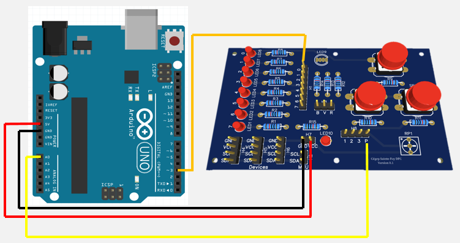
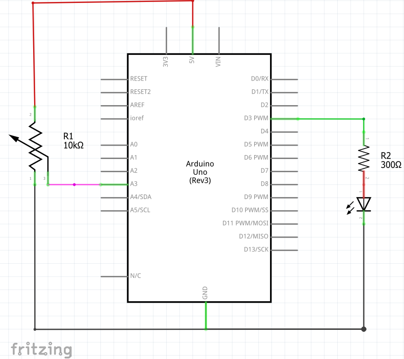
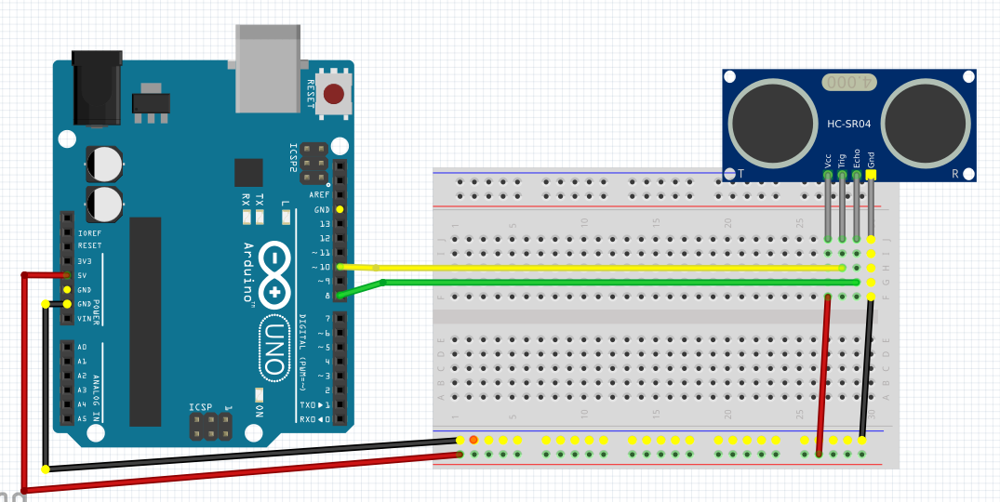
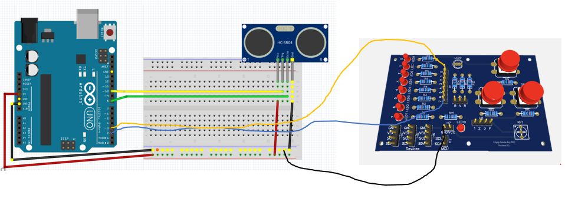
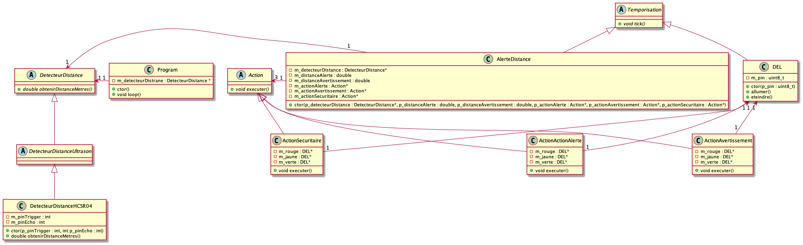

# Module 05 - Programmation de bornes analogiques

Pour l'ensemble de ces exercices, vous allez utiliser :

- Visual studio code avec PlatformIO
- Votre plaquette de développement Arduino UNO
- Votre plaquette d'expérimentation
- Votre détecteur à ultra-sons, modèle HC-SR04
- Fils de branchement
- Autres accessoires nécessaires
- De la patience ;)

## Préparation des fils

Chaque natte de votre ensemble est composé de 10 brins de fils de couleurs variées, débutant par noir et se terminant par brun. Séparez l'ensemble d'une natte en gardant collées les 2 premiers brins (noir et blanc) de l'ensemble ou les 2 derniers brins (rouge et brun).


Vous obtenez alors un doublet noir-blanc ou brun-rouge et 8 brins de couleurs variées. Ces derniers se brancheront sur les bornes des DELs de votre plaquette d'expérimentation pour simuler un octet.

Si vous avez choisi le couple noir-blanc, le blanc du doublet représente alors le fil d'alimentation VCC (5 V), normalement rouge ! Si vous avez choisi le couple rouge-brun, le brun du doubler représente alors le fil d'alimentation GND (0V), normalement noir.

Faire de même pour les 3 autres nattes reçues. Rangez soigneusement les nattes obtenues.

## Exercice 1 - Contrôle de la tension d'un potentiomètre en entrée - 30 mins

Dans cet exercice, nous allons brancher la plaquette d'expérimentation à la plaquette Arduino pour pouvoir afficher la tension selon différentes positions du pivot d'un potentiomètre.

Ensuite, nous allons faire varier l'intensité d'une DEL en fonction des différentes positions du pivot d'un potentiomètre.

### Exercice 1.1 - Branchement du potentiomètre à la plaquette Arduino - 5 mins

- Utilisez l'image suivante pour brancher le potentiomètre de votre plaquette d'expérimentation à votre plaquette Arduino.


- Utilisez le doublet noir-blanc ou brun-rouge pour l'alimentation, le noir/brun à la prise de terre  ``` GND ```, le blanc/rouge à l'alimentation ```"5 V"```. Dans ce cas-ci, le câblage  est de type  ```Mâle-Femelle```.
- Utilisez un fil volant approprié, de couleur différente, pour brancher la borne  ```"A0"``` au pivot  ```"P"``` du potentiomètre de votre carte d'expérimentation.

### Exercice 1.2 - Affichage de la tension du potentiomètre - 10 mins

- Créez le projet ```"AMOC_Module05_AfficherTension"``` pour afficher la valeurLue sur la borne ```"A0"``` et la valeur corrrespondante en Volts, lorsque vous tournez le pivot du potentiomètre entre 0 et 5 V.
- Tournez le pivot pour obtenir une valeur sensiblement égale à la moitié de sa course. Sur papier, notez les valeurs affichées à la console. Répétez cette lecture, pour obtenir une valeur sensiblement égale au 3/4 de sa course.
- Comment pouvez-vous affirmer que votre potentiomètre est de type linéaire et non logarithmique ?

<details>
    <summary>Réponse</summary>

   En collectant et traçant un graphique de plusieurs positions du pivot, le résultat donne une droite.

</details>

### Exercice 1.3 -  Contrôler l'éclairage d'une DEL - 10 mins

- Reliez un câble approprié entre la borne numérique ```"No 3"``` de votre plaquette Arduino et la borne ```"No 0"``` de votre plaquette d'expérimentation. Cette borne est en contact avec la ```"DEL No 8"```.



Et son schéma correspondant :



- Créez le projet ```"AMOC_Module05_FaireClignoterDEL"``` pour que la DEL augmente d'intensité (0 à max) lorsque vous tournez le pivot du potentiomètre entre 0 V et 5 V (Voir cours / exercices sur le MLI/PWM).
- Modifiez le programme pour effectuer l'opération inverse, c'est-â-dire que l'intensité diminue de max à 0 lorsque vous tournez le pivot du potentiomètre entre les positions minimales (1) et maximales (3).

### Exercice 1.4 (Optionnel) -  Le Pulsar

- Branchez un autre circuit de DEL entre la borne numérique ```"No 5"``` de votre plaquette Arduino et la borne ```"No 1"``` de votre plaquette d'expérimentation.
- Modifiez le programme pour que les 2 DELs agissent en opposition de phase, c'est-à-dire qu'une DEL augmente son intensité lorsque le pivot du potentiomètre passe de l'extrémité gauche à droite alors que l'autre diminue la sienne durant le même mouvement.

## Exercice 2 -  Éviter des collisions

Dans cet exercice, nous allons utiliser un détecteur de distance de modèle HC-SR04. Ce détecteur n'est pas soudé à la plaquette d'expérimentation. Il faudra donc utiliser la "Breadboard".

### Exercice 2.1  - Branchement - 10 mins

- Branchez le détecteur sonar sur la Breadboard. Servez-vous de l'image suivante pour vous aider.



- Utilisez le doublet noir-blanc ou brun-rouge pour l'alimentation, le noir/brun à la prise de terre  ``` GND ```, le blanc/rouge à l'alimentation ```"5 V"```. Dans ce cas-ci, le câblage  est de type  ```Mâle-Mâle```.
- Utilisez un fil volant pour relier la borne "trigger" à la borne no 10 de l'Arduino.
- Utilisez un fil volant de couleur différente pour relier la borne "echo" à la borne No 8 de l'Arduino.

### Exercice 2.2  - Mesures de distances - 10 mins

- Créez le projet ```"AMOC_Module05_AfficherDistance"``` pour afficher la distance qui sépare l'Arduino des obstacles à proximité.
- Utilisez un obstacle simple devant le détecteur pour afficher la distance qui le sépare de l'écran (en cm). Utilisez une règle pour calibrer l'équipement.

### Exercice 2.3 - Sigaux d'alertes - 15 mins

- Situations :
  - Quand l'obstacle est loin de l'Arduino, seule la DEL verte est allumée.
  - Quand l'obstacle est entre 4 et 8 cm de l'Arduino, seule la DEL jaune est allumée.
  - Quand l'obstacle est à moins de 4 cm de l'Arduino, seule la DEL rouge est allumée.
- Complétez le branchement en intégrant trois DELs de votre plaquette d'expérimentation à l'Arduino, une rouge, une jaune et une verte. N'oubliez pas d'ajouter un fil de prise de terre entre les équipements. Relier la breadboard à la prise GND de la plaquette d'expérimentation fait bien l'affaire.



Vues avec le logiciel Fritzing pour 2 DELs. N'oubliez pas d'ajouter la DEL jaune.


Composez le projet ```"AMOC_Module05_SignalerDanger"``` pour respecter les trois conditions illustrées dans les vidéos de l'exercice :

- la DEL verte est allumée en situation sécuritaire: 8 cm et +, les autres DELs sont éteintes.
- la DEL jaune est allumée en situation de danger : entre 4 cm et 8 cm, les autres DELs sont éteintes.
- la DEL rouge est allumée en situation extrême de danger: moins de 4 cm, les autres DELs sont éteintes.

### Exercice 2.4 - Même si ce n'est pas l'objet principal, on programme avec classe - 60 mins

Soit le diagramme de classes suivant :



- Écrivez la classe "Program". Pour le moment vous ne pourrez pas écrire le code du constructeur ni de la méthode "loop". Le constructeur contiendra toutes les configurations que l'on trouve normalement dans la fonction "setup". La méthode "loop" contient toutes les instructions que l'on trouve normalement dans la fonction "loop"
- Dans le fichier "main.cpp" :
  - Déclarez la variable globale "program" de type pointeur de "Program"
  - Dans la fonction "setup", créez un objet de type "Program" et affectez son adresse au pointeur précédemment créé
  - Dans la fonction "loop", appelez la méthode "loop" de l'objet pointé par "program"
- Écrivez la classe abstraite "Tache". Elle déclare simplement la méthode "tick" qui doit être redéfinie par ses classes filles. Cette méthode doit être exécutée à chaque fois que l'on peut, soit dans la méthode loop de la classe "Program"
- Écrivez la classe "DEL", ainsi que ses méthodes. La fonction "pinMode" est appelée dans le constructeur de cette classe.
- Dans la classe "Program", créez trois pointeurs de "DEL", un pour chaque couleur. Ces objets sont créés dans le constructeur de "Program". Les pins sont conservées dans des constantes appartenant au même fichier.
- Créez les classes "DetecteurDistance" et "DetecteurDistanceUltrason" (Ces classes étant abstraites, elles ne contiennent rien mise à part des déclarations)
- Créez la classe "DetecteurDistanceHCSR04". Implantez le constructeur ainsi que la méthode "obtenirDistanceMetres"
- Créez la classe abtraite "Action".
- Créez les classes "ActionAlerte", "ActionAvertissement" et "ActionSecuritaire", qui prennent trois DELs dans leurs constructeurs d'initialisation et qui active/désactive les DELs dans la méthode "executer" suivant le type d'action.
- Créez la classe "AlerteDistance" : 
  - Le constructeur d'initialisation prend en paramètres :
    - Un detecteur de distance
    - Les distances d'alerte et d'avertissement en paramètres
    - Les actions à effectuer suivant les cas alerte, avertissement et sécuritaire
  - La méthode "tick" :
    - Lit la distance actuelle
    - Suivant les distances, elle déclanche l'action adéquat.
- Modifiez la classe "Program"
  - Dans le constructeur, ajoutez l'initialisation du port série
  - Toujours dans le constructeur, créez un objet de type "AlerteDistance" et gardez le dans vos données membres (pour cela, vous devez créer 3 DELs, les 3 actions qui ont besoin des 3 DELs, un détecteur de distance)
  - Dans la méthode "loop", vous devez appeler la méthode "tick" de l'objet de type "AlerteDistance" que vous avez créé dans le constructeur

<details>
    <summary>Débogage #1</summary>

Validez que le détecteur de distance fonctionne bien en remplaçant le code de votre méthode "loop" de la classe "Program" par :

```cpp
Serial.println("Distance : " + String(this->m_detecteurDistance->obtenirDistanceMetres()) + " m");
delay(200);
```

</details>
