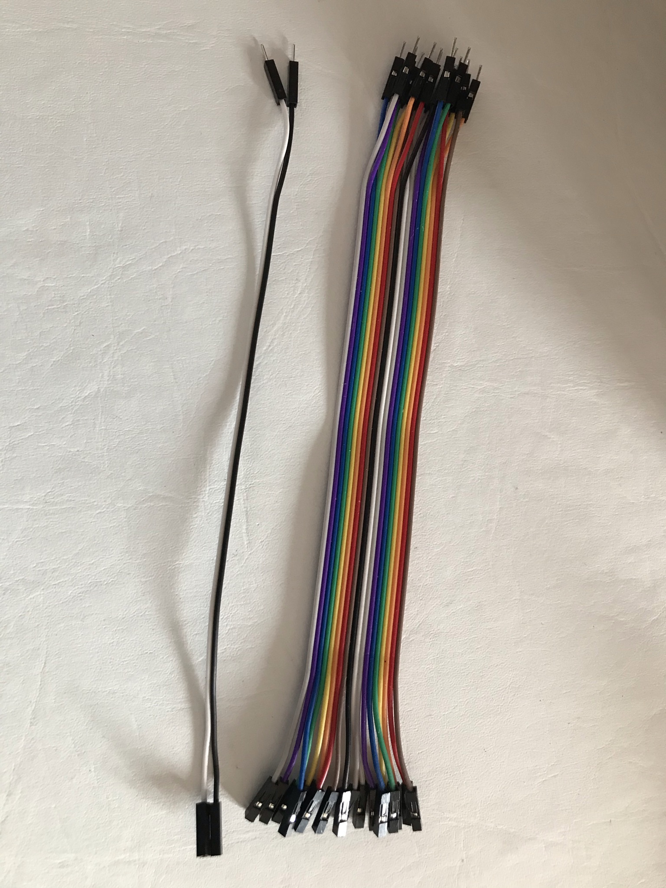
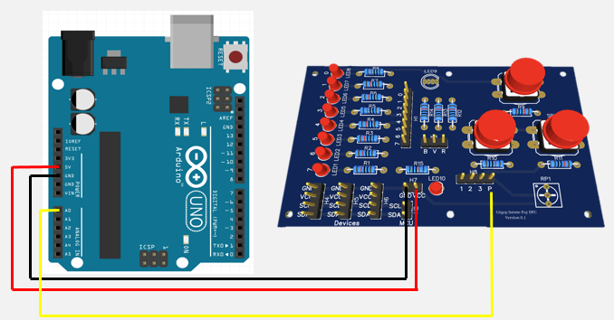
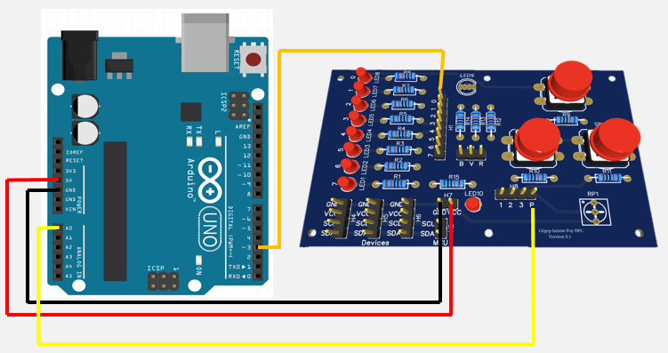
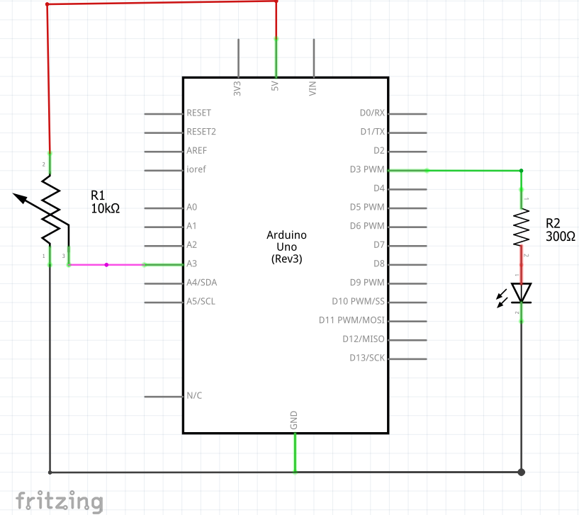
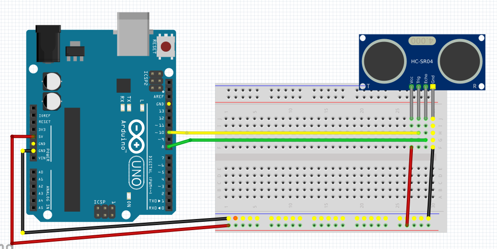
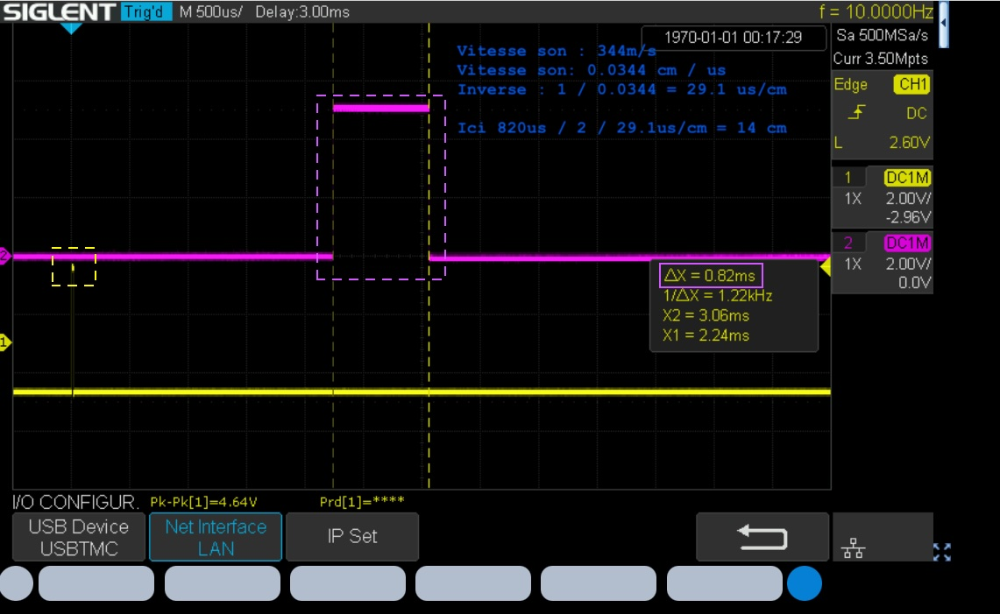
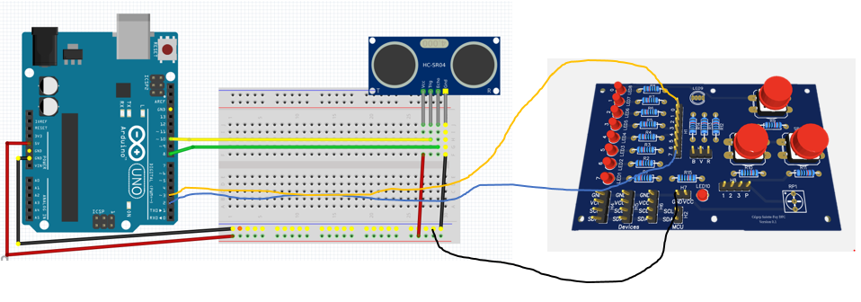
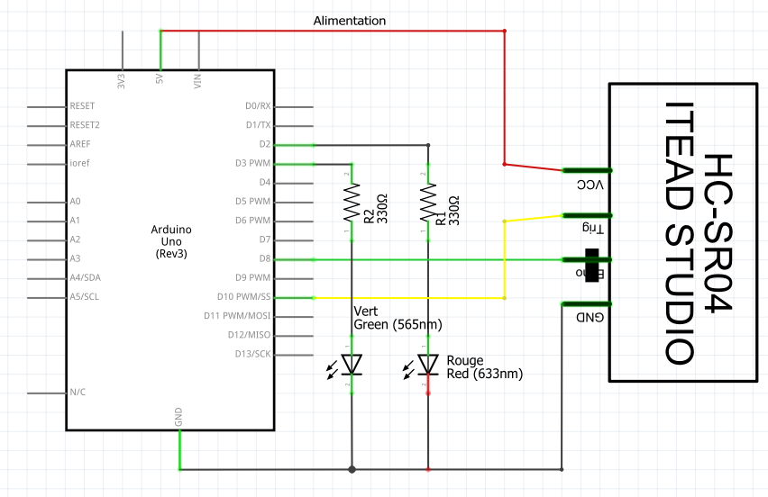
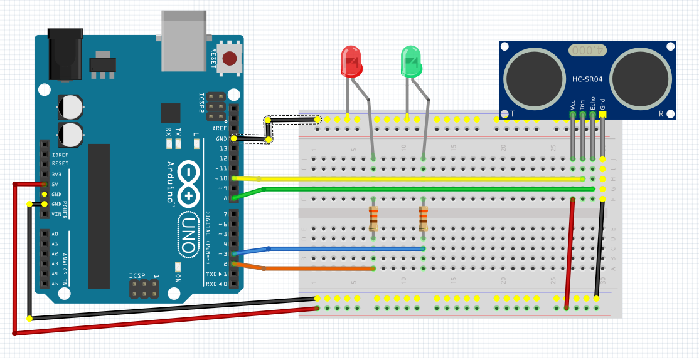
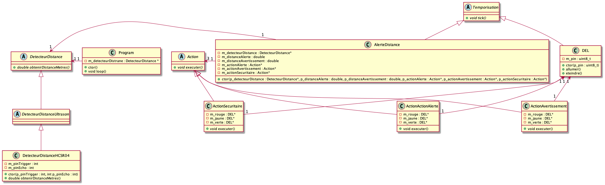

# Module 05 - Programmation de bornes analogiques

## Ce qui sera vu

- Lire la valeur d'un potentiomètre avec une entrée analogique et la convertir en tension.
- Utiliser cette mesure pour commander l'intensité d'une DEL.
- Déclencher et lire un capteur ultrasonique HC-SR04 afin d'estimer une distance.
- Produire des signaux d'alerte selon la distance mesurée.
- En extension, encapsuler différents détecteurs et signaux dans des classes C++.

## Prérequis

- Savoir créer, compiler et téléverser un projet PlatformIO sur Arduino UNO.
- Connaître les variables, les fonctions, les conditions et les classes C++ simples; utiliser la remédiation du module 02 au besoin.
- Connaître les notions de tension et de durée d'impulsion vues au module 03.
- Savoir commander une DEL avec la PWM comme au module 04.
- Disposer de la carte Arduino, de la plaquette d'expérimentation, du potentiomètre et du capteur HC-SR04.

Pour l'ensemble de ces exercices, vous allez utiliser :

- Visual Studio Code avec PlatformIO
- Votre plaquette de développement Arduino UNO
- Votre plaquette d'expérimentation
- Votre détecteur à ultra-sons, modèle HC-SR04
- Fils de branchement
- Autres accessoires nécessaires
- De la patience ;)

## Préparation des fils

Chaque natte est composée de 10 brins de couleurs variées, commençant par le noir et se terminant par le brun. Séparez une natte en conservant ensemble les deux premiers brins (noir et blanc) ou les deux derniers (rouge et brun).



Vous obtenez alors un doublet noir-blanc ou brun-rouge et huit brins de couleurs variées. Ces derniers se brancheront sur les bornes des DEL de votre plaquette d'expérimentation pour simuler un octet.

Si vous avez choisi le couple noir-blanc, le fil blanc représente l'alimentation VCC (5 V), normalement rouge. Si vous avez choisi le couple rouge-brun, le fil brun représente la masse GND (0 V), normalement noire.

Faire de même pour les 3 autres nattes reçues. Rangez soigneusement les nattes obtenues.

## Exercice 1 - Contrôle de la tension d'un potentiomètre en entrée - 30 min

Dans cet exercice, nous allons brancher la plaquette d'expérimentation à la plaquette Arduino pour pouvoir afficher la tension selon différentes positions du pivot d'un potentiomètre.

Ensuite, nous allons faire varier l'intensité d'une DEL en fonction des différentes positions du pivot d'un potentiomètre.

### Exercice 1.1 - Branchement du potentiomètre à la plaquette Arduino - 5 min

- Utilisez l'image suivante pour brancher le potentiomètre de votre plaquette d'expérimentation à votre plaquette Arduino.



- Utilisez le doublet noir-blanc ou brun-rouge pour l'alimentation, le noir/brun à la prise de terre  ``` GND ```, le blanc/rouge à l'alimentation ```"5 V"```. Dans ce cas-ci, le câblage  est de type  ```Mâle-Femelle```.
- Utilisez un fil volant approprié, de couleur différente, pour brancher la borne  ```"A0"``` au pivot  ```"P"``` du potentiomètre de votre carte d'expérimentation.

### Exercice 1.2 - Affichage de la tension du potentiomètre - 10 min

- Créez le projet `AMOC_Module05_AfficherTension` pour afficher la valeur lue sur la borne `A0` et la tension correspondante en volts lorsque vous tournez le potentiomètre entre 0 et 5 V.
- Tournez le pivot pour obtenir une valeur sensiblement égale à la moitié de sa course. Sur papier, notez les valeurs affichées à la console. Répétez cette lecture, pour obtenir une valeur sensiblement égale au 3/4 de sa course.
- Comment pouvez-vous affirmer que votre potentiomètre est de type linéaire et non logarithmique ?

<details>
    <summary>Réponse</summary>

   En collectant et traçant un graphique de plusieurs positions du pivot, le résultat donne une droite.

</details>

### Exercice 1.3 - Contrôler l'éclairage d'une DEL - 10 min

- Reliez un câble approprié entre la borne numérique ```"No 3"``` de votre plaquette Arduino et la borne ```"No 0"``` de votre plaquette d'expérimentation. Cette borne est en contact avec la ```"DEL No 8"```.



Et son schéma correspondant :



- Créez le projet ```"AMOC_Module05_FaireClignoterDEL"``` pour que la DEL augmente d'intensité (0 à max) lorsque vous tournez le pivot du potentiomètre entre 0 V et 5 V (Voir cours / exercices sur le MLI/PWM).
- Modifiez le programme pour effectuer l'opération inverse, c'est-â-dire que l'intensité diminue de max à 0 lorsque vous tournez le pivot du potentiomètre entre les positions minimales (1) et maximales (3).

### Exercice 1.4 (Optionnel) -  Le Pulsar

- Branchez un autre circuit de DEL entre la borne numérique ```"No 5"``` de votre plaquette Arduino et la borne ```"No 1"``` de votre plaquette d'expérimentation.
- Modifiez le programme pour que les deux DEL agissent en opposition : lorsqu'une DEL augmente d'intensité pendant la rotation du potentiomètre, l'autre diminue.

## Exercice 2 -  Éviter des collisions

Dans cet exercice, nous allons utiliser un détecteur de distance HC-SR04. Ce détecteur n'est pas soudé à la plaquette d'expérimentation; il faudra donc utiliser une plaquette d'essai.

### Exercice 2.1 - Branchement - 10 min

- Branchez le détecteur sonar sur la plaquette d'essai. Servez-vous de l'image suivante pour vous aider.



- Utilisez le doublet noir-blanc ou brun-rouge pour l'alimentation, le noir/brun à la prise de terre  ``` GND ```, le blanc/rouge à l'alimentation ```"5 V"```. Dans ce cas-ci, le câblage  est de type  ```Mâle-Mâle```.
- Utilisez un fil volant pour relier la borne "trigger" à la borne no 10 de l'Arduino.
- Utilisez un fil volant de couleur différente pour relier la borne "echo" à la borne No 8 de l'Arduino.

### Exercice 2.2 - Mesure des distances - 10 min

- Créez le projet ```"AMOC_Module05_AfficherDistance"``` pour afficher la distance qui sépare l'Arduino des obstacles à proximité.
- Utilisez un obstacle simple devant le détecteur pour afficher la distance qui le sépare de l'écran (en cm). Utilisez une règle pour calibrer l'équipement.

L'observation à l'oscilloscope des différents signaux, trigger en jaune, echo en rose, montre comment cela fonctionne au niveau des E/S. Le calcul est aussi détaillé sur l'image (Comment trouver la formule + un exemple) :



### Exercice 2.3 - Signaux d'alerte - 15 min

- Situations :
  - Quand l'obstacle est loin de l'Arduino, seule la DEL verte est allumée.
  - Quand l'obstacle est entre 4 et 8 cm de l'Arduino, seule la DEL jaune est allumée.
  - Quand l'obstacle est à moins de 4 cm de l'Arduino, seule la DEL rouge est allumée.
- Complétez le branchement en reliant à l'Arduino trois DEL de votre plaquette d'expérimentation : une rouge, une jaune et une verte. N'oubliez pas de relier les masses des équipements. Relier la plaquette d'essai à la borne GND de la plaquette d'expérimentation convient.



Vues réalisées avec Fritzing pour deux DEL. N'oubliez pas d'ajouter la DEL jaune.





Composez le projet ```"AMOC_Module05_SignalerDanger"``` pour respecter les trois conditions illustrées dans les vidéos de l'exercice :

- La DEL verte est allumée lorsque la distance est supérieure ou égale à 8 cm; les autres DEL sont éteintes.
- La DEL jaune est allumée lorsque la distance se situe entre 4 et 8 cm; les autres DEL sont éteintes.
- La DEL rouge est allumée lorsque la distance est inférieure à 4 cm; les autres DEL sont éteintes.

### Exercice 2.4 - Même si ce n'est pas l'objet principal, on programme avec classe - 60 min

Soit le diagramme de classes suivant :



- Écrivez la classe `Program`. Pour le moment, vous ne pourrez pas écrire le constructeur ni la méthode `loop`. Le constructeur contiendra les configurations normalement placées dans `setup`, et la méthode `loop` contiendra les instructions de la boucle principale.
- Dans le fichier "main.cpp" :
  - Déclarez la variable globale "program" de type pointeur de "Program"
  - Dans la fonction "setup", créez un objet de type "Program" et affectez son adresse au pointeur précédemment créé
  - Dans la fonction "loop", appelez la méthode "loop" de l'objet pointé par "program"
- Écrivez la classe abstraite "Tache". Elle déclare simplement la méthode "tick" qui doit être redéfinie par ses classes filles. Cette méthode doit être exécutée à chaque fois que l'on peut, soit dans la méthode loop de la classe "Program"
- Écrivez la classe "DEL", ainsi que ses méthodes. La fonction "pinMode" est appelée dans le constructeur de cette classe.
- Dans la classe `Program`, créez trois pointeurs de `DEL`, un pour chaque couleur. Ces objets sont créés dans le constructeur de `Program`. Les numéros de broches sont conservés dans des constantes du même fichier.
- Créez les classes "DetecteurDistance" et "DetecteurDistanceUltrason" (Ces classes étant abstraites, elles ne contiennent rien mise à part des déclarations)
- Créez la classe "DetecteurDistanceHCSR04". Implantez le constructeur ainsi que la méthode "obtenirDistanceMetres"
- Créez la classe abstraite `Action`.
- Créez les classes `ActionAlerte`, `ActionAvertissement` et `ActionSecuritaire`, qui reçoivent trois DEL dans leur constructeur et les activent ou les désactivent dans la méthode `executer`, selon le type d'action.
- Créez la classe "AlerteDistance" : 
  - Le constructeur d'initialisation prend en paramètres :
    - Un detecteur de distance
    - Les distances d'alerte et d'avertissement en paramètres
    - Les actions à effectuer suivant les cas alerte, avertissement et sécuritaire
  - La méthode "tick" :
    - Lit la distance actuelle
    - Selon la distance, elle déclenche l'action adéquate.
- Modifiez la classe "Program"
  - Dans le constructeur, ajoutez l'initialisation du port série
  - Toujours dans le constructeur, créez un objet de type `AlerteDistance` et conservez-le dans les données membres. Vous devez pour cela créer trois DEL, les trois actions correspondantes et un détecteur de distance.
  - Dans la méthode "loop", vous devez appeler la méthode "tick" de l'objet de type "AlerteDistance" que vous avez créé dans le constructeur

<details>
    <summary>Débogage #1</summary>

Validez que le détecteur de distance fonctionne bien en remplaçant le code de votre méthode "loop" de la classe "Program" par :

```cpp
Serial.println("Distance : " + String(this->m_detecteurDistance->obtenirDistanceMetres()) + " m");
delay(200);
```

</details>

### Contributions étudiantes

- Jérémy Corbeil de la cohorte d'hiver 2025, accompagné d'Anthony Mc-Gee-Cloutier, nous a fabriqué un [thérémine](https://fr.wikipedia.org/wiki/Thérémine).


<details><summary>Voici son code</summary>

```cpp
// Jérémy Corbeil - Hiver 2025
#include <Arduino.h>

const int borneTrigger = 10;
const int borneEcho = 8;
float cm;
long duree, pouces;
int distance;

int freqID;

const float maxHeight = 35;
const float frequences[] = {130.9f, 146.8f, 164.8f, 174.6f, 196.0f, 220.0f, 246.9f, 261.6f};

const int borneSon = 3;

void setup() {
  Serial.begin(9600);
  Serial.println("démarrage de la console");
  pinMode(borneEcho, INPUT);
  pinMode(borneTrigger, OUTPUT);
  pinMode(borneSon, OUTPUT);
}

void loop() {
  digitalWrite(borneTrigger, LOW);
  delayMicroseconds(2000);
  digitalWrite(borneTrigger, HIGH);
  delayMicroseconds(2000);
  digitalWrite(borneTrigger, LOW);
  duree = pulseIn(borneEcho, HIGH);
  cm = (duree/2)/29.1;
  Serial.print(cm);
  Serial.println(" cm");

  freqID = cm / maxHeight * 8;
  Serial.print(freqID);
  Serial.println(" ");

  if (freqID < 9) {
    tone(borneSon, frequences[freqID]);
  } else {
    noTone(borneSon);
  }
}
```
    
</details>
