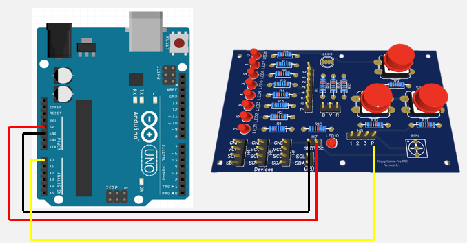

préalable installer tinker ()
et fritzing beta 
image branchement(1) Plaquette pot et alim.
image  branchement(2) Plaquette pot DEL  et alim

potentiometre avec sortie en console
 a) afficher résultat
b) convertir le code d'affichage avec la fonction AfficherTension
 (tension et valeurLue)
potentiometre avec DEL en sortie
  variation de 0-5V éclairage croissant
  inversion éclairage décroissant
  ajouter l'affichage de tension

nous désirons obtenir un éclairage de 75 % Quelle est la tension du POT pour cela

HC-SR04
1) branchement sur breadboard (IMAGE1)
IMAGE 2 LIAISON TRIGGER AVEC Fritzing
2)  reproduire le programme

3) branchement de 1 del sur borne 8
 ajouter del selon image 2
4) programmer affichage 
5) programmer l'affichage Alerte: - de 4 cm. clignotement rouge aux 500 mS, 
- de 8 cm allumer la del rouge,
autrea cas del verte

------------------

-------------------

# Module 05 - Programmation de bornes analogiques

Pour l'ensemble de ces exercices, vous allez utiliser :

- Visual studio code avec PlatformIO
- Votre plaquette de développement Arduino UNO
- Votre plaquette d'expérimentation
- Votre détecteur à ultra-sons, modèle HC-SR04
- Fils de branchement 
- autres accessoires nécessaires 
- De la patience ;)

## Préparation des fils

Chaque natte de votre ensemble est composé de 10 brins de fils de couleurs variées, débutant par Noir et se terminant par Brun. Séparez l'ensemble d'une natte en gardant collées les 2 premiers brins (Noir et blanc) de l'ensemble. Vous obtenez alors un doublet Noir-Blanc et 8 brins de couleurs variées. Ces derniers se brancheront sur les bornes des Dels de votre plaquette d'expérimentation pour simuler un octet.
Le Blanc du doublet Noir-Blanc représente alors le fil d'alimentation, 5 V, normalement rouge!
- Faire de même pour les 3 autres nattes. Rangez soigneusement les nattes obtenues. 

## Exercice 1 - Contrôle de la tension d'un potentiomètre en entrée

Dans cet exercice, nous allons brancher la plaquette d'expérimentation à la plaquette Arduino pour pouvoir afficher la tension selon différentes positions du pivot d'un potentiomètre.

Ensuite, nous allons faire varier l'intensité d'une DEL en fonction des différentes positions du pivot d'un potentiomètre.

### Exercice 1.1 - Branchement du potentiomètre à la plaquette Arduino

- Utilisez l'image suivante pour brancher le potentiomètre de votre plaquette d'expérimentation à votre plaquette Arduino.
- Utilisez le doublet Noir-Blanc pour l'alimentation, le noir à la prise de terre  ``` GND ```, le blanc à l'alimentation ```"5 V"```. Dans ce cas-ci, le câblage  est de type  ```Mâle-Femelle```.
- Utilisez un fil volant approprié, de couleur différente, pour brancher la borne  ```"A0"``` au pivot  ```"P"``` du potentiomètre de votre carte d'expérimentation.


### Exercice 1.2 - Affichage de la tension du potentiomètre

- Composez le programme ```"AfficherTension.ino"``` pour afficher la valeurLue sur la borne ```"A0"``` et la valeur corrrespondante en Volts, lorsque vous tournez le pivot du potentiomètre entre 0 et 5 V.

- Tournez le pivot pour obtenir une valeur sensiblement égale à la moitié de sa course. Sur papier, notez les valeurs affichées à la console. Répétez cette lecture, pour obtenir une valeur sensiblement égale au 3/4 de sa course.
- Comment pouvez-vous affirmer que votre potentiomètre est de type linéaire et non logarithmique?
<details>
    <summary>Réponse</summary>

   En collectant et traçant un graphique de plusieurs positions du pivot, le résultat donne une droite.

</details

### Exercice 1.3 -  Contrôler l'éclairage d'une DEL

- Reliez un câble approprié entre la borne numérique ```"No 3"``` de votre plaquette Arduino et la borne ```"No 0"``` de votre plaquette d'expérimentation. Cette bonre est en contact avec la ```"DEL No 8"```. 


- Composez le programme ```"FaireClignoterDEL.ino"``` pour que la DEL augmente d'intensité (0 à max) lorsque vous tournez le pivot du potentiomètre entre 0 V et 5 V.
- Modifiez le programme pour efffectue l'opération inverse, c'est-â-dire que l'intensité diminue de max à 0 lorsque vous tournez le pivot du potentiomètre entre les positions minimales (1) et maximales (3). 

### Exercice 1.4 (optionnel) -  Le Pulsar

- Branchez un autre circuit de DEL entre la borne numérique ```"No 5"``` de votre plaquette Arduino et la borne ```"No 1"``` de votre plaquette d'expérimentation.

- Modifiez le programme que les 2 DELs agissent en opposition de phase, c'est-à-dire qu'une DEL augmente son intensité lorsque le pivot du potentiomètre passe de l'extrémité gauche à droite alors  que l'autre diminue la sienne durant le même mouvement.

## Exercice 2 -  Éviter des collisions

Dans cet exercice, nous allons utiliser  un détecteur sonar de modèle HC-SR04. Ce détecteur n'est pas soudé à la plaquette d'expérimentation. Il faudra donc utiliser la "Breadboard".

### Exercice 2.1  - Branchement

-Branchez le détecteur sonar sur la Brreadboard. Servez-vous de l'image suivante pour vous aider.


-Utilisez le doublet Noir-Blanc pour l'alimentation, le noir à la prise de terre  ``` GND ```, le blanc à l'alimentation ```"5 V"```. Dans ce cas-ci, le câblage  est de type  ```Mâle-Mâle```.
-Utilisez un fil volant pour relier la borne "triger" à la borne No 10 de l'Arduino.
-Utilisez un fil volant de couleur différente pour relier la borne "echo" à la borne No 8 de l'Arduino.

### Exercice 2.2  - Mesures de distances

- Composez le programme ```"AfficherDistance.ino"``` pour afficher la distance qui sépare l'Arduino des obstacles à proximité.

- Utilisez un obstacle simple devant le sonar pour afficher la distance qui le sépare de l'écran (en cm). Utilisez une règle pour calibrer l'équipement.

- Ajouter du code pour afficher aussi la distance en pouces.

### Exercice 2.3  - Sigaux d'alertes

Les trois vidéos présentés sur GitHub résument le prochain exercice.
Quand l'obstacle est loin de l'Arduino, la DEL verte est allumée.
Quand l'obstacle est à moins de 8 cm de l'Arduino, la DEL rouge est allumée, la verte s'éteind.
Quand l'obstacle est à moins de 4 cm de l'Arduino, la DEL rouge clignote aux 0,5 secomdes.

- Complétez le branchement en intégrant deux DELs de votre plaquette d'expérimentation à l'Arduino, une rouge et une verte. N'oubliez pas d'ajouter un fil de prise de terre entre les équipements: relier la breadboard à la prise GND de la plaquette d'expérimentation fait bien l'affaire.


- Composez le programme ```"SignalerDanger.ino"``` pour respecter les trois conditions illustrées dans les vidéos de l'exercice.