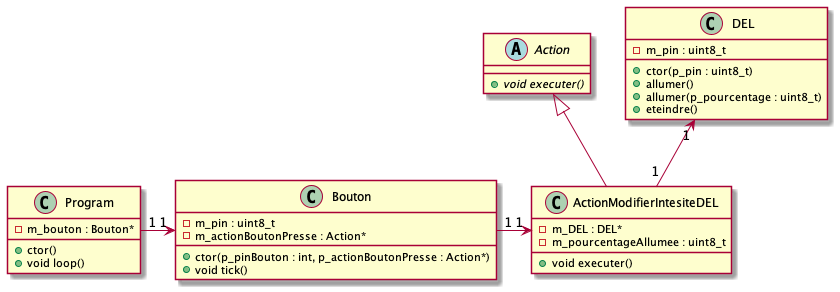

# Module 06 - Programmation des entrées numériques 2 / 2

Pour l'ensemble de ces exercices, vous allez utiliser :

- Visual studio code avec PlatformIO
- Votre plaquette de développement Arduino UNO
- Ou votre plaquette d'expérimentation
- Fils de branchement
- Autres accessoires nécessaires
- De la patience ;)

## Exercice 1 - Bouton poussoir avec Pull-up

Dans ce montage, le bouton poussoir sera alimenté par la borne no 2, la DEL sera alimentée par la borne no 10.

### Étape 1 - Montage du circuit

- Effectuez le montage en vous inspirant du schéma suivant.

Ou :

    
Explicitation du câblage de la plaquette d'expérimentation

### Étape 2 - Programmation

- Codez le projet "AMOC_Module06_ProgrammationEntreesNumeriques_Gradateur" : à chaque pression du bouton, la DEL passe d'un état allumé à éteint et inversement.
- Modifiez le programme pour que la DEL changent d'intensité de 25 % à chaque fois qu'on appuie sur le bouton. Après 4 appuis successifs, l'intensité doit s'inverser de 25 % et ainsi de suite.

    
Indice intensité

Retournez voir [le module 4 sur les sorties au niveau de la section sur le MLI (PWM)](../Module04_ProgrammationSorties/Module04_ProgrammationSorties_Exercices.md).

### Étape 3 - Ajout d'un deuxième bouton (Optionnel, i.e. une fois que les tous les autres exercices sont terminés)

- Ajoutez un nouveau bouton qui permet de lire les pressions sur la borne 4.
- Modifiez votre programme pour que la luminosité diminue par pas de 25 % en cas de pression sur le bouton de la borne 2 et augment de 25 % en cas de pression sur le bouton de la borne 4.

## Exercice 2 - On va faire plus classe !

- Écrivez la classe abstraite "Action"
- Écrivez la classe "DEL"
- Écrivez la classe "Bouton"
- Écrivez la classe "Program"
- Testez votre code !

## Exercice 3 - Le multi-tâche, c'est simplement faire une partie de chaque tâche à tour de rôle !

- Créez le projet "AMOC_Module06_ProgrammationEntreesNumeriques_DEL_MultiFrequence"
- Dessinez sur un circuit sur un schéma qui permet de contrôler deux DELs à partir d'un Arduino UNO
- Montez votre circuit en utilisant votre plaquette d'expérimentation ou votre breadboard
- Codez une version procédurale (non objet) qui permet de faire clignoter les deux DELs à des fréquences différentes :
  - DEL1 : 300ms allumée / 300ms éteinte
  - DEL2 : 500ms allumée / 500ms éteinte

## Exercice 4 - Le multi-tâche, c'est simplement faire une partie de chaque tâche à tour de rôle !

- Réouvrez le projet "AMOC_Module06_ProgrammationEntreesNumeriques_Gradateur"
- Modifiez la classe "DEL" afin qu'elle implante une nouvelle méthode qui permet de faire clignoter une DEL. La méthode doit prendre en paramètres le temps où la DEL est allumée et le temps où la DEL est éteinte.
- Modifiez la classe "Program" ainsi que les autres classes nécessaires afin que la pression sur le bouton fasse clignoter une DEL de votre choix avec un temps dépendant de l'intensité sélectionnée :
  - 0% : DEL allumée
  - 25% : DEL allumée 250ms, DEL éteinte 250ms
  - 50% : DEL allumée 500ms, DEL éteinte 500ms
  - 75% : DEL allumée 750ms, DEL éteinte 750ms
  - 100% : DEL éteinte
