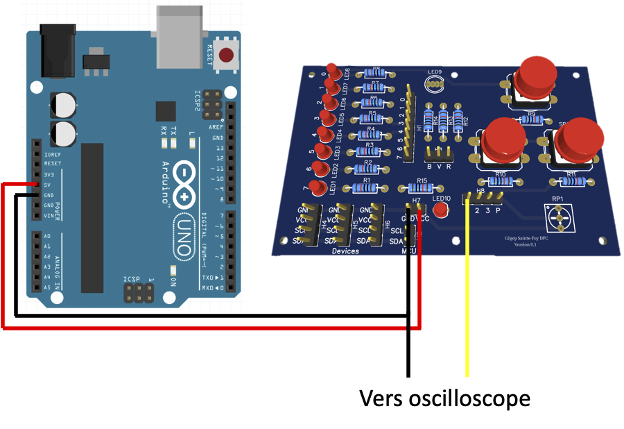
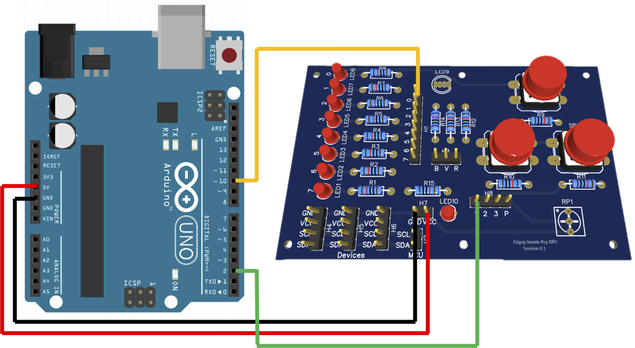
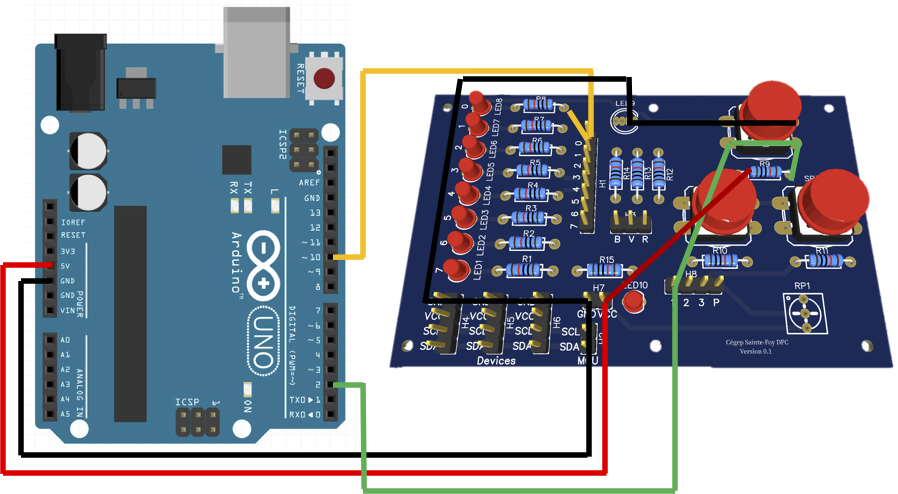
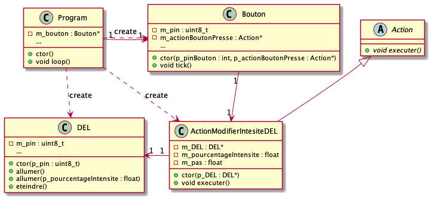

# Module 06 - Programmation des entrées numériques 2 / 2

Pour l'ensemble de ces exercices, vous allez utiliser :

- Un oscilloscope pour deux
- Visual studio code avec PlatformIO
- Votre plaquette de développement Arduino UNO
- Ou votre plaquette d'expérimentation
- Fils de branchement
- Autres accessoires nécessaires
- De la patience ;)

## Exercice 1 - Observation des rebonds

### Étape 1 - Calculs et hypothèses

- Sur votre cahier de laboratoire, calculez le temps minimal d'exécution d'une instruction sachant que l'Arduino Uno tourne à 16 Mhz
- En admettant qu'une instruction s'exécute toujours avec cette base de temps (ce qui est faux !), toujours sur votre cahier de laboratoire, calculez combien d'instructions s'exécutent en 1 μs et en 100 μs ?
- Si un carreau d'oscilloscope représente 100 μs, combien d'instructions pourraient s'exécuter sur la durée mesurée sur tout l'écran ?

    
Conversion mesures

- 1s = 1e3 ms = 1 000 ms
- 1s = 1e6 μs = 1 000 000 μs
- 1s = 1e9 ns = 1 000 000 000 ns

    
Réponse

Fréquence = 16 MHz

Unité de temps = 1 / 16e6

= 6,25e-8 s

= 0,0000000625 s

= 0,0000625 ms

= 0,0625 μs

= 62,5 ns

Fréquence = 16 MHz => 16 000 000 unités d'instruction / s

=> 16 instructions en 1 μs

=> 1 600 instructions en 100 μs

### Étape 2 - Montage du circuit

- Mettre sonde 1 (Jaune) sur le bouton 1 et la masse sur la masse du circuit
- Branchez votre circuit à une source d'alimentation

### Étape 3 - Réglages oscilloscope

- Allumez l'oscilloscope
- Appuyez sur le bouton "Default Setup" puis "Auto"
- Choisissez une échelle "Horizontal" de 100μs
- Appuyez sur le bouton "Trig Menu" qui se trouve à droite avec les autres options de déclenchement.
- Validez ou modifiez la configuration pour que :
  - Type = Edge
  - Source = CH1
  - Slope = front descendant
  - Mode = Single
- Utilisez le bouton rotatif "Position" de la section Horizontal afin de déplacer le "T" qui se trouve actuellement en haut au centre vers la fin du premier carré du cadriage

### Étape 4 - Expérimentation

- Appuyez sur le bouton poussoir de votre platine d'essais : le bouton "Run/stop" doit passer au rouge : la saisie des mesures est arrêtée, les données sont figées.
  - En appuyant sur ce même bouton, vous pouvez remettre l'affichage en fonction
- Sur votre cahier de laboratoire, dessiner la forme d'onde obtenue
- Recommencez la saisie de nouvelles formes d'ondes pour avoir au moins des dessins de rebonds
- Dans vos expérimentations, vous pouvez modifier votre échelle de temps

## Exercice 2 - Bouton poussoir avec Pull-up

Dans ce montage, le bouton poussoir sera alimenté par la borne no 2, la DEL sera alimentée par la borne no 10.

### Étape 1 - Montage du circuit

- Effectuez le montage en vous inspirant du schéma suivant.

    
Explicitation du câblage de la plaquette d'expérimentation

### Étape 2 - Programmation

- Codez le projet "AMOC_Module06_ProgrammationEntreesNumeriques_Gradateur" : à chaque pression du bouton, la DEL passe d'un état allumé à éteint et inversement (Si vous avez lu le cours vous savez où est le code). Exemple :
  - Premier appui : on allume la DEL
  - Deuxième appui : on éteint la DEL
  - Troisième appui : on allume la DEL
  - etc.
- (Optionnel) Modifiez le programme pour que la DEL changent d'intensité de 25 % à chaque fois qu'on appuie sur le bouton. Après 4 appuis successifs, l'intensité doit s'inverser de 25 % et ainsi de suite.

    
Indice intensité

Retournez voir [le module 4 sur les sorties au niveau de la section sur le MLI (PWM)](../Module04_ProgrammationSorties/Module04_ProgrammationSorties_Exercices.md).

### Étape 3 - Ajout d'un deuxième bouton (Optionnel, i.e. une fois que les tous les autres exercices sont terminés)

- Ajoutez un nouveau bouton qui permet de lire les pressions sur la borne 4.
- Modifiez votre programme pour que la luminosité diminue par pas de 25 % en cas de pression sur le bouton de la borne 2 et augment de 25 % en cas de pression sur le bouton de la borne 4.

## Exercice 3 - On va faire plus classe !

> [!NOTE]
> `tick()` représente un battement de temps logique. À chaque passage dans loop(), on appelle `tick()` pour permettre au composant de mettre à jour son état interne sans bloquer le programme.

> !NOTE]
> Une `Action` représente une fonction. Sur l’Arduino Uno R3, il n’est pas possible de capturer `this` dans une lambda. Pour éviter les variables globales, nous utilisons donc des classes héritées d’`Action`, permettant d’encapsuler des données membres sur lesquelles la méthode executer() agit. Cette pratique ne sera pas nécessaire avec la version de C++ utilisée pour l'ESP32.

Dans cet exercice, vous allez passer votre code impératif en code objet. Pour cela vous allez coder les classes du diagramme précédent. La classe "Program" permet de "ranger" le code de "main.cpp". Le constructeur de "Program" correspond à la fonction "setup", la méthode "loop" de "Program" correspond à la fonction "loop".

- Copiez le répertoire de votre projet "AMOC_Module06_ProgrammationEntreesNumeriques_Gradateur" vers un nouveau projet "AMOC_Module06_ProgrammationEntreesNumeriques_GradateurClasses"
- Écrivez la classe abstraite "Action"
- Écrivez la classe "DEL"
- Écrivez la classe "Bouton"
- Écrivez la classe "ActionModifierIntensiteDEL"
- Écrivez la classe "Program"
- Testez votre code !

## Exercice 4 - Le multi-tâche, c'est simplement faire une partie de chaque tâche à tour de rôle !

- Copiez le répertoire de votre projet "AMOC_Module06_ProgrammationEntreesNumeriques_GradateurClasses" vers un nouveau projet "AMOC_Module06_ProgrammationEntreesNumeriques_GradateurClignotantClasses"
- Modifiez la classe "DEL" afin qu'elle implante une nouvelle méthode qui permet de faire clignoter une DEL. La méthode doit prendre en paramètres le temps où la DEL est allumée et le temps où la DEL est éteinte.
- Modifiez la classe "Program" ainsi que les autres classes nécessaires afin que la pression sur le bouton fasse clignoter une DEL de votre choix avec un temps dépendant de l'intensité sélectionnée :
  - DEL allumée à 100%
  - DEL allumée à 25%, 750ms, DEL éteinte 250ms
  - DEL allumée à 50%, 500ms, DEL éteinte 500ms
  - DEL allumée à 75%, 250ms, DEL éteinte 750ms
  - DEL éteinte
