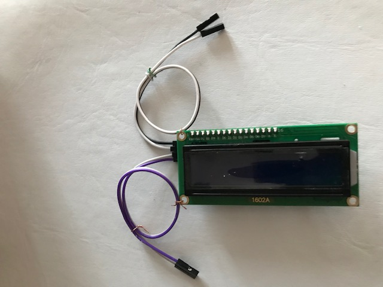
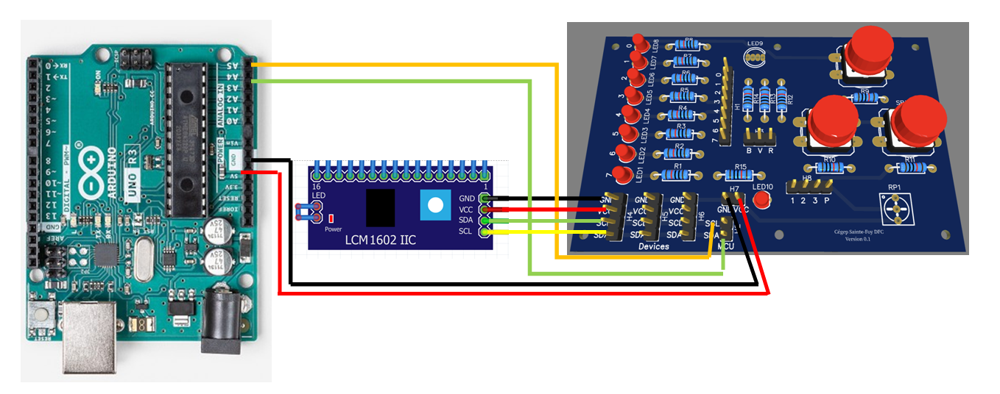
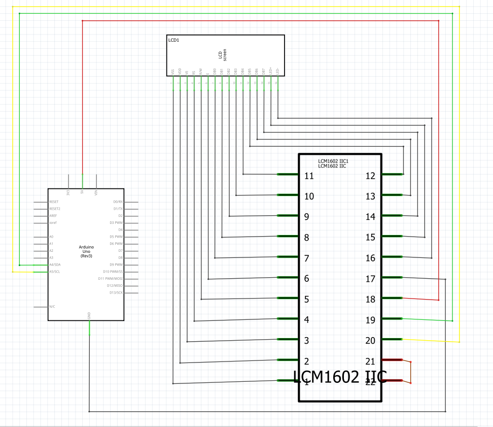
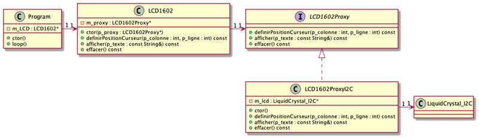

# Module 08 - Programmation de l'afficheur à Cristaux liquides (LCD)

OBJECTIFS:
- installer une librairie dans platformIO
- configurer ou vérifier l'adressage I2C d'un composant
- programmer un afficheur LCD pour effectuer divers effets visuels, tels que clignotement, déplacement latéral ou vertical

Pour l'ensemble de ces exercices, vous allez utiliser :

- Visual studio code avec PlatformIO
- Votre plaquette de développement Arduino UNO
- Votre plaquette d'expérimentation
- Votre afficheur LCD, modèle AAAA
- Fils de branchement
- Autres accessoires nécessaires
- De la patience ;)

### Préparation des fils

Pur ces exercices, vous aurez besoin de 4 fils Dupont femelle-femelle. Séparez l'ensemble d'une natte en gardant collées les 2 premiers brins (noir et blanc) de l'ensemble ou les 2 derniers brins (rouge et brun).




## Exercice 1 -  Afficheur LCD avec le protocole I2C

Le module 1602A est un afficheur à cristaux liquides (LCD) de format 16 caractèrs sur 2 rangées.
Son branchement et sa programmation sont facilités par l'usage du protocole I2C. Grâce à ce protoocole, 4 fils suffisent: 2 pour l'alimentation ( ```Vcc``` et  ```GND```) et 2 pour le transfert de données (```SCL``` et ```SDA``` )

### Étape 1 - branchement
Branchez les fils en respectant la convention:
rouge pour alimentation 5 V (couleur peut varié selon la disponibilité)
noir pour retour du courant (GND) (couleur peut varié selon la disponibilité)
couleurX pour SCL (pour moi, il s'agit d'orange)
couleurY pour SDA (pour moi, il s'agit de vert)


Complétez le montage en reliant le composant 1602.IIC à votre plaquette. Observez que 3 composants I2C peuvent être branchés simultanément sur la plaquette. Votre afficheur LCD pourra occuper une place sur 4 broches comme dans l'illustration.



### Étape 2 - identification de l'écran LCD_I2C

Dans cette étape, vous allez identifier l'adresse I2C de votre afficheur LCD.

Créez une nouvelle application platformIO ```IdentificationLCD```. Un modèle de programme est disponible dans le répertoire LCD_PreparationCours.
Compilez  et exécutez le programme.
Vous trouverez l'adresse I2C en sortie dans l'écran de la console
- Combien de bits contient l'adresse du protocole I2C de votre afficheur?
- Le programme recherche des adresses entre 8 et 127. Pouvez-vous expliquer pourquoi la recherche se limite à cet intervalle?
<details>
    <summary>Indice</summary>

Le protocole I2C a une plage d'adresse sur 7 bits. La limite supérieure est donc 127. les 3 premières bits sont réservées pour des commandes spécifiques du protocole. Elles ne peuvent donc pas servir pour identifier un périphérique.

</details>

 VOUS NE POUVEZ PAS POURSUIVRE si vous ne connaissez pas l'adresse I2C de votre périphérique.

## Exercice 2 -  Programmes de test
### Étape 1 - Installation d'une librairie LiquidCrystal_I2C

- importez le projet ```TestLCD``` dans PlateformIO.  Vous trouverez ce projet sur github.com/PiFou86/420-W48-SF dans random/TestLCD/

- Aidez-vous des directives  de librairies dans https://platformio.org/lib/show/576/LiquidCrystal_I2C/installation
<details>
    <summary>Indice</summary>

L'onglet Installation donne la liste des dépendances à ajouter dans le fichier de configuration platformIO.ini de l'application
L'onglet Headers donne l'entête ```#include``` de la librairie à ajouter dans le programme man.cpp

</details>

### Étape 2 - Programme TestLCD

- Vérifiez que l'adresse I2C du programme dans TestLCD/src/main.cpp correspond à l'adresseI2C de votre écran LCD
- Compilez et exécutez le programme dans TestLCD/src/main.cpp

## Exercice 3 - Programmation avec la classe LCDI2C 

### méthodes de la librairie liquidcrystal-i2c

Plusieurs méthodes permettent le contrôle et l'affichage d'un écran LCD

- Consultez https://www.arduino.cc/reference/en/libraries/liquidcrystal-i2c/

- Un lien vers ```Read the documentation``` offre de  l'aide sur les méthodes disponibles de la librairie

Quelle méthode efface les caractères et positionne le curseur en position (0,0) de l'écran?

<details>
    <summary>Indice</summary>

 objet.clear() 

</details>

Quelle méthode positionne le curseur dans une position (x,y) de l'écran?

<details>
    <summary>Indice</summary>

 objet.setCursor(colonne, rangee) 

</details>

### Étape 1 -  classe virtuelle LCD1602



- Créez une classe pour l'écran LCD. Vous trouverez ce projet sur github.com/PiFou86/420-W48-SF dans  Module08_LCD/LCD_PrepExercicePOO


### Étape 2 -  Etat des routes

Votre prochaine tache consiste à afficher un message sur un panneau d'information sur les autoroutes.

- Le but du programme est d'afficher un message d'information parmi une liste de 6 messages entreposés dans la mémoire EEPROM.

- Créez le  projet  ```EtatDesRoutes ``` dans plateformIO

- A toutes les 30 secondes, un nouveau message,choisi au hasard, apparaît dans l'écran.

On convient que la longueur d'un message est de 32 octets maximum. Le premier message est gardé dans la mémoire EEPROM à partir de l'adresse 16. Les autres messages suivent selon un positionnement équivalent.
- L'adresse 0 de l'EEPROM est réservée pour garder le numéro d'index du message présenté sur l'autoroute. Au redémarrage, cette information permet de revenir sur le dernier message affiché.

<details>
    <summary>Indice</summary>

Consultez le site d'Arduino pour tirer un nombre au hasard

</details>
