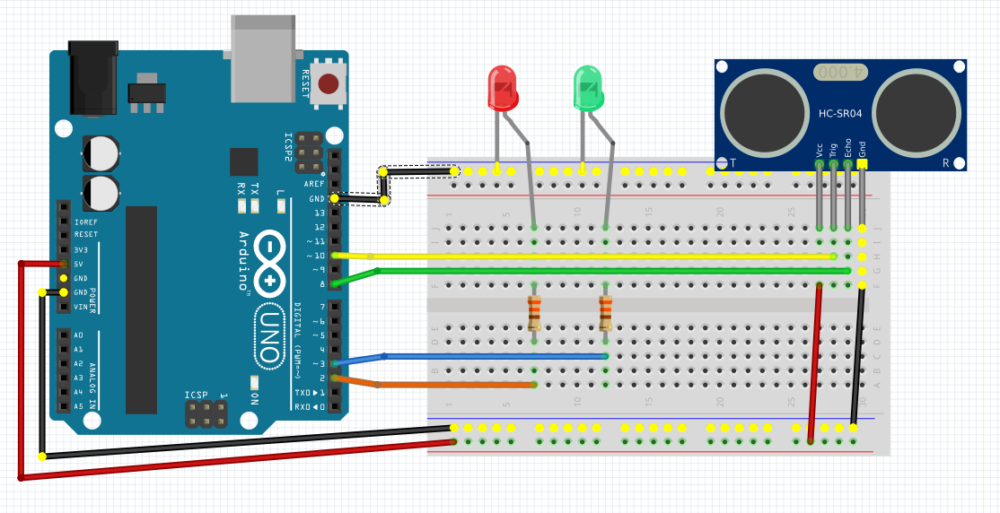

# Module 08 - Programmation de l'afficheur à Cristaux liquides (LCD)

OBJECTIFS:
- installer une librairie dans PlatformIO
- configurer ou vérifier l'adressage I2C d'un composant
- programmer un afficheur LCD pour effectuer divers effets visuels, tels que clignotement, déplacement latéral ou vertical

Pour l'ensemble de ces exercices, vous allez utiliser :

- Visual studio code avec PlatformIO
- Votre plaquette de développement Arduino UNO
- Votre plaquette d'expérimentation
- Votre afficheur LCD, modèle 1602A
- Fils de branchement
- Autres accessoires nécessaires
- De la patience ;)

### Préparation des fils

Pour ces exercices, vous aurez besoin de 
- 4 fils Dupont femelle-femelle
- 4 fils Dupont mâle-femelle

L'exercice 1, étape 1  illustre le branchement. Choississez des brins de couleur pour respecter les conventions de couleur d'alimentation (rouge ou blanc pour Vcc, noir ou brun pour GND). Choississez des brins de couleurs distinctes pour SCL et SDA.


## Exercice 1 -  Afficheur LCD avec le protocole I2C

Le module 1602A est un afficheur à cristaux liquides (LCD) de format 16 caractères sur 2 rangées.
Son branchement et sa programmation sont facilités par l'usage du protocole I2C. Grâce à ce protoocole, 4 fils suffisent: 2 pour l'alimentation ( ```Vcc``` et  ```GND```) et 2 pour le transfert de données (```SCL``` et ```SDA``` )

### Étape 1 - branchement

- En entrée: Arduino vers plaquette
Branchez les fils en respectant la convention des couleurs pour l'alimentation. Branchez
couleurX pour SCL (pour moi, il s'agit d'orange)
couleurY pour SDA (pour moi, il s'agit de vert)

- En sortie:  plaquette vers afficheur LCD
Prenez note! La plaquette est prévue accepter trois périphériques. Les trois circuits sont identiques, avec 4 bornes bien identifiées: ```Vcc``` , ```GND``` ,  ```SCL``` et ```SDA```


### Étape 2 - identification de l'écran LCD_I2C

Créez une nouvelle application PlatformIO ```IdentificationLCD```. Un modèle de programme est disponible dans le répertoire LCD_PreparationCours.
Compilez  et exécutez le programme.
Vous trouverez l'adresse I2C en sortie dans l'écran de la console
- Combien de bits contient l'adresse du protocole I2C de votre afficheur?
- Le programme recherche des adresses entre 8 et 127. Pouvez-vous expliquer pourquoi la recherche se limite à cet intervalle?
<details>
    <summary>Indice</summary>

Le protocole I2C a une plage d'adresse sur 7 bits. La limite supérieure est donc 127. les 3 premières bits sont réservées pour des commandes spécifiques du protocole. Elles ne peuvent donc pas servir pour identifier un périphérique.

</details>

 VOUS NE POUVEZ PAS POURSUIVRE si vous ne connaissez pas l'adresse I2C de votre périphérique.

## Exercice 2 -  Programmes de test

### Étape 1 - Installation d'une librairie LiquidCrystal_I2C
- Créez le  projet  ```LCDI2C_Base``` dans PlateformIO
- Installez les librairies suivantes dans platformio.ini selon les directives suivantes
-https://platformio.org/lib/show/576/LiquidCrystal_I2C/installation

<details>
    <summary>Indice</summary>

L'onglet Installation donne la liste des dépendances à ajouter dans le fichier de configuration PlatformIO.ini de l'application ino
L'onglet Headers donne l'entête #include de la librairie (ou plusieurs si c'est le cas) à ajouter dans le programme man.cpp

</details>

### Étape 2 - Programme LCDI2C_Base

Créez une nouvelle application PlatformIO ```LCDI2C_Base```. Un modèle de programme est disponible dans le répertoire LCD_PreparationCours.

AVANT DE COMPILER, vous devez vérifier, et peut-être ajuster, l'adresse I2C du modèle dans votre programme. Une ligne d'instruction est prévue pour cela.

Compilez  et exécutez le programme.

### Matériel
- https://www.arduino.cc/reference/en/libraries/liquidcrystal-i2c/

- Un lien vers ```Read the documentation``` offre de  l'aide sur les méthodes disponibles de la librairie pour contrôler le curseur, l'affichage et le fond d'écran.

Quelle méthode efface les caractères et positionne le curseur en position (0,0) de l'écran?

<details>
    <summary>Indice</summary>

``objet.clear()``

</details>

Quelle méthode positionne le curseur dans une position (x,y) de l'écran?

<details>
    <summary>Indice</summary>

``objet.setCursor(colonne, rangee)``

</details>

## Exercice 3 - Promotion dans nos boutiques

Votre prochaine tache consiste à afficher des annonces publicitaires dans le centre d'achat.

### Étape 1 - Affichage vertical
- Créez le  projet  ```ClignotementVertical ``` dans PlateformIO

Le but du programme est de faire clignoter le texte suivant quatre fois pendant 500 milisecondes puis de faire une pause de 100 milisecondes d'affichage.

 ```Rabais 15% dans```

 ```  nos boutiques ```

### Étape 2 - Affichage latéral
- Créez le  projet ```BalayageHorizontal ``` dans plateformIO

Le but du programme est de faire dérouler le texte suivant de gauche à droite. Le texte doit apparaître comme une banderolle circulaire, le texte réapparaissant à gauche sans arrêt.

 ```   Bienvenue    ``` 

 ```  aux visiteurs ``` 

## Exercice 4 -  Etat des routes

Votre prochaine tache consiste à afficher un message sur un panneau d'information sur les autoroutes.

### Étape 1 - Affichage de messages

- Créez le  projet  ```EtatDesRoutes ``` dans PlateformIO

- A toutes les 30 secondes, un nouveau message, choisi au hasard, apparaît dans l'écran.

- Six messages sont entreposés dans la mémoire EEPROM. La longueur d'un message est de 32 caractères.

- L'adresse 0 de l'EEPROM est réservée pour garder le numéro d'index du message présenté sur l'autoroute. Au redémarrage, cette information permet de revenir sur le dernier message affiché.

<details>
    <summary>Indice</summary>

Consultez le site d'Arduino pour tirer un nombre au hasard

</details>

## Exercice 4 - Attention ! Collisions? (optionnel)

### Matériel

- Composant "capteur de distance par ultrasons" HC-SR04 

### Étape 1 - Branchement du capteur HC-SR04



- Branchez la sonde du capteur sur la borne No7 d'Arduino. Polarisez le capteur aves ses bornes + et -

- Affichez la distance calculée sur l'écran LCD

### Étape 2 - Afficher la distanee sur l'écran LCD

- Créez le  projet  ```DistancesSurLCD``` dans PlateformIO

- Créez le programme pour afficher la distance sur l'écran LCD 