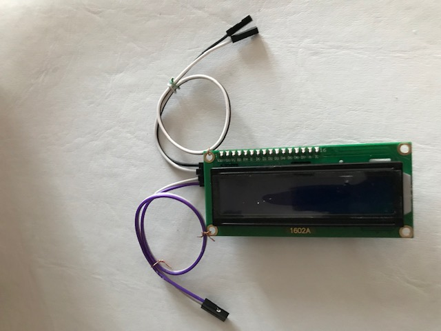
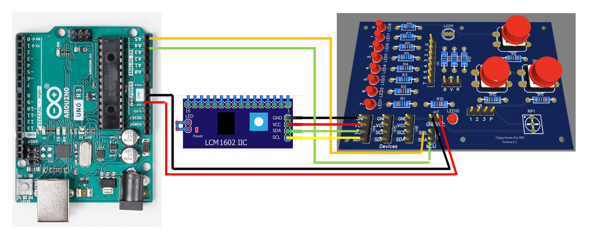
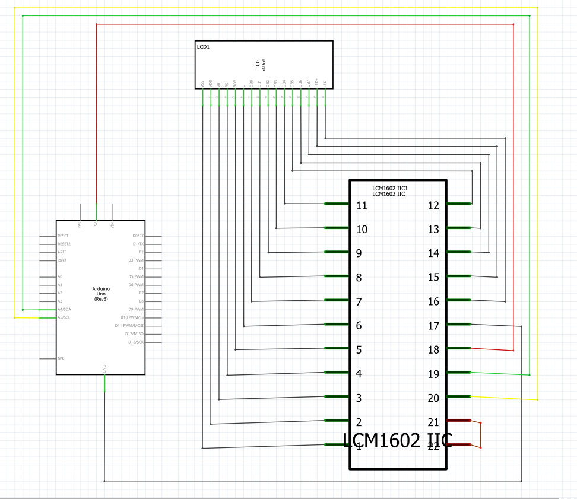
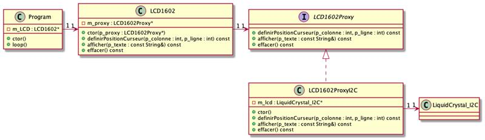

# Module 08 - Programmation de l'afficheur à Cristaux liquides (LCD)

## Ce qui sera vu

- Brancher un afficheur LCD 1602A à l'Arduino avec le bus I²C.
- Détecter et vérifier l'adresse I²C du module.
- Installer et configurer une bibliothèque d'affichage dans PlatformIO.
- Afficher du texte et expérimenter le clignotement ainsi que les déplacements du contenu.
- Encapsuler l'affichage dans une classe, puis présenter l'état de plusieurs routes.

## Prérequis

- Savoir créer, compiler et téléverser un projet PlatformIO sur Arduino UNO.
- Connaître les classes C++ simples et l'installation d'une bibliothèque.
- Savoir reconnaître VCC, GND et les conducteurs de données d'un montage.
- Connaître le principe d'une adresse de périphérique sur un bus partagé; aucun détail avancé d'I²C n'est requis.
- Disposer de l'afficheur LCD 1602A avec interface I²C et de quatre fils adaptés.

Pour l'ensemble de ces exercices, vous allez utiliser :

- Visual Studio Code avec PlatformIO
- Votre plaquette de développement Arduino UNO
- Votre plaquette d'expérimentation
- Votre afficheur LCD, modèle 1602A
- Fils de branchement
- Autres accessoires nécessaires
- De la patience ;)

## Préparation de votre environnement matériel

Pour ces exercices, vous aurez besoin de quatre fils Dupont femelle-femelle. Séparez une natte en gardant ensemble les deux premiers brins (noir et blanc) ou les deux derniers (rouge et brun).

## Exercice 1 -  Afficheur LCD avec le protocole I2C

Le module 1602A est un afficheur à cristaux liquides (LCD) de 16 caractères sur 2 lignes.

Son branchement et sa programmation sont facilités par le protocole I²C. Quatre fils suffisent : deux pour l'alimentation (`VCC` et `GND`) et deux pour les données (`SCL` et `SDA`).

### Étape 1 - Branchement

Branchez les fils en respectant la convention :

- Rouge pour l'alimentation 5 V (la couleur peut varier selon la disponibilité).

- Noir pour la masse GND (la couleur peut varier selon la disponibilité).

- CouleurX pour SCL (pour moi, il s'agit d'orange)

- CouleurY pour SDA (pour moi, il s'agit de vert)

Complétez le montage en reliant le composant 1602_IIC à votre plaquette. Observez que plusieurs composants I2C peuvent être branchés simultanément sur la plaquette. Votre afficheur LCD occupe une série sur 4 broches comme dans l'illustration.

### Étape 2 - Identification de l'écran LCD_I2C

Dans cette étape, vous allez identifier l'adresse I2C de votre afficheur LCD.

Créez une nouvelle application PlatformIO `IdentificationLCD`. Un modèle est disponible dans le répertoire `LCD_PreparationCours`.

Compilez et exécutez le programme.

Vous trouverez l'adresse I2C en sortie dans l'écran de la console :

- Combien de bits contient l'adresse du protocole I2C de votre afficheur?
- Le programme recherche des adresses entre 8 et 127. Pouvez-vous expliquer pourquoi la recherche se limite à cet intervalle?

    
Indice

Le protocole I2C a une plage d'adresse sur 7 bits. La limite supérieure est donc 127. Les 3 premiers bits sont réservés pour des commandes spécifiques du protocole. Elles ne peuvent donc pas servir pour identifier un périphérique.

VOUS NE POUVEZ PAS POURSUIVRE si vous ne connaissez pas l'adresse I2C de votre périphérique.

- Utilisez le programme Identification_LCD.cpp pour cela

## Exercice 2 -  Programmes de test

### Étape 1 - Installation de la bibliothèque LiquidCrystal_I2C

- Importez le projet `TestLCD` dans PlatformIO. Vous trouverez ce projet dans le dossier `random/TestLCD/` du dépôt.

- Consultez les directives d'installation de la bibliothèque sur [PlatformIO](https://platformio.org/lib/show/576/LiquidCrystal_I2C/installation).

    
Indice

L'onglet **Installation** donne la liste des dépendances à ajouter au fichier `platformio.ini` de l'application.

L'onglet **Headers** donne la directive `#include` de la bibliothèque à ajouter dans le programme `main.cpp`.

### Étape 2 - Programme TestLCD

- Vérifiez que l'adresse I2C du programme dans TestLCD/src/main.cpp correspond à l'adresseI2C de votre écran LCD
- Compilez et exécutez le programme dans TestLCD/src/main.cpp

    
connexion I2C

Pour tester une connexion I2C, utilisez le code suivant, au démarrage:

    Wire.beginTransmission();  
    if (!Wire.endTransmission(<adresseI2C>) == 0) {
        Serial.println("Erreur de connexion I2C");
        return;
    }

## Exercice 3 - Programmation avec la classe LCDI2C 

### Méthodes de la bibliothèque LiquidCrystal_I2C

Plusieurs méthodes permettent le contrôle et l'affichage d'un écran LCD

- Consultez https://www.arduino.cc/reference/en/libraries/liquidcrystal-i2c/

- Le lien **Read the documentation** donne accès à la description des méthodes de la bibliothèque. Vous pourrez en compter jusqu'à 20.

    
Liste des méthodes

- La liste des méthodes est donnée dans le fichier `keywords.txt` du site Web.

Quelle méthode efface les caractères et positionne le curseur en position (0,0) de l'écran?
 

    
Indice

 objet.clear();
 

 Quelle méthode déplace le texte vers la droite?

    
Indice

 objet.scrollDisplayRight();

### Étape 1 - Classe LCD1602

- Créez les classes pour l'écran LCD.

### Étape 2 -  État des routes

Votre prochaine tâche consiste à afficher un message sur un panneau d'information routière.

- Le but du programme est d'afficher un message d'information parmi une liste de 6 messages entreposés dans la mémoire EEPROM.
- A toutes les 30 secondes, un nouveau message, choisi au hasard, apparaît dans l'écran.

On convient que la longueur d'un message est de 32 octets maximum. Le premier message est gardé dans la mémoire EEPROM à partir de l'adresse 16. Les autres messages suivent selon un positionnement équivalent.

- L'adresse 0 de l'EEPROM est réservée pour garder le numéro d'index du message présenté sur l'autoroute. Au redémarrage, cette information permet de revenir sur le dernier message affiché.

    
Indice

Consultez le site d'Arduino pour tirer un nombre au hasard

