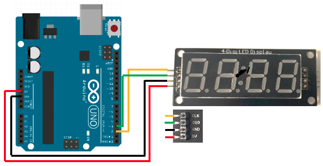

# Module 09 - 4 Digits

## Exercice 1 - Afficher un nombre sur 4 digits

### Matériel

- Arduino Uno
- Afficheur 4 digits avec le TM1637
- 4 fils mâle-femêlle

### Brancher le matériel

Effectuez les branchements suivants :

### Programme

Le but de ce programme est de pouvoir compter et afficher un compteur qui s'incrémente. Le compteur peut être affiché en binaire et en décimal.

#### Étape 1 - Première implantation - Affichage de base

- Créez le projet Platformio "Module09_4Digits_Entiers"
- Ajoutez la librairie "https://github.com/avishorp/TM1637"
- Implantez les classes suivantes :

- Avec les classes que vous venez de créer, afficher la valeur "1010" et validez que cela fonctionne

#### Étape 2 - Compteur binaire

- Dans la classe "Affichage4Digits", ajoutez la méthode publique "valeurSegment" qui prend une valeur comprise entre 0 et 1 et qui renvoie la représentation du caractère affichable directement avec votre fonction afficher.
- Écrivez la méthode "afficherBinaire" qui prend un entier et qui affiche ce nombre sur le 4 digits (c'est le moment de revisiter vos décalages et vos opérateurs bit à bit : comment extraire un bit ?)
- Écrivez un programme principal qui compte en binaire de "0000" (0 en décimal) à "1111" (15 en décimal) et qui affiche le résultat sur le 4 digits (attendre 1 seconde entre chaque incrément)

#### Étape 3 - Compteur décimal

- Dans la classe "Affichage4Digits", complétez la méthode publique "valeurSegment" pour qu'elle puisse maintenant prendre une valeur entre 0 et 9.
- Écrivez la méthode "afficherDecimal" qui prend un entier et qui affiche ce nombre sur le 4 digits (comment décomposer un nombre ?)
- Écrivez un programme principal qui compte en binaire de "0000" à "9999" et qui affiche le résultat sur le 4 digits (attendre 100 millisecondes entre chaque incrément)

Indice

Cherchez à décaler votre entier vers la droite et à appliquer un filtre qui permet d'isoler le bit de poids faible avec un "&"

## Exercice 2 - Compteur de pressions

### Matériel

- Arduino Uno
- Afficheur 4 digits avec le TM1637
- 4 fils mâle-femêlle
- Votre circuit imprimé d'expérimentation : vous aurez besoin de la partie des boutons

### Brancher le matériel

Effectuez le montage de votre affichage 4 digits. Connectez aussi un bouton poussoir sur la pin 4.

### Programme

- Créez le projet Platformio "Module09_4Digits_Compteur"
- Le programme doit fonctionner comme suit :
  - À chaque pression d'un bouton un compteur doit être incrémenté
  - Le compteur doit être affiché et mis à jour après chaque pression
  - (optionnel) Au bout de 10 secondes d'inactivité, le 4 digits doit s'éteindre afin d'économiser de l'énergie
  - (optionnel) À chaque pression, le nombre de pression est sauvegardé dans l'EEPROM. Au démarrage de votre montage, la valeur de départ du compteur est prise dans l'EEPROM.

## Exercice 3 - Le chronomètre (optionnel)

### Matériel

- Arduino Uno
- Afficheur 4 digits avec le TM1637
- 4 fils mâle-femêlle
- Votre circuit imprimé d'expérimentation : vous aurez besoin de la partie des boutons

### Brancher le matériel

Effectuez le montage de votre affichage 4 digits. Connectez aussi deux boutons poussoir : un sur la pin 4 et l'autre sur la 5.

### Programme

- Créez le projet Platformio "Module09_4Digits_Chronometre"
- Ajoutez la librairie "https://github.com/avishorp/TM1637"
- Ajoutez les classes pour le 4 digits que vous avez développé dans les exercices précédents
- Implantez l'affichage d'un chronomètre qui mesure 60 minutes maximum :
  - Le chronomètre se déclanche ou s'arrête après la pression d'un des boutons
  - Le chronomètre se réinitialise à la pression d'un autre bouton
  - Le chronomètre affiche en permanence le temps mesuré
