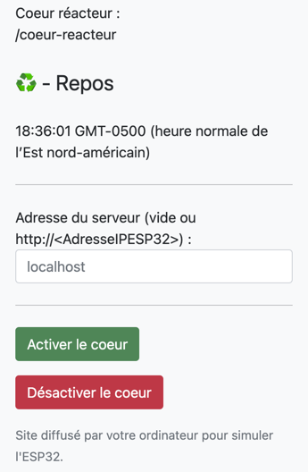
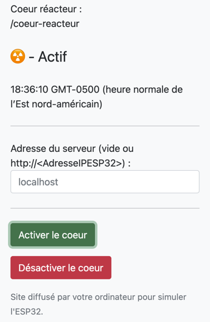
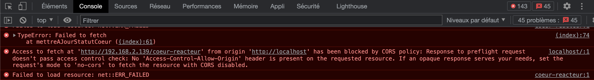

# Exercice récapitulatif - On coupe le fil !

Le but de cet exercice est de créer deux applications différentes. La première simule un réacteur nucléaire qui peut être contrôlé à distance par une API REST. Le second simule le contrôle à distance du réacteur.

Pour chaque équipe, un étudiant effectue l'Exercice 1, l'autre l'Exercice 2. La remise est individuelle : chacun remet sa partie.

Ce travail doit s'effectuer à deux avec deux ESP32. C'est un exercice récapitulatif des modules précédents sur l'ESP32 et ses possibilités réseau. Il est préparatoire aux prochains travaux pratiques.

Pour cet exercice, vous n'avez pas besoin de "WiFiManager".

Afin de vous facilité le travail à la maison qui sera individuel, nous vous proposons une application .Net MVC qui vous permet de simuler aussi bien le client que le serveur. La solution "M13_CoeurReacteurCSharp" se trouve à la racine de ce dossier. Pour la faire fonctionner, il faut avoir [.Net 6.0](https://dotnet.microsoft.com/en-us/download/dotnet/6.0).

## Exercice 1 - Réacteur nucléaire - Périphérique serveur

Le premier montage comprend un ESP32 et une DEL rouge. Quand l'état du réacteur est "repos", la DEL rouge est éteinte. Quand l'état est "actif", la DEL rouge est allumée.

### Exercice 1.1 - Connection à votre réseau domestique ou création d'un point d'accès en cas d'échec

Le programme interne doit essayer de se connecter sur votre réseau domestique. S'il n'y arrive pas, il doit créer le point d'accès "IoT_M13_Ex04_<numéroMatricule>".

### Exercice 1.2 - Création de l'API REST

Votre programme interne doit exposer une application web sur le port 80. L'application web comprend une API REST qui permet de piloter le coeur du réacteur.

L'API est définie comme suit :

| Ressource       | Méthode | Résultat                                              |
|-----------------|---------|-------------------------------------------------------|
| /coeur-reacteur | GET     | Renvoie l'état du coeur du réacteur - code 200        |
| /coeur-reacteur | PUT     | Permet de modifier l'état du coeur et renvoie le nouvel état - code 200 |
| *               | OPTIONS | Permet de fournir les options de communication pour la ressource - code 204 : le code de cette route est donnée plus bas |

L'objet d'état doit être au format suivant :
```json
{
    "etat": "actif"
}
OU
{
    "etat": "repos"
}
```

### Exercice 1.3 - Prise en charge de CORS - Route OPTIONS

Afin de pouvoir faire des tests avec un navigateur web, il est nécessaire de permettre l'accès à l'API. Pour cela, il faut répondre aux requêtes OPTIONS du navigateur. Cela permet de préciser les méthodes HTTP autorisées pour une ressource. Cela permet également de préciser les headers autorisés. Dans notre cas, nous autorisons toutes les méthodes HTTP et tous les headers.

Pour la route "*" avec la méthode "OPTIONS", le serveur doit renvoyer une liste des méthodes supportées par la ressource :

```cpp
#include <uri/UriRegex.h>

// ...
// Ici je suppose que vous définissez la classe ServeurWeb
// et que vous avez une donnée membre "m_webServer" de type WebServer.
// Si ce n'est pas le cas, adaptez le code suivant
ServeurWeb::ServeurWeb(/* ... */) {
  // ...
  this->m_webServer->on(Uri("/coeur-reacteur"), HTTPMethod::HTTP_GET,
                        [this]() { /* ... */ });
  this->m_webServer->on(Uri("/coeur-reacteur"), HTTPMethod::HTTP_PUT,
                        [this]() { /* ... */ });
                        });
  this->m_webServer->on(UriRegex(".*"), HTTPMethod::HTTP_OPTIONS,
                        [this]() {
                          this->optionsCors();
                        });  
  this->m_webServer->onNotFound(
      [this]() { this->ressourceNonTrouvee(this->m_webServer->uri()); });

  this->m_webServer->begin();
  // ...
}

// ...

void ServeurWeb::optionsCors() const {
  this->m_webServer->sendHeader("Access-Control-Allow-Origin", "*");
  this->m_webServer->sendHeader("Access-Control-Max-Age", "600");
  this->m_webServer->sendHeader("Access-Control-Allow-Methods", "PUT,POST,GET,OPTIONS");
  this->m_webServer->sendHeader("Access-Control-Allow-Headers", "*");
  this->m_webServer->send(204);
}

void ServeurWeb::envoyerCors() const {
  this->m_webServer->sendHeader("Access-Control-Allow-Origin", "*");
}
```

### Exercice 1.4 - Prise en charge de CORS - Ajout des headers CORS

Dans vos routes, il faut ajouter les headers CORS. Pour cela, avant d'appeler la méthode send() de la classe WebServer, il faut appeler la méthode "envoyerCors" :

```cpp
// ...
    this->envoyerCors();
    this->m_webServer->send(200, "text/json", /* ... */);
```

### Exercice 1.5 - Votre collègue n'est pas prêt ou vous travaillez seul de chez vous ?

Si votre collègue n'est pas prêt ou que la situation vous oblige à travailler seul, vous pouvez utiliser un serveur web local. Pour cela, vous allez devoir connecter votre ESP32 à votre réseau WiFi local. Ce point est traité dans le point 4.1.1. La première étape est donc de valider que vous y arrivez bien et que votre ESP32 et votre ordinateur sont sur le même réseau. Pour vous aidez, récupérez l'adresse IP de votre ESP32 sur votre trace ainsi que l'adresse IP de votre ordinateur à l'aide des commandes ```ipconfig``` (Windows), ```ifconfig``` (Mac / Linux) ou ```ip a``` (Linux si ifconfig non installé).

Ensuite récupérez la solution Visual Studio "M13_CoeurReacteurCSharp" qui se trouve à la racine de ce module.

Pour lancer l'application, vous pouvez soit passer par Visual Studio en ouvrant la solution ou vous pouvez lancer l'exécution dans une console en vous plaçant dans le répertoire du projet et en tapant la commande ```dotnet run```.

L'application expose un site sur le port 80 de votre ordinateur. Vous pouvez accéder à ce site en lançant votre navigateur web et en tapant l'adresse suivante : http://localhost:80. Vous pouvez tester l'application web en validant que le statut de la simulation fonctionne quand vous cliquez sur le bouton "Activer le coeur" ou "Désactiver le coeur".




Une fois l'application web en marche, vous pouvez modifier l'adresse du serveur web dans le champ "Adresse du serveur web" de l'application web. Dans l'exemple suivant, l'ESP32 est sur le même réseau que l'ordinateur qui affiche l'application web et a comme adresse IP "192.168.2.139" :


On peut observer que l'application web affiche le statut du coeur. Si vous cliquez sur le bouton "Activer le coeur" ou sur le bouton "Désactiver le coeur", l'application web effectue une requête sur l'API REST de l'ESP32 et affiche le statut du coeur.

Si cela ne fonctionne pas, vous devriez avoir le symbole de l'erreur d'affiché :


Dans le cas d'une telle erreur, ouvrez le mode développeur du navigateur et affichez la trace réseau. À partir de celle-ci, vous pourrez investiguer le problème :

- Validez que vous êtes bien connecté à votre réseau WiFi local
- Validez que vous êtes capable d'effectuer une requête ICMP de votre ordinateur vers l'ESP32 (Ping)
- Validez que votre l'API de votre ESP32 répond sur les bonnes routes avec les bons verbes
- Validez que l'application web est bien démarrée et que vous pouvez y accéder
- Validez que vous avez bien ajouté les entêtes pour désactiver les sécurités pour CORS

Si vous n'avez pas suivi les étapes pour CORS, vous allez avoir les erreurs suivantes dans la partie réseau et dans la partie console :




Une fois les problèmes résolus, la partie réseau devrait ressembler à :


## Exercice 2 - Périphérique client

Le deuxième montage comprend un ESP32, un bouton et deux DELs (une rouge, une verte). La DEL verte permet d'indiquer que le coeur du réacteur est au repos. La DEL rouge indique que le coeur du réacteur est actif. Pour connaître l'état du réacteur, vous devez utiliser l'API REST de votre collègue (n'oubliez pas de vous connecter sur le même réseau !). À l'appui du bouton, si le coeur du réacteur est au repos, il devient actif. Si le coeur du réacteur est actif, il devient au repos.

### Exercice 2.1 - Connection à votre réseau domestique ou au point d'accès créé par l'équipier

Écrivez le code qui permet de se connecter sur votre réseau domestique ou sur le point d'accès créé par l'équipier. Gardez le tout configurable facilement car vous risquez de devoir alterner entre votre réseau domestique et le point d'accès créé par votre collègue.

### Exercice 2.2 - Affichage du statut du coeur du réacteur

- Écrivez le code qui permet d'interroger l'API REST décrite dans la section 4.1.2 afin de savoir si le réacteur est actif ou au repos.
- Écrivez le code qui permet d'aller chercher cet état toute les 2000 millisecondes. Ce temps doit être facilement paramétrable. Une fois le statut récupéré, vous devez afficher le statut à l'aide de la DEL verte ou rouge.

### Exercice 2.3 - Prise en charge du bouton

- Écrivez le code qui permet de détecter l'appui sur le bouton. À l'appuie sur le bouton poussoir, vous devez valider le statut actuel du réacteur et ensuite envoyer le bon ordre au réacteur à l'aide d'une requête ```PUT``` :

  - Si le coeur est déjà actif, envoyez une requête de mise en repos
  - Si le coeur est au repos, envoyez une requête d'activation

<details>
    <summary>Envoi d'une requête PUT</summary>

Il faut biensur explorer la documentation de la bibliothèque HTTPClient pour comprendre comment envoyer une requête PUT. Voici un exemple de code qui permet d'envoyer une requête PUT :

```cpp
#include <HTTPClient.h>

// ...

HTTPClient http;
http.begin(url);
http.addHeader("Content-Type", "application/json");
http.addHeader("Accept", "application/json");

int codeRetour = http.PUT(json);
if (codeRetour == HTTP_CODE_OK) {
  // ...
} else {
  // ...
}
```

</details>

### Exercice 2.4 - Votre collègue n'est pas prêt ou vous travaillez seul de chez vous ?

Si votre collègue n'est pas prêt ou que la situation vous oblige à travailler seul, vous pouvez utiliser un serveur web local. Pour cela, vous allez devoir connecter votre ESP32 à votre réseau WiFi local. Ce point est traité dans le point 4.2.1. La première étape est donc de valider que vous y arrivez bien et que votre ESP32 et votre ordinateur sont sur le même réseau. Pour vous aidez, récupérez l'adresse IP de votre ESP32 sur votre trace ainsi que l'adresse IP de votre ordinateur à l'aide des commandes ```ipconfig``` (Windows), ```ifconfig``` (Mac / Linux) ou ```ip a``` (Linux si ifconfig non installé).

Ensuite récupérez la solution Visual Studio "M13_CoeurReacteurCSharp" qui se trouve à la racine de ce module.

Pour lancer l'application, vous pouvez soit passer par Visual Studio en ouvrant la solution ou vous pouvez lancer l'exécution dans une console en vous plaçant dans le répertoire du projet et en tapant la commande ```dotnet run```.

L'application expose un site sur le port 80 de votre ordinateur. Vous pouvez accéder à ce site en lançant votre navigateur web et en tapant l'adresse suivante : http://localhost:80. Vous pouvez tester l'application web en validant que le statut de la simulation fonctionne quand vous cliquez sur le bouton "Activer le coeur" ou "Désactiver le coeur".


Une fois le simulateur lancé, vous devez modifier l'adresse IP du réacteur dans le code de votre ESP32 par celle de votre ordinateur.

Si votre ESP32 est bien configuré, vous devriez voir le statut du coeur du réacteur changer à chaque pression du bouton sur votre ESP32.

Si ce n'est pas le cas :

- Validez que vous êtes bien connecté à votre réseau WiFi local
- Validez que vous êtes capable d'effectuer une requête ICMP de votre ordinateur vers l'ESP32 (Ping)
- Validez que l'application web est bien démarrée et que vous pouvez y accéder
- Validez que vos requête respectent bien l'API REST définie plus haut avec les bonnes routes avec les bons verbes
