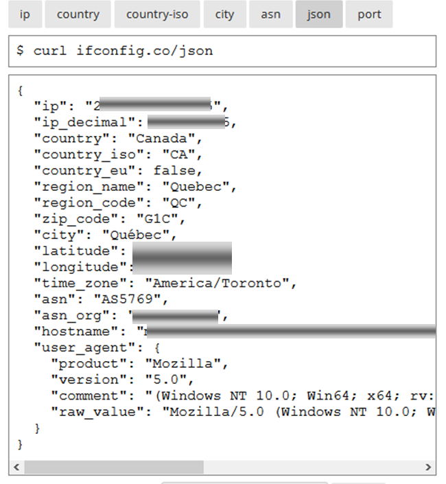
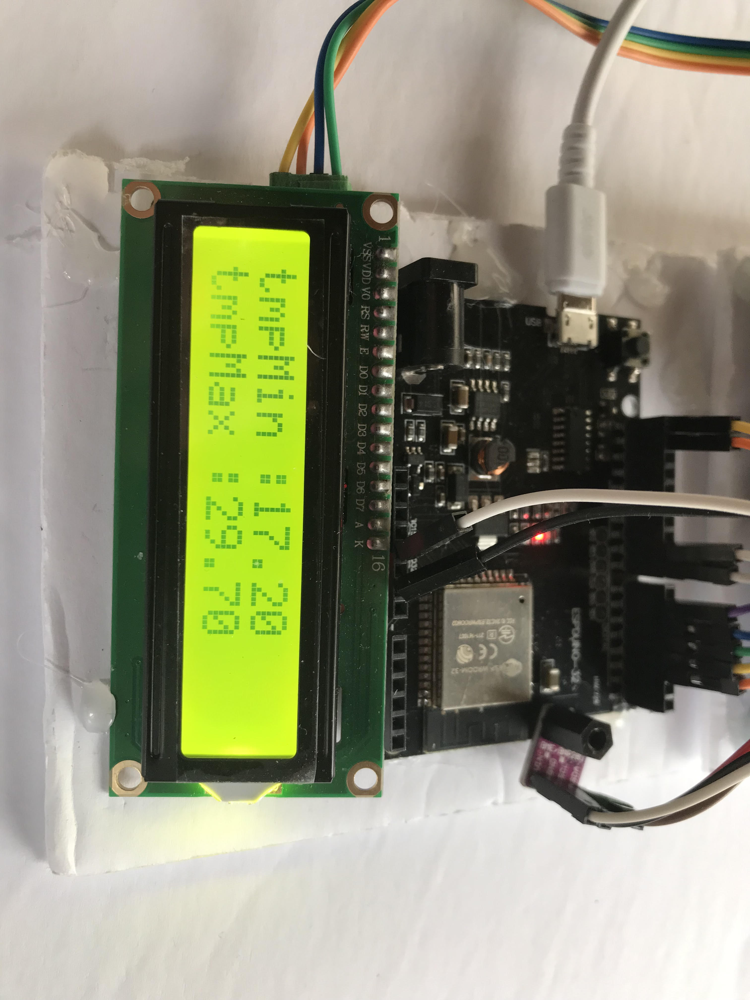

# Module 10 - Client Web avec le microcontrôleur ESP32

## Ce qui sera vu

- Créer et téléverser un premier projet PlatformIO sur une carte ESP32.
- Repérer les différences utiles entre les bornes et bibliothèques de l'Arduino UNO et de l'ESP32.
- Connecter l'ESP32 à un réseau Wi-Fi et afficher les paramètres de connexion.
- Envoyer une requête HTTP, recevoir une réponse et en extraire une donnée JSON.
- Réutiliser, en extension, ces données sur un afficheur ou avec un service météorologique.

## Prérequis

- Maîtriser le cycle créer–compiler–téléverser–tester avec PlatformIO.
- Posséder les bases du C++, du Web, de HTTP, de JSON et des réseaux IP vues dans les cours précédents.
- Savoir distinguer une adresse locale d'une adresse publique et disposer d'un réseau Wi-Fi autorisé.
- Savoir brancher les périphériques déjà utilisés, notamment l'afficheur LCD si l'extension est réalisée.
- Disposer d'une carte ESP32 et des identifiants de connexion conservés hors du code partagé.

## Matériel pour les exercices suivants

- Microcontrôleur ESP32 monté sur le circuit imprimé de développement modèle esp32doit-devkit-v1
- Circuit imprimé d'expérimentation
- Afficheur LCD
- Fils Dupont, mâle-femelle

**Mise en garde :** respectez le choix des bibliothèques à installer. Il existe différentes versions; celles qui sont proposées ont été testées par vos enseignants.

## Exercice 1 - Faire clignoter la DEL interne

Le but de cet exercice est de vous familiariser avec les broches du microcontrôleur et les bibliothèques adaptées à l'ESP32.

Créez une application PlatformIO `AMOC_Module10_DELInterneClignoter` qui fait clignoter la DEL intégrée à l'ESP32 toutes les 0,5 seconde.

<!-- 
## Exercice 2 - Contrôle de l'intensité de DEL

### Brancher le matériel

Effectuez les branchements suivants sur votre plaquette expérimentale :

- Reliez une DEL rouge à la borne IO25
- Reliez la borne d'un bouton à la borne IO26
- Alimentez votre circuit imprimé d'expérimentation
  - Un fil sur une borne d'alimentation ```3,3V``` vers le VCC
  - Un fil à la mise à la terre (GND)

### Programmation

Modifiez l'application platformIO ```AMOC_Module10_DELInterneClignoter``` pour que :

- À chaque pression d'un bouton un compteur doit être incrémenté
- Le compteur doit être affiché et mis à jour après chaque pression
- À chaque pression, la luminosité de la DEL rouge augmente de 20 %.
- Lorsque la luminosité de la DEL est au maximum, la pression fait diminuer sa luminosité de 20%. Ce cycle se répète.

 - (optionnel) La valeur du compteur est gardée dans la mémoire EEPROM pour ajuster la luminosité au démarrage. À ce moment, la luminosité de la DEL rouge est ajustée en conséquence.
  -->

## Exercice 2 - Afficher l'adresse IP publique

### Objectifs

- Connecter le client Web ESP32 à Internet.
- Collecter des données d'un site web en format JSON.

### Matériel

- Microcontrôleur ESP32, modèle esp32doit-devkit-v1
- Votre afficheur LCD, modèle 1602A
- Fils de branchement

### Brancher le matériel

- Branchement des broches I²C entre l'ESP32 et l'afficheur LCD.

#### Étape 1 - Connexion internet

- Créez le projet PlatformIO `AMOC_Module10_Client_Web`.
- Le programme doit fonctionner comme suit :
  - À l'aide de la méthode `WiFi.begin` de la bibliothèque `WiFi.h`, établissez une connexion Wi-Fi entre votre ESP32 et votre routeur.
  - Ajoutez une boucle pour 30 tentatives. En cas d'échec, le programme se termine avec un message d'erreur.
  
#### Étape 2 - Obtenir l'adresse IP publique 

Le programme se poursuit de la façon suivante :

- Une routine obtient différentes informations sur la connexion Internet de l'ESP32 à partir de la ressource `https://ifconfig.co/json`. La bibliothèque `HTTPClient` est utilisée à cette étape.
- Cette routine retourne une chaîne qui est du type String. Cette chaîne contient alors tout le texte descriptif de la connexion en JSON, sauf si une erreur s'est produite.



#### Étape 3 - Afficher les adresses IP locale et publique sur l'écran LCD 

Le programme se poursuit de la façon suivante:

- Le programme affiche les données JSON disponibles sur le moniteur série.
- Les adresses IP locale et publique sont affichées sur l'écran LCD.

## Exercice 3 - "Fera-t-il beau, fera-t-il chaud, c'est le secret de la météo ?" (optionnel)

### Objectif

Le but de ce programme est d'extraire des données météorologiques et de les afficher dans le moniteur série.

#### Étape 1 - Obtenir des informations météo

- Créez le projet PlatformIO `AMOC_Module10_Meteo_Montreal`.
- Basez-vous sur l'exercice précédent pour obtenir des données JSON du lien  ```https://api.open-meteo.com/v1/forecast?latitude=45.5017&longitude=-73.5672&hourly=temperature_2m```.

#### Étape 2 - Extraire des données  météo

- Extraire les données nécessaires pour calculer la température minimale moyenne et la température maximale moyenne d'une semaine
- Afficher les valeurs sur l'écran LCD (optionnel)


