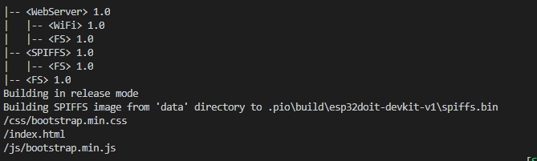
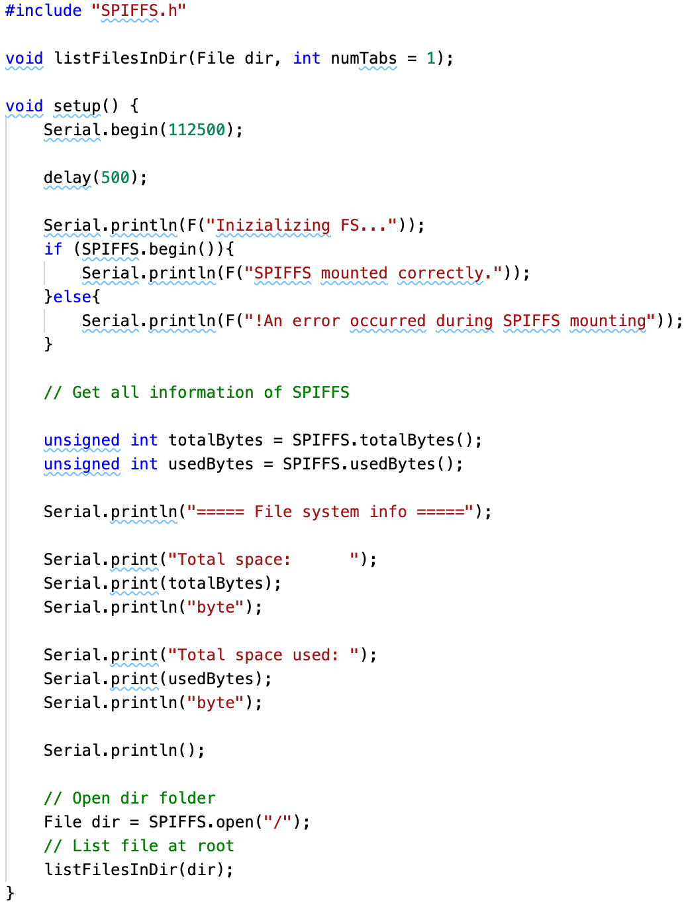
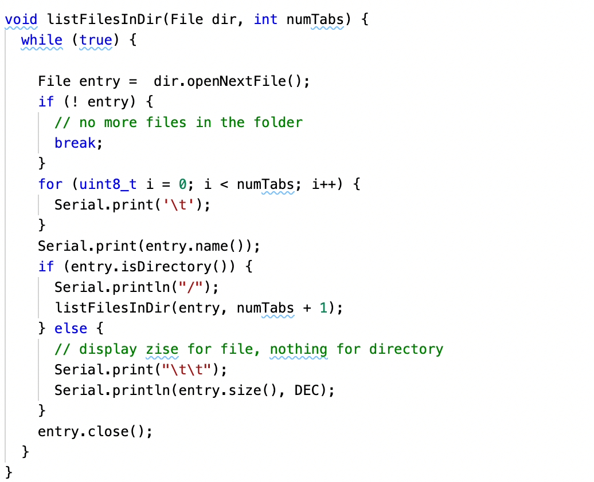
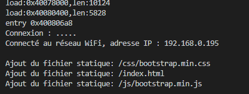
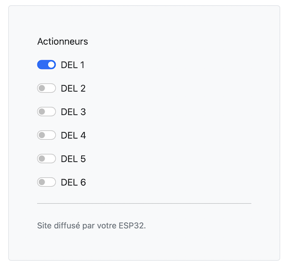
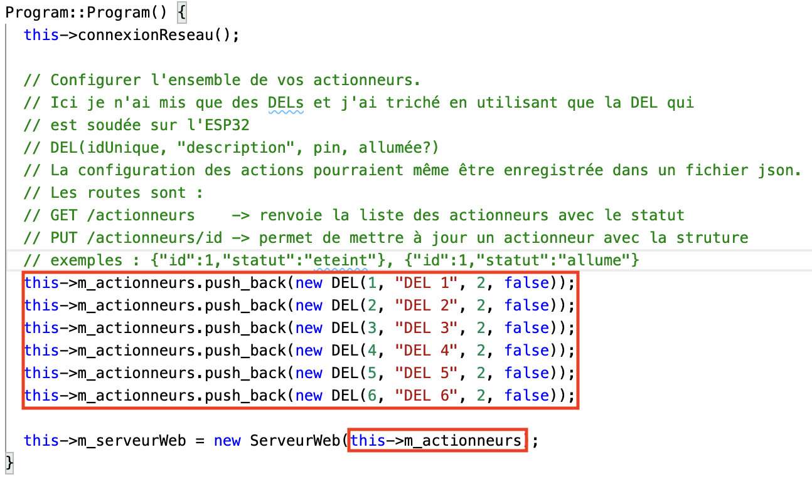

# Module 11 - ESP32 - Serveur web

## Objectifs

Dans ces exercices, vous aurez à modifier votre fichier index.html en :

- Modifiant le code HTML et en utilisant judicieusement "Bootstrap"
- Modifiant le code JavaScript des appels asynchrones

À l'aide de votre ordinateur ou de votre cellulaire connecté au réseau, vous pourrez alors allumer ou éteindre des DELs.

Afin de rendre votre ESP32 autonome, vous ne devez pas inclure de ressources externes dans votre code HTML. Les ressources doivent être servies à partir de votre ESP32. C'est à dire, qu'ici, il ne faut PAS utiliser les fichiers .css et .js à partir de sites web comme "Bootstrap" ou un de ses CDN.

Vous aurez à modifier les classes "Program.cpp", "Webserveur.cpp" et "index.html" pour répondre à ces exercices.

## Exercice 1 - Mon premier serveur web sur l'ESP32 - 30 mins

Pour cet exercice, ne cherchez pas à faire un modèle objet, allez au plus simple !

### Étape 1 - Installation d'un serveur web

Dans cette étape, votre serveur web ESP32 affichera un court message HTML sur un client web. Ce client web peut être utilisé à partir de votre cellulaire ou à partir de votre PC.

- Créez une nouvelle application platformIO ```AMOC_Module11_HelloWeb```. Utilisez le fichier . . ./AMOC_Module11_ServeurWebPrepCours/src/hello.cpp  dans Github
- Écrivez le code pour vous connecter à votre réseau local avec votre SSID ainsi que votre mot de passe (Voir module 10)
- Affichez le statut de votre connexion WiFi et l'adresse IP de l'ESP sur le port série
- Écrivez un serveur web minimum qui affiche "Bonjour à partir de mon ESP32 !" à la demande d'affichage de la page "/" (Voir méthode ```on``` de la classe ```WebServer```)

### Étape 2 - Affichage d'une page web sur un client web

- Ouvrez un navigateur web
- Entrez l'adresse du serveur web
- Le programme fonctionne si le texte "Bonjour à partir de mon ESP32 !" apparaît

<details>
    <summary>Débogage</summary>

Si cela ne fonctionne pas :

- Validez que vous avez bien la bonne adresse IP
- Validez que votre ordinateur ou votre cellulaire est bien connecté sur le même réseau :
  - Même réseau WiFi
  - Ou à un réseau WiFi connecté sur le réseau filaire sur lequel vous êtes
  - ET que vous avec le même début d'adresse IP en considérant les premières valeurs d'une taille données par votre masque réseau (Exemple : 192.168.1.x pour les deux périphériques si votre CIDR est /24, c'est à dire que le masque est 255.255.255.0)
- Validez que vous appelez bien la méthode ```handleResquest``` à chaque appel de la fonction ```loop``` par le cadriciel "Arduino"
- Validez que vous demandez bien la ressource qui est déclarée dans votre enregistrement de route ```on(URI, Verbe, Fonction)```
- Ajoutez une fonction à l'événement ```onNotFound``` qui affiche la ressource non trouvée sur le port série en utilisant la méthode ```uri``` de votre objet ```WebServer```

</details>

## Exercice 2 - Initialisation du serveur web ESP32 - 30 mins

### Étape 1 - Installation du système de fichiers SPIFSS pour ESP32

Dans cette étape, vous allez tester la mise en place des fichiers CSS, JavaScript et HTML dans le système SPIFSS de votre serveur web.

- Créez une nouvelle application platformIO ```AMOC_Module11_ServeurWeb```.
- À la racine du projet, créez un répertoire ```data```


- Copiez la structure ```data``` se trouvant dans le gitHub  ... /AMOC_Module11_ServeurWebPrepCours/data/. **RESPECTEZ le nom des répertoires et fichiers**


- Construisez et téléversez l'image du système de fichiers par les boutons "Build Filesystemimage" et "Upload Filesystemimage". Le résultat devrait donner:



### Étape 2 - Tester le système de fichiers SPIFSS pour ESP32

- Utilisez le code suivant pour lister les fichiers présents dans votre mémoire flash :

<details>
    <summary>Code pour lister les fichiers</summary>

<!-- ```cpp
#include "SPIFFS.h" 

void listFilesInDir(File dir, int numTabs = 1);

void setup() {
    Serial.begin(112500);
 
    delay(500);
 
    Serial.println(F("Inizializing FS..."));
    if (SPIFFS.begin()){
        Serial.println(F("SPIFFS mounted correctly."));
    }else{
        Serial.println(F("!An error occurred during SPIFFS mounting"));
    }

    // Get all information of SPIFFS
 
    unsigned int totalBytes = SPIFFS.totalBytes();
    unsigned int usedBytes = SPIFFS.usedBytes();
 
    Serial.println("===== File system info =====");
 
    Serial.print("Total space:      ");
    Serial.print(totalBytes);
    Serial.println("byte");
 
    Serial.print("Total space used: ");
    Serial.print(usedBytes);
    Serial.println("byte");
 
    Serial.println();
 
    // Open dir folder
    File dir = SPIFFS.open("/");
    // List file at root
    listFilesInDir(dir);
}

void listFilesInDir(File dir, int numTabs) {
  while (true) {
 
    File entry =  dir.openNextFile();
    if (! entry) {
      // no more files in the folder
      break;
    }
    for (uint8_t i = 0; i < numTabs; i++) {
      Serial.print('\t');
    }
    Serial.print(entry.name());
    if (entry.isDirectory()) {
      Serial.println("/");
      listFilesInDir(entry, numTabs + 1);
    } else {
      // display zise for file, nothing for directory
      Serial.print("\t\t");
      Serial.println(entry.size(), DEC);
    }
    entry.close();
  }
}
``` -->





</details>

Vous devriez avoir le résultat suivant dans votre moniteur série :


## Exercice 3 - Contrôler une DEL à distance - 15 mins

- Reprenez le projet Pio "AMOC_Module11_ServeurWebPrepCours" présent à la racine du module
- Téléversez et exécutez le programme



- Notez l'adresse IP du serveur Web.

- À l'aide de votre cellulaire ou de votre PC, ouvrez un navigateur web. Entrez l'adresse IP du serveur web. Vous pourrez alors allumer ou éteindre la DEL No2 sur la carte ESP32. Les boutons Allumer et Éteindre sont déjà programmés et fonctionnels.

## Exercice 4 - Afficher un état à distance - 1h

### Étape 1 - Ajout d'une route

Dans cette étape, vous devez modifier votre programme pour ajouter la route "/statut" avec le verbe "GET" qui renvoie le document json suivant :

```json
{
    "id" : 1,
    "etat": "eteinte"
}
```

```json
{
    "id" : 1,
    "etat": "allumee"
}
```

- Ajoutez la route et codez les méthodes. N'oubliez pas de renvoyer les bons code de statut
- Intégrez l'appel à cette fonctionnalité au chargement de la page et affichez le statut sur la page

### Étape 2 - Modification des routes existantes

Modifier les routes "/allumer" et "/eteindre" pour n'avoir plus que la seule route "/actionneurs/1" avec le verbe "PUT" :

- L'état est maintenant demandé dans un document json. Ce document est le même que celui présenté à l'étape 1. Quand vous recevez un json avec un état à "allume" ou à "eteint", modifiez l'état de la DEL pour le faire correspondre à ce qui est demandé.
- Pour accéder au corp de la requête, utilisez la méthode "arg" de votre objet "WebServer" avec comme paramètres "plain" : ```this->m_webServer->arg("plain");```
- N'oubliez pas de renvoyer les bons code de statut
- La route doit renvoyer le nouvel état de la DEL en json

### Étape 3 - Modifier l'interface

- Modifiez l'interface pour élimer les deux boutons et les remplacer par un bouton unique à changement d'état comme illustré dans l'image :



## Exercice 5 - Paramétrer l'application (Optionnel) - 3h

Dans cet exercice, nous allons généraliser la notion d'actionneurs ainsi que le nombre d'actionneurs disponibles sur une page.

- Vous allez devoir créer une classe abstraite "Actionneur" qui contient un identifiant et une description
- Votre classe "DEL" doit maintenant hériter de la classe "Actionneur"
- Votre classe "ServeurWeb" doit maintenant prendre en paramètres un "std::vector<Actionneur*>" avec un passage par référence. Cette collection provient d'une données membre du même type qui est remplie dans le constructeur de la classe "Program" :



- Vous devez modifier les routes de l'exercices précédent afin que l'identifiant ne soit plus codé en dur dans l'URI. Pour cela, un enregistrement de ressource similaire à :

```cpp
this->m_webServer->on(UriBraces("/actionneurs/{}"), HTTPMethod::HTTP_PUT,
                    [this]() {
                        int id = atoi(this->m_webServer->pathArg(0).c_str());
                        this->actionner(id);
                    });
```

- Comme vous le voyez dans le code, l'identifiant de l'actionneur est récupéré grâce à la méthode "pathArg" avec en paramètres le numéro de la partie variable
- Modifiez les réponses de vos routes, si nécessaire, afin de tenir compte que vous avez maintenant un nombre dynamique d'actionneurs
- Modifiez votre fichier HTML pour tenir compte de cette nouvelle API :
  - Au chargement la page est vide et vous interrogez la ressource "/actionneurs" afin de récupérer l'ensemble des actionneurs avec leurs états.
  - À chaque demande de changement sur un actionneur, envoyer l'action à l'API
- Utilisez votre plaquette d'expérimentation pour vérifier votre application

<details>
    <summary>Solution</summary>

Voir le code du projet "AMOC_Module11_ServeurWebPrepExercices" présent à la racine du module.

</details>
