# Module 11 - ESP32 - Serveur web

## Ce qui sera vu

- Héberger un serveur HTTP minimal sur l'ESP32 et répondre à une requête GET.
- Charger et servir des fichiers locaux avec LittleFS.
- Adapter une page HTML et ses appels JavaScript asynchrones à une API embarquée.
- Commander une DEL à distance et publier son état sous une forme exploitable par le client.
- Conserver les ressources Web sur l'ESP32 plutôt que dépendre de services externes.
- Réaliser, en extension optionnelle, une interface configurable pour plusieurs actionneurs.

## Prérequis

- Avoir terminé le module 10 et savoir connecter l'ESP32 au réseau local.
- Maîtriser les bases de HTTP, HTML, JavaScript et JSON acquises dans les cours précédents.
- Connaître les classes et les fichiers C++ ainsi que l'organisation d'un projet PlatformIO.
- Disposer d'un ordinateur ou d'un téléphone connecté au même réseau que l'ESP32.
- Savoir conserver les identifiants Wi-Fi dans un fichier de configuration non publié.

Les fichiers `Program.cpp`, `Webserveur.cpp` et `index.html` seront modifiés. Les ressources CSS et JavaScript nécessaires doivent être servies localement par l'ESP32, sans dépendance à un CDN.

## Exercice 1 - Mon premier serveur Web sur l'ESP32 - 30 min

Pour cet exercice, reprenez le code des notes de cours et simplifiez-le afin de répondre à une requête HTTP avec la méthode GET. Retirez, par exemple, la gestion des fichiers.

### Étape 1 - Installation d'un serveur web

Dans cette étape, le serveur Web de l'ESP32 transmettra un court message HTML à un navigateur utilisé depuis un téléphone ou un ordinateur.

- Créez une application PlatformIO `AMOC_Module11_HelloWeb`.
- Écrivez le code pour vous connecter à votre réseau local avec votre SSID ainsi que votre mot de passe (Voir module 10)
- Affichez l'état de la connexion Wi-Fi et l'adresse IP de l'ESP32 dans le moniteur série.
- Écrivez un serveur web minimum qui affiche "Bonjour à partir de mon ESP32 !" à la demande d'affichage de la page "/" (Voir méthode ```on``` de la classe ```WebServer``` du cours)

### Étape 2 - Affichage d'une page web sur un client web

- Ouvrez un navigateur web
- Entrez l'adresse du serveur web
- Le programme fonctionne si le texte "Bonjour à partir de mon ESP32 !" apparaît.

<details>
    <summary>Diagramme de classes</summary>

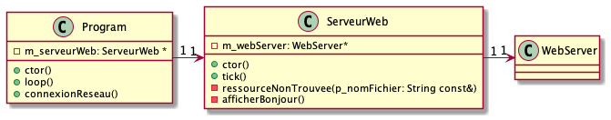

</details>

<details>
    <summary>Débogage</summary>

Si cela ne fonctionne pas :

- Validez que vous avez bien la bonne adresse IP
- Vérifiez que votre ordinateur ou votre téléphone est connecté au même réseau Wi-Fi que l'ESP32, ou à un réseau filaire qui lui est relié.
- Vérifiez que les adresses IP appartiennent au même sous-réseau. Par exemple, avec un préfixe `/24` et un masque `255.255.255.0`, les deux adresses peuvent commencer par `192.168.1`.
- Vérifiez que la méthode `handleResquest` est appelée à chaque passage dans la fonction `loop` du cadriciel Arduino.
- Validez que vous demandez bien la ressource qui est déclarée dans votre enregistrement de route ```on(URI, Verbe, Fonction)```
- Ajoutez une fonction à l'événement ```onNotFound``` qui affiche la ressource non trouvée sur le port série en utilisant la méthode ```uri``` de votre objet ```WebServer```

</details>

<details>
    <summary>Diagramme de séquence</summary>

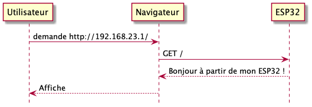

</details>

## Exercice 2 - Initialisation du serveur Web ESP32 - 30 min

### Étape 1 - Installation du système de fichiers LittleFS pour ESP32

Dans cette étape, vous allez tester la mise en place des fichiers CSS, JavaScript et HTML dans le système LittleFS de votre serveur web.

- Créez une application PlatformIO `AMOC_Module11_ServeurWeb`.
- À la racine du projet, créez un répertoire ```data```

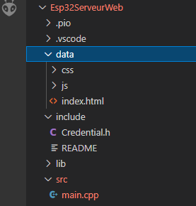

- Copiez la structure ```data``` se trouvant dans le gitHub  ... /AMOC_Module11_ServeurWebPrepCours/data/. **RESPECTEZ le nom des répertoires et fichiers**

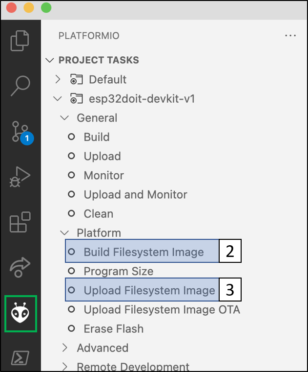

- Construisez et téléversez l'image du système de fichiers par les boutons "Build Filesystemimage" et "Upload Filesystemimage". Le résultat devrait donner:

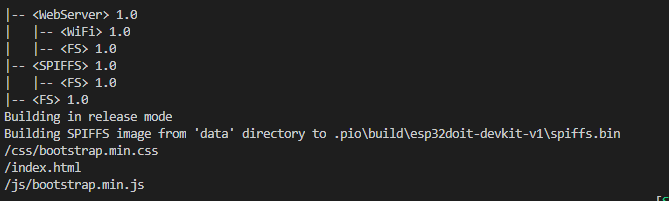

### Étape 2 - Tester le système de fichiers LittleFS pour ESP32

- Utilisez le code suivant pour lister les fichiers présents dans votre mémoire flash :

<details>
    <summary>Code pour lister les fichiers</summary>

<!-- ```cpp
#include "LittleFS.h" 

void listFilesInDir(File dir, int numTabs = 1);

void setup() {
    Serial.begin(112500);
 
    delay(500);
 
    Serial.println(F("Inizializing FS..."));
    if (LittleFS.begin()){
        Serial.println(F("LittleFS mounted correctly."));
    }else{
        Serial.println(F("!An error occurred during LittleFS mounting"));
    }

    // Get all information of SPIFFS
 
    unsigned int totalBytes = LittleFS.totalBytes();
    unsigned int usedBytes = LittleFS.usedBytes();
 
    Serial.println("===== File system info =====");
 
    Serial.print("Total space:      ");
    Serial.print(totalBytes);
    Serial.println("byte");
 
    Serial.print("Total space used: ");
    Serial.print(usedBytes);
    Serial.println("byte");
 
    Serial.println();
 
    // Open dir folder
    File dir = LittleFS.open("/");
    // List file at root
    listFilesInDir(dir);
}

void listFilesInDir(File dir, int numTabs) {
  while (true) {
 
    File entry =  dir.openNextFile();
    if (! entry) {
      // no more files in the folder
      break;
    }
    for (uint8_t i = 0; i < numTabs; i++) {
      Serial.print('\t');
    }
    Serial.print(entry.name());
    if (entry.isDirectory()) {
      Serial.println("/");
      listFilesInDir(entry, numTabs + 1);
    } else {
      // display zise for file, nothing for directory
      Serial.print("\t\t");
      Serial.println(entry.size(), DEC);
    }
    entry.close();
  }
}
``` -->

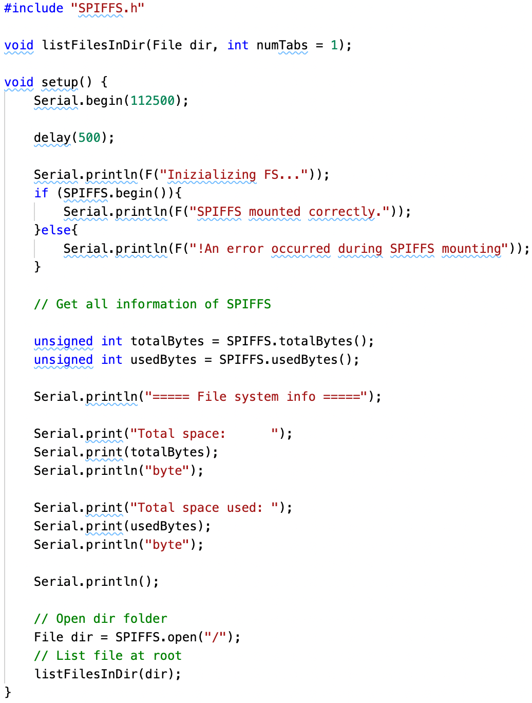

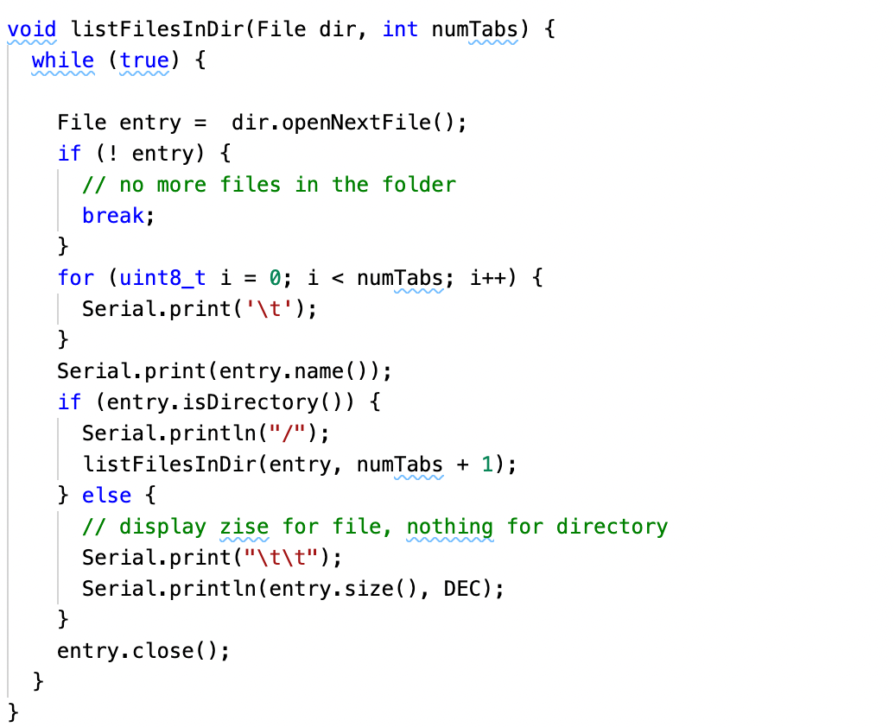

</details>

Vous devriez avoir le résultat suivant dans votre moniteur série :

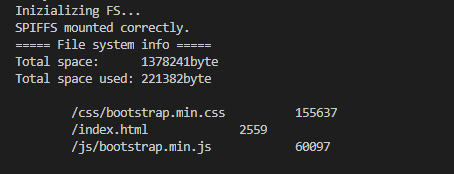

<details>
    <summary>Diagramme de séquence</summary>

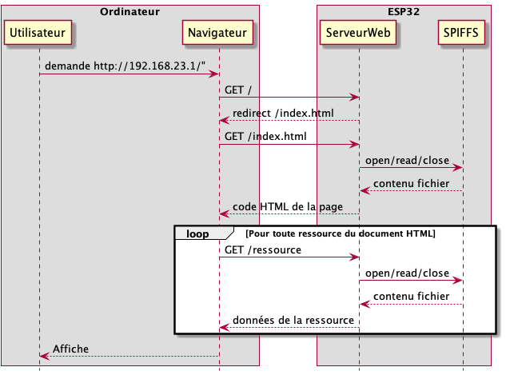

</details>

## Exercice 3 - Contrôler une DEL à distance - 15 min

- Reprenez le projet Pio "AMOC_Module11_ServeurWebPrepCours" présent à la racine du module
- Téléversez et exécutez le programme

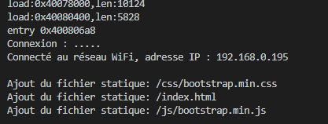

- Notez l'adresse IP du serveur Web.

- Depuis votre téléphone ou votre ordinateur, ouvrez un navigateur Web et entrez l'adresse IP du serveur. Vous pourrez alors allumer ou éteindre la DEL 2 de l'ESP32. Les boutons **Allumer** et **Éteindre** sont déjà programmés.

<details>
    <summary>Diagramme de séquence</summary>

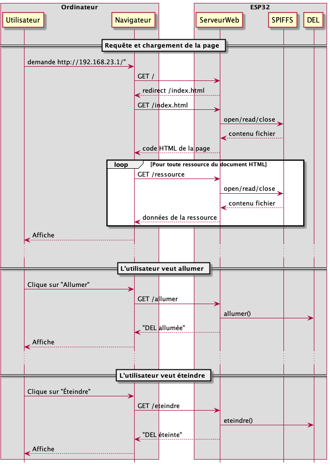

</details>

## Exercice 4 - Afficher un état à distance - 1h

### Étape 1 - Ajout d'une route

Dans cette étape, vous devez modifier votre programme pour ajouter la route "/actionneur" avec le verbe "GET" qui renvoie le document json suivant :

```json
{
    "id" : 1,
    "etat": "eteint"
}
```

```json
{
    "id" : 1,
    "etat": "allume"
}
```

- Ajoutez la route et programmez les méthodes. N'oubliez pas de renvoyer les bons codes d'état.
- Intégrez l'appel à cette fonctionnalité au chargement de la page et affichez le statut sur la page

### Étape 2 - Modification des routes existantes

Modifiez les routes `/allumer` et `/eteindre` pour ne conserver que la route `/actionneurs/1` avec la méthode PUT :

- L'état est maintenant transmis dans un document JSON identique à celui de l'étape 1. Lorsque vous recevez la valeur `allume` ou `eteint`, modifiez l'état de la DEL en conséquence.
- Pour accéder au corps de la requête, utilisez la méthode `arg` de votre objet `WebServer` avec le paramètre `plain` : `this->m_webServer->arg("plain");`
- N'oubliez pas de renvoyer les bons codes d'état.
- La route doit renvoyer le nouvel état de la DEL en json

### Étape 3 - Modifier l'interface

- Modifiez l'interface pour éliminer les deux boutons et les remplacer par un bouton unique à changement d'état, comme dans l'image :

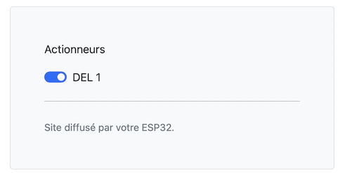

<details>
    <summary>Diagramme de séquence</summary>

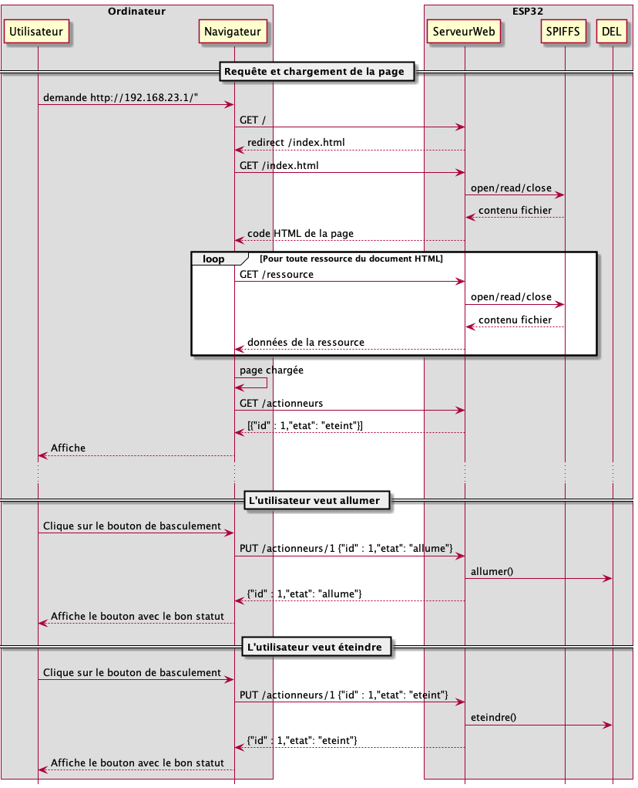

</details>

## Exercice 5 - Paramétrer l'application (optionnel) - 3 h

Dans cet exercice, nous allons généraliser la notion d'actionneurs ainsi que le nombre d'actionneurs disponibles sur une page.

Pour cet exercice, nous vous demandons de vous baser sur le diagramme de classes ci-dessous :

<details>
    <summary>Diagramme de classes</summary>

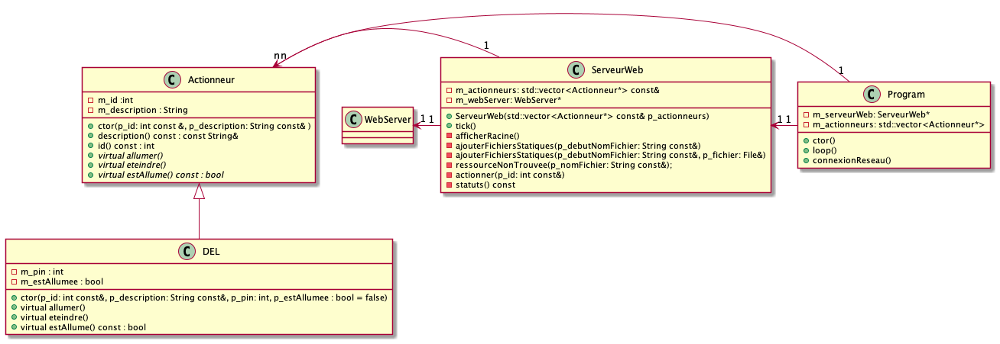

</details>

- Vous allez devoir créer une classe abstraite "Actionneur" qui contient un identifiant et une description
- Votre classe "DEL" doit maintenant hériter de la classe "Actionneur"
- Votre classe "ServeurWeb" doit maintenant prendre en paramètres un "std::vector<Actionneur*>" avec un passage par référence. Cette collection provient d'une données membre du même type qui est remplie dans le constructeur de la classe "Program" :

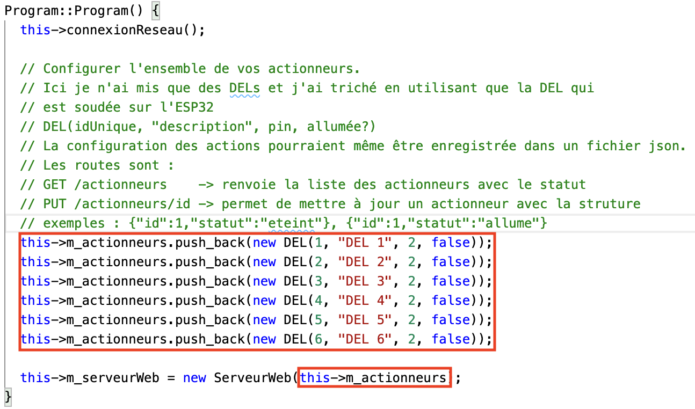

- Modifiez les routes de l'exercice précédent afin que l'identifiant ne soit plus codé en dur dans l'URI. Utilisez un enregistrement de ressource semblable à celui-ci :

```cpp
this->m_webServer->on(UriBraces("/actionneurs/{}"), HTTPMethod::HTTP_PUT,
                    [this]() {
                        int id = atoi(this->m_webServer->pathArg(0).c_str());
                        this->actionner(id);
                    });
```

- Comme vous le voyez dans le code, l'identifiant de l'actionneur est récupéré grâce à la méthode "pathArg" avec en paramètres le numéro de la partie variable
- Modifiez les réponses de vos routes, si nécessaire, afin de tenir compte que vous avez maintenant un nombre dynamique d'actionneurs
- Modifiez votre fichier HTML pour tenir compte de cette nouvelle API :
  - Au chargement la page est vide et vous interrogez la ressource "/actionneurs" afin de récupérer l'ensemble des actionneurs avec leurs états.
  - À chaque demande de changement sur un actionneur, envoyer l'action à l'API
- Utilisez votre plaquette d'expérimentation pour vérifier votre application

<details>
    <summary>Solution</summary>

Voir le code du projet "AMOC_Module11_ServeurWebPrepExercices" présent à la racine du module.

</details>

<details>
    <summary>Diagramme de séquence</summary>

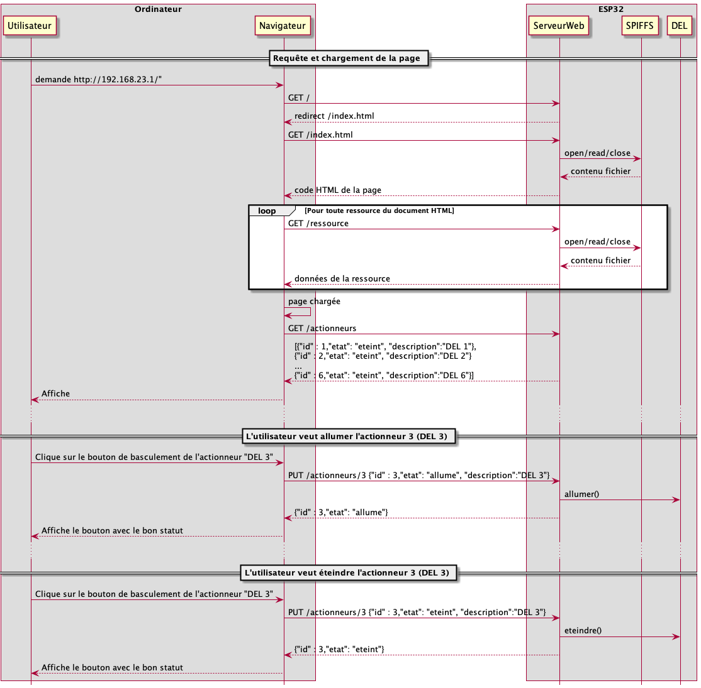

</details>
