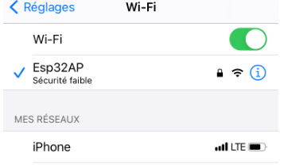
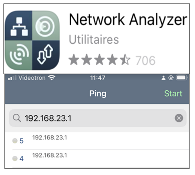
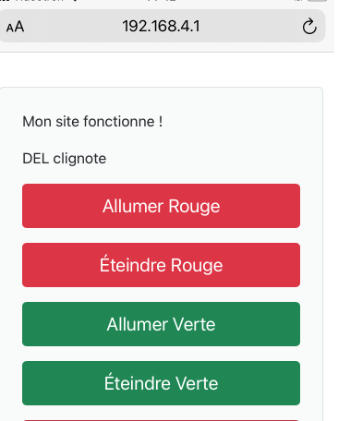

# Module 12 - ESP32 - Point D'accès

## Objectifs

Dans ces exercices, vous allez utiliser un ordinateur ou votre cellulaire pour vous connecter à votre ESP32. Votre ESP32 sera configuré comme un point d'accès sans-fil, sans lien avec internet.

En premier lieu, il faudra démontrer que le ESP32 est bien configuré comme un point d'accès. C'est le classique "Hello World!" qui sera envoyé au client.

Par la suite, l'ESP32 agira aussi comme serveur Web dans une activité précédente.

Enfin, le MCU transmettra des informations lues sur un périphérique. Pour la cause, nous utiliserons un potentiomètre comme périphérique d'entrée analogique.

NOTE IMPORTANTE: il est préférable d'effectuer les tests avec votre cellulaire. Ainsi, votre PC pourra maintenir un lien internet avec votre routeur.

## Exercice 1 - Mon point d'accès avec un ESP32 - 15 mins

Cet exercice a pour but de démontrer le fonctionnement d'un ESP32 en point d'accès grâce à la librairie Wifi.h.

- Créez la nouvelle application PlatformIO ```AMOC_Module12_HelloAC```.
- Utilisez le programme "main.cpp" du GitHub -->.../AMOC_Module12_ESP32_AP_SrvWeb_PrepCours/src
Le nom du SSID choisi est ```ESP32AP_<VotreNumeroMatricule>```. Le mot de passe sera ```12345678```.

- - Inscrire ces deux données dans un fichier d'authentification ```config.h``` intégré à vos projets futurs.

NOTE : ce mot de passe est peu sécuritaire, mais nous permet de faire des tests dans un réseau privé et isolé. Dans un prochain module, une méthode sécuritaire sera proposée.

- Compilez et exécutez le programme.
- Mémorisez l'adresse IP de votre point d'accès ```ESP32AP_<VotreNumeroMatricule>``` à partir de la console
- Sur votre cellulaire, repérez et utilisez votre réseau Esp32AP.



- A l'aide du bouton (i), consultez l'adresse IP de votre client Wi-Fi.

Cette adresse DOIT se trouver sur le même réseau que l'adresse IP de votre point d'accès ```ESP32AP_<VotreNumeroMatricule>```. Sans cette condition, vous ne pouvez pas continuer.

### À observer et à répondre

- Quel protocole fournit une adresse du réseau 192.168.23.0/24 au cellulaire?
- Quelles sont les adresses possibles pour les stations se connectant à ce point d'accès ?
- Combien cela fait-il de stations potentielles ?

## Exercice 2 - Mon point d'accès avec un ESP32 - 10 mins

Votre point d'accès ESP32 utilise la majorité du code de vos exercices du module ```ServeurWeb```. Vous pouvez donc répliquer vos exercices précédents.

- Faites une copie de l'application PlatformIO ```AMOC_Module11_ServeurWeb``` dans une nouvelle application nommée ```AMOC_Module12_AP```
- Utilisez le code de l'application ```AMOC_Module12_AP```

### Étape 1 - Configurer le point d'accès ESP32

- Modifiez la connexion réseau pour une connexion au point d'accès ```ESP32AP_<VotreNumeroMatricule>```. Inspirez-vous de l'exercice 1

### Étape 2 - Accéder au point d'accès

- Sur votre cellulaire, accédez au réseau ```ESP32AP_<VotreNumeroMatricule>```
- Ouvrez un navigateur web; lancez une requête web à l'adresse IP du point d'accès

<details>
 <summary>Dépannage</summary>

- Utilisez l'application "Network Analyser" sur votre cellulaire
- Lancez la recherche ping vers l'adresse IP du point d'accès ```ESP32AP_<VotreNumeroMatricule>```. Les requêtes doivent réussir



</details>

- Votre navigateur se trouve dans les mêmes conditions que l'exercice 3 du module_11. Vous pouvez allumer ou éteindre la DEL No 2.

## Exercice 3 - Contrôler deux DELs à distance - 15 mins

Dans cet exercice, vous allez remplacer le contrôle de la borne No 2 par le contrôle des 2 bornes GPIO 25 et GPIO 26. Si vous avez fait l'exercice optionnel du module précédent, vous pouvez réutilisez son code.

### Matériel et montage

- Plaquette d'expérimentation avec fils Dupont de branchement
- Branchez des fils Dupont entre les bornes 25 et 26 de votre MCU et deux borniers de DELs de votre plaquette. Reliez le fil noir à la prise de terre (GND)
- Modifiez le code de votre application PlattfromIO pour remplacer la borne NO 2 par la borne No 25
- Compilez et exécutez le programme.
- Modifiez le code pour pouvoir allumer et éteindre 2 DELs de votre plaquette. Votre interface html aura donc 4 boutons



<details>
 <summary>Indice</summary>

Analysez les fichiers de votre application. Repérez les endroits en référence avec la DEL No2. Adaptez le code pour 2 bornes.

</details>

## Exercice 4 - Afficher de l'information d'une borne analogique - 60 mins

Dans cet exercice, vous allez mesurer la tension d'un potentiomètre.

Si la tension se situe entre 0 V et 1,6 V, votre MCU allume la DEL verte et affiche alors ```DEL Verte allumée``` sur la page web du client connecté.

Si la tension se situe entre 1,7 V et 3,3 V (max), votre MCU allume la DEL rouge et affiche alors ```DEL Rouge allumée``` sur la page web du client connecté.

## Exercice 5 Définir le profil différent d'un point d'accès - 10 mins (optionnel)

Dans cet exercice, vous allez modifier les configurations du point d'accès ESP32.

Sans configuration précise, la classe ```WiFi``` initie un réseau sans mot de passe avec les valeurs suivantes:

- Passerelle par défaut: ```192.168.4.1```
- Masque de sous-réseau 255.255.255.0
- Sans mot de passe de connexion

Ces règles d'usage ont trois inconvénients, dans le mode pratique :

- Ces valeurs par défaut sont assez connues, donc attaquées facilement (sic)
- Sans mot de passe, les accès sont ouverts
- Si deux MCUs ESP32 sont voisins, il y aura confusion de connexion entre les clients et les points d'accès.

<details>
 <summary>Indice</summary>

La librairie ```Wifi``` possède un fonction DHCP pour l'attibution dynamique des adresses IP des clients qui se connectent au pont d'accès. Consultez le lien suivant: https://github.com/arduino-libraries/WiFi/blob/master/docs/readme.md.

Voici une liste d'autres exemples que vous pourrez adapter à vos projets.
- redéfinir le réseau par défaut (cet exercice);
- fournir une liste des réseaux à proximité;
- utiliser le protocole NTP.

</details>

Votre tâche, si vous acceptez de la prendre, consiste à définir le point d'accès avec la valeur 10.10.1.1/24 avec le SSID ```Esp32MissionImpossible``` et le mot de passe ```Sijedevaisvousdireoujallaisceneseraientplusdesvacances.```
