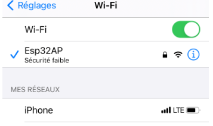
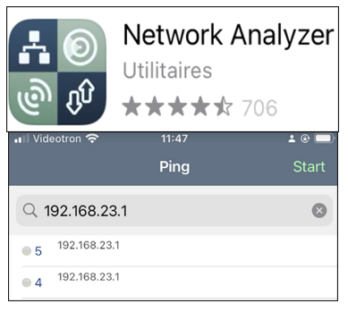
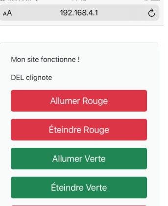

# Module 12 - ESP32 - Point d'accès

## Ce qui sera vu

- Configurer l'ESP32 comme point d'accès Wi-Fi autonome.
- Vérifier l'adressage du point d'accès et d'un client connecté.
- Héberger un serveur Web directement sur ce réseau local isolé.
- Commander deux DEL à distance depuis un téléphone ou un ordinateur.
- Lire une entrée analogique et transmettre sa valeur au client Web.
- Définir, en extension optionnelle, un profil de point d'accès différent.

## Prérequis

- Avoir terminé le module 11 et savoir servir une page ou une route HTTP depuis l'ESP32.
- Maîtriser les notions de réseau local, adresse IP, client, serveur et point d'accès vues dans les cours précédents.
- Savoir commander une DEL et lire un potentiomètre avec un microcontrôleur.
- Disposer d'un téléphone ou d'un ordinateur capable de rejoindre le réseau Wi-Fi créé par l'ESP32.
- Comprendre que le réseau de laboratoire peut être isolé d'Internet pendant les essais.

Il est préférable d'effectuer les tests avec un téléphone afin que l'ordinateur puisse conserver son accès au réseau habituel.

## Exercice 1 - Mon point d'accès avec un ESP32 - 15 min

Cet exercice démontre le fonctionnement d'un ESP32 en point d'accès avec la bibliothèque `WiFi.h`.

- Créez la nouvelle application PlatformIO ```AMOC_Module12_HelloAC```.
- Utilisez le programme "main.cpp" du GitHub -->.../AMOC_Module12_ESP32_AP_SrvWeb_PrepCours/src
Le nom du SSID choisi est ```ESP32AP_<VotreNumeroMatricule>```. Le mot de passe sera ```12345678```.

- Inscrivez ces deux données dans un fichier d'authentification `config.h` à intégrer à vos futurs projets.

NOTE : ce mot de passe est peu sécuritaire, mais nous permet de faire des tests dans un réseau privé et isolé. Dans un prochain module, une méthode sécuritaire sera proposée.

- Compilez et exécutez le programme.
- Mémorisez l'adresse IP de votre point d'accès ```ESP32AP_<VotreNumeroMatricule>``` à partir de la console
- Sur votre téléphone, repérez et rejoignez le réseau `ESP32AP`.



- À l'aide du bouton (i), consultez l'adresse IP de votre client Wi-Fi.

Cette adresse DOIT se trouver sur le même réseau que l'adresse IP de votre point d'accès ```ESP32AP_<VotreNumeroMatricule>```. Sans cette condition, vous ne pouvez pas continuer.

### À observer et à répondre

- Quel protocole fournit une adresse du réseau `192.168.23.0/24` au téléphone?
- Quelles sont les adresses possibles pour les stations se connectant à ce point d'accès ?
- Combien cela fait-il de stations potentielles ?

## Exercice 2 - Mon point d'accès avec un ESP32 - 10 min

Votre point d'accès ESP32 utilise la majorité du code de vos exercices du module ```ServeurWeb```. Vous pouvez donc répliquer vos exercices précédents.

- Faites une copie de l'application PlatformIO ```AMOC_Module11_ServeurWeb``` dans une nouvelle application nommée ```AMOC_Module12_AP```
- Utilisez le code de l'application ```AMOC_Module12_AP```

### Étape 1 - Configurer le point d'accès ESP32

- Modifiez la connexion réseau pour une connexion au point d'accès ```ESP32AP_<VotreNumeroMatricule>```. Inspirez-vous de l'exercice 1

### Étape 2 - Accéder au point d'accès

- Sur votre téléphone, accédez au réseau `ESP32AP_<VotreNumeroMatricule>`.
- Ouvrez un navigateur web; lancez une requête web à l'adresse IP du point d'accès

<details>
 <summary>Dépannage</summary>

- Utilisez l'application **Network Analyzer** sur votre téléphone.
- Lancez la recherche ping vers l'adresse IP du point d'accès ```ESP32AP_<VotreNumeroMatricule>```. Les requêtes doivent réussir



</details>

- Votre navigateur se trouve dans les mêmes conditions que l'exercice 3 du module_11. Vous pouvez allumer ou éteindre la DEL No 2.

## Exercice 3 - Contrôler deux DEL à distance - 15 min

Dans cet exercice, vous remplacerez le contrôle de la broche 2 par celui des broches GPIO 25 et GPIO 26. Si vous avez fait l'exercice optionnel du module précédent, vous pouvez réutiliser son code.

### Matériel et montage

- Plaquette d'expérimentation avec fils Dupont de branchement
- Branchez des fils Dupont entre les broches 25 et 26 du microcontrôleur et deux borniers de DEL de votre plaquette. Reliez le fil noir à la masse (GND).
- Modifiez le code de votre application PlatformIO pour remplacer la broche 2 par la broche 25.
- Compilez et exécutez le programme.
- Modifiez le code pour pouvoir allumer et éteindre deux DEL de votre plaquette. Votre interface HTML comportera donc quatre boutons.



<details>
 <summary>Indice</summary>

Analysez les fichiers de votre application. Repérez les endroits en référence avec la DEL No2. Adaptez le code pour 2 bornes.

</details>

## Exercice 4 - Afficher l'information d'une entrée analogique - 60 min

Dans cet exercice, vous allez mesurer la tension d'un potentiomètre.

Si la tension se situe entre 0 V et 1,6 V, votre MCU allume la DEL verte et affiche alors ```DEL Verte allumée``` sur la page web du client connecté.

Si la tension se situe entre 1,7 V et 3,3 V (max), votre MCU allume la DEL rouge et affiche alors ```DEL Rouge allumée``` sur la page web du client connecté.

## Exercice 5 - Définir un profil différent pour le point d'accès - 10 min (optionnel)

Dans cet exercice, vous allez modifier les configurations du point d'accès ESP32.

Sans configuration précise, la classe ```WiFi``` initie un réseau sans mot de passe avec les valeurs suivantes:

- Passerelle par défaut: ```192.168.4.1```
- Masque de sous-réseau 255.255.255.0
- Sans mot de passe de connexion

Ces règles d'usage ont trois inconvénients, dans le mode pratique :

- Ces valeurs par défaut sont assez connues, donc attaquées facilement (sic)
- Sans mot de passe, les accès sont ouverts
- Si deux MCUs ESP32 sont voisins, il y aura confusion de connexion entre les clients et les points d'accès.

<details>
 <summary>Indice</summary>

La bibliothèque `WiFi` offre une fonction DHCP pour l'attribution dynamique des adresses IP aux clients qui se connectent au point d'accès. Consultez la [documentation](https://github.com/arduino-libraries/WiFi/blob/master/docs/readme.md).

Voici une liste d'autres exemples que vous pourrez adapter à vos projets.
- redéfinir le réseau par défaut (cet exercice);
- fournir une liste des réseaux à proximité;
- utiliser le protocole NTP.

</details>

Votre tâche, si vous acceptez de la prendre, consiste à définir le point d'accès avec la valeur 10.10.1.1/24 avec le SSID ```Esp32MissionImpossible``` et le mot de passe ```Sijedevaisvousdireoujallaisceneseraientplusdesvacances.```
