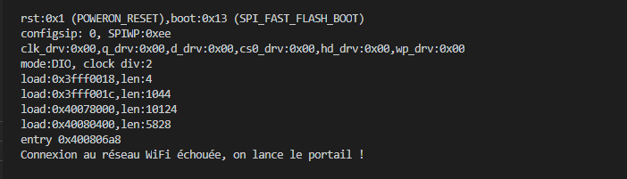
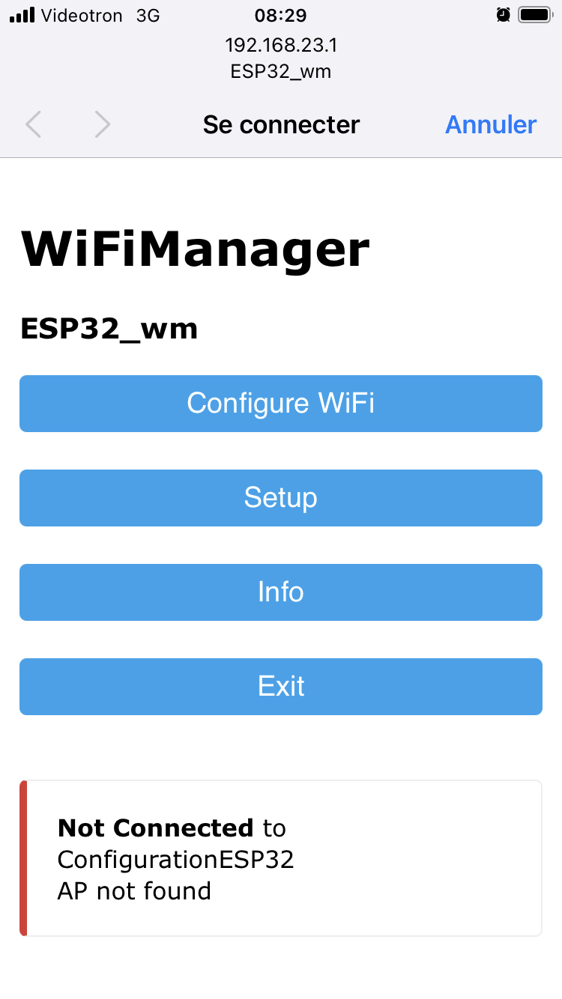
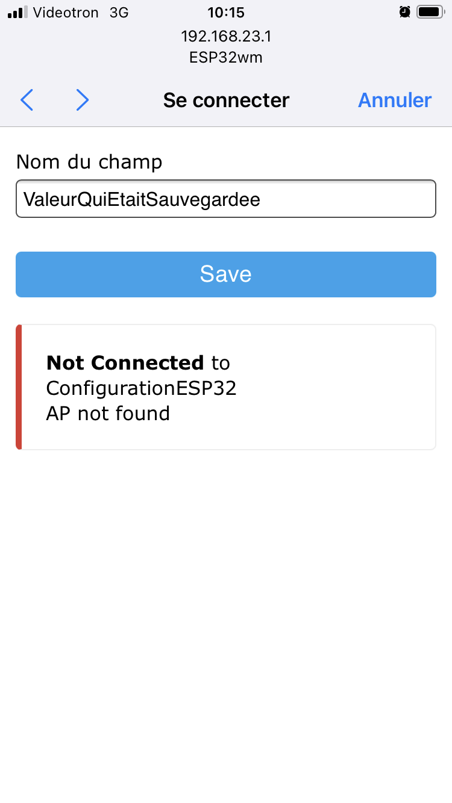
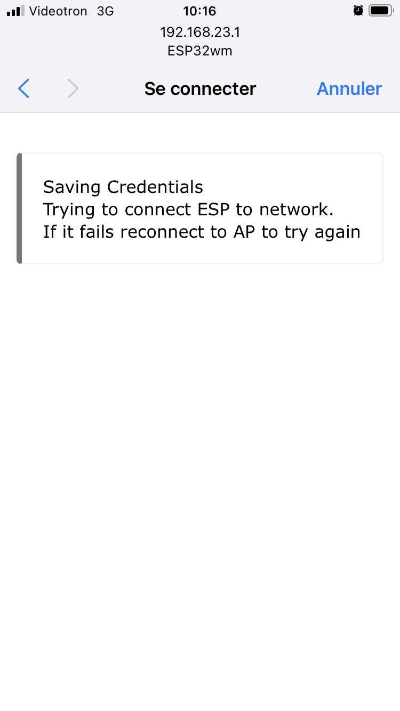

# Module 13 - WiFiManager

## Objectifs

Dans ces exercices, vous allez mettre en place un gestionnaire de connexion Wifi. La librairie ```WifiManager``` simmplifie la connexion de votre ESP32 à divers réseaux wifi en mémorisant les paramètres de connexion.

La librairie offre même une "voie de contournement". Si la connexion échoue, une connexion vers un portail web dirige le client pour:
- Afficher les sites Wifi visibles
- Se connecter à un réseau particulier avec le "bon" mot de passe
- Sauvegarder ce nouveau profil pour les prochaines connexions

Les étapes des exercices peut donc se résumer à:
- 1 - faire échec à la connexion (votre ESP32 n'a pas encore le profil pour une connexion)
- 2 - démarrer un portail de configuration donnant la liste des réseaux WiFi disponibles
- 3 - choisir et s'autentifichier sur un des réseaux
- 4 - sauvegarder le profil pour les prochaines connexions

## Exercice 1 - Configurez le WiFiManager pour la première fois

### Étape 1 - installer le WiFiManager

Utilisez les diapositives pour coder et compiler votre propre WiFiManager

### Étape 2 - configurer un profil client avec  WiFiManager

- Au premier démarrage, la connexion est en échec. C'est normal, parce qu'aucun profil n'a été détecté par l'application



- Sur la liste des réseaux visible de votre cellulaire, recherchez le réseau nommé par votre application (exemple:ESP32_wm)

- Entrez l'adresse IP configurée (exemple 192.168.23.1)

- "Configuration WiFi" permet de choisir le profil pour un réseau particulier



- Sur la liste, choissisez un réseau Wifi pour connecter votre ESP32 (exemple : "CLOCHE_123")

    - Entrez les informations de mot de passe
    - Sauvegardez le profil





- Redémarrez l'application de votre ESP32 en appuyant sur le bouton "reset" situé sur la carte près du branchement USB
-  Ouvrez un navigateur web pour vous connecter à l'adresse IP du réseau WiFi que vous venez de choisir

- Le message  ```Bienvenue sur mon site Web``` devrait apparaître en format texte non formatté.

## Exercice 2 -  remise à zéro du profil dans WiFiManager

La méthode wm.erase() efface le profil enregistré. Cette méthode permet de se conserver le profil pour un autre réseau

- Activez l'instruction ```wm.erase()``` 

- Compilez et exécutez le programme

- Le message d'invitation au portail revient 


- NE PAS OUBLIER: ajoutez l'instruction ```wm.erase()``` commentaires. 

- Reprenez l'étape 2 pour un nouveau profil

## Exercice 3 -  Bouton de remise à zéro (optionnel)

Vous venez de démontrer comment remettre à zéro le profil du serveur web habité sur votre ESP32.

Il faut reconnaître que cette façon de faire est peu pratique, car elle exige une recompilation successive.

La façon conventionnelle de faire cette opération consiste à appuyer sur un bouton-poussoir pour remettre à zéro le profil

- Reliez un bouton pooussoir de votre plaquette d'expérimentation sur la borne GPIO 25 de votre Esp32. Ajoutez un fil de retour à la terre (GND)

- Ajoutez le code de programmation du bouton-poussoir (module précédent) qui appellera l'instruction ```wm.erase()``` lorsque vous appuyez sur le bouton

- Ajoutez un message à la console pour aviser de cette action

- Compilez et exécutez le programme

- Appuyez sur le bouton-poussoir

- Appuyez sur le bouton "reset" pour amorcer le programme depuis le début

Le programme devrait passer en mode équivalente à l'étape 2
