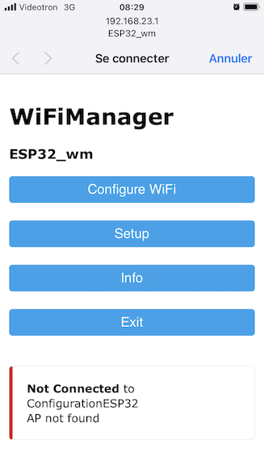
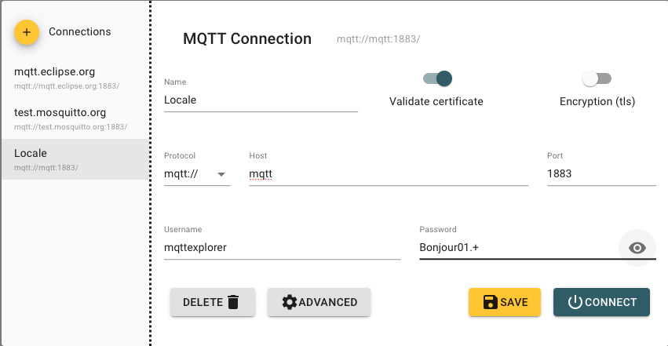
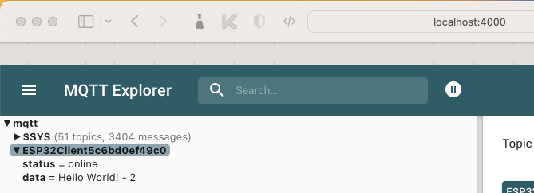
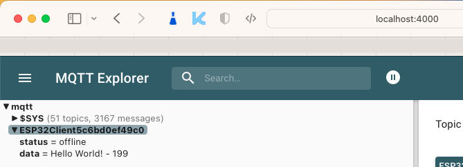
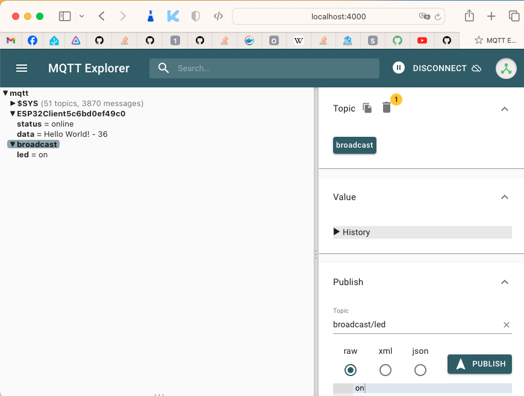
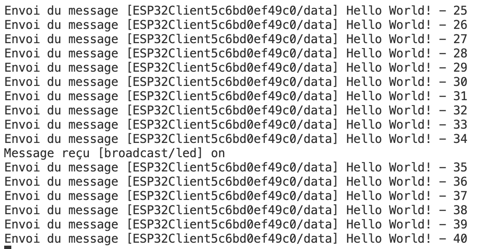

# Module 13 - ESP32 - WiFiManager - MQTT

## Objectifs

Dans ces exercices, vous allez mettre en place un gestionnaire de connexion Wifi. La librairie ```WifiManager``` simplifie la connexion de votre ESP32 à divers réseaux wifi en mémorisant les paramètres de connexion.

La librairie offre même une "voie de contournement". Si la connexion échoue, une connexion vers un portail web dirige le client pour :

- Afficher les accès Wi-Fi visibles
- Se connecter à un réseau particulier avec le "bon" mot de passe
- Sauvegarder ce nouveau profil pour les prochaines connexions

Les étapes des exercices peut donc se résumer à :

1. Faire échec à la connexion (votre ESP32 n'a pas encore le profil pour une connexion)
2. Démarrer un portail de configuration donnant la liste des réseaux WiFi disponibles
3. Choisir et s'authentifier sur un des réseaux
4. Sauvegarder le profil pour les prochaines connexions

## Exercice 1 - Configurez un objet de type ```WiFiManager``` pour la première fois

### Étape 1 - Installer la bibliothèque WiFiManager

- Utilisez les diapositives pour importer WiFiManager (***Ne passer pas par la fenêtre d'ajout de bibliothèque de Pio, mettez l'adresse du dépôt Git dans ```platformio.ini```)
- Dans votre fichier ```main.cpp```, créez un objet de type ```WiFiManager```
- Compilez votre programme pour valider que la bibliothèque est bien installée
- Codez la configuration de votre objet dans la fonction ```setup``` comme illustré dans le cours
- Codez un site web qui répond sur le port 80. Il doit répondre ```Bienvenue sur mon site Web```

### Étape 2 - Configurer un profil client avec  WiFiManager

- Au premier démarrage, la connexion est en échec. C'est normal, parce qu'aucun profil n'a été détecté par l'application


- Sur la liste des réseaux visible de votre cellulaire, recherchez le réseau nommé par votre application (exemple : ESP32_wm)
- Un portail s'ouvre automatiquement
- Si le portail ne se lance à la connexion sur le réseau Wi-Fi de l'ESP32, entrez l'adresse IP configurée (exemple : 192.168.23.1)
- "Configuration WiFi" permet de choisir le profil pour un réseau particulier



- Sur la liste, choisissez un réseau Wi-Fi pour connecter votre ESP32 (exemple : "CLOCHE_123")
- Entrez les informations de mot de passe
- Sauvegardez le profil


- Sur la console de votre ESP32, notez l'adresse IP (normalement générée par DHCP)
- Assurez-vous que votre cellulaire peut rejoindre le réseau WiFi choisi (exemple : "CLOCHE_123")
- Ouvrez un navigateur web pour vous connecter à l'adresse IP du serveur Web
- Le message  ```Bienvenue sur mon site Web``` devrait apparaître en format texte non formatté.

## Exercice 2 -  Remise à zéro du profil dans WiFiManager

La méthode wm.erase() efface le profil enregistré. Cette méthode permet de changer de réseau à chaque démarrage du programme.

- Activez l'instruction ```wm.erase()```
- Activez l'instruction ```wm.setDebugOutput(true);``` de votre déboggeur d'application

***Cette façon de faire doit être supprimée À LA FIN DES TESTS***

- Compilez et exécutez le programme
- Le message d'invitation au portail revient


- Reprenez l'étape 2 pour un tester un nouveau profil
- NE PAS OUBLIER : placez l'instruction ```wm.erase()``` en commentaires
- NE PAS OUBLIER : placez l'instruction ```wm.setDebugOutput(true);``` en commentaires

## Exercice 3 -  Bouton de remise à zéro (optionnel)

Vous venez de démontrer comment remettre à zéro le profil du serveur web habité sur votre ESP32.

Il faut reconnaître que cette façon de faire est peu pratique, car elle exige une recompilation successive.

La façon conventionnelle de faire cette opération consiste à appuyer sur un bouton-poussoir pour remettre à zéro le profil.

- Reliez un bouton poussoir de votre plaquette d'expérimentation sur la borne GPIO 25 de votre Esp32. Ajoutez un fil de retour à la terre (GND)
- Ajoutez le code de programmation du bouton-poussoir (module précédent) qui appellera l'instruction ```wm.erase()``` et l'instruction ```ESP.reset()```lorsque vous appuyez sur le bouton
- Ajoutez un message à la console pour aviser de cette action
- Compilez et exécutez le programme
- Appuyez sur le bouton-poussoir
- Appuyez sur le bouton "reset" pour amorcer le programme depuis le début

Le programme devrait passer en mode équivalente à l'étape 2

## Exercice 4 -  MQTT

### Exercice 4.1 - Mise en place

- Créez votre serveur MQTT à partir de docker-compose :
  - Placez vous dans le répertoire ```AMOC_Module13_MQTT_PrepCours/docker-compose-mosquitto```
  - ```docker-compose up -d```
  - Vous devriez voir deux conteneurs avec la commande ```docker ps```
- Naviguez sur le site http://localhost:4000 pour valider que le serveur est bien en fonction
- Créez une connexion vers votre serveur MQTT dans MQTT Explorer
  - Name : Locale
  - Host : mqtt
  - Nom d'utilisateur : mqttexplorer
  - Mot de passe : Bonjour01.+
  - Cliquez sur "Save" et sur "Connect"



- Reprenez le code AMOC_Module13_MQTT_PrepCours
- Modifiez l'adresse IP du serveur MQTT pour qu'elle corresponde à votre serveur MQTT (ipconfig / ifconfig)
- Envoyez votre code sur l'ESP32
- Validez que l'ESP32 se connecte bien au WiFi et au serveur MQTT
- Si tout se passe bien, votre moniteur série devrait ressembler à ceci :


- Validez que la connexion est bien établie dans MQTT Explorer et que vous recevez bien les messages :



- Si vous déconnectez votre ESP32, vous devriez voir le status passer à "offline"



- Utilisez MQTT explorer pour publier un message dans le sujet "broadcast/led" avec le payload RAW "on" pour allumer la DEL de votre ESP32. Testez aussi avec la valeur "off"



- Dans le terminal série, vous devriez aussi voir les messages reçu sur l'ESP32.



- Une fois les expériences effectuées, analysez le code de l'ESP32 pour comprendre comment tout cela fonctionne

### Exercice 4.2 - Diffusion de la température

- Connectez le BME280 sur les broches I2C de votre ESP32
- Publiez un message MQTT sur le sujet "ESP32{id}/temperature" avec le message température de la pièce
- Validez que l'information est reçue sur le serveur MQTT
- Permettez à l'utilisateur de définir une température maximum au travers du sujet "ESP32{id}/temperature/max" : si la température dépasse cette valeur, la DEL interne s'allume, sinon elle s'éteint

### Exercice 4.3 - Intégration avec WiFiManager

- Modifiez votre code pour que la connexion WiFi et que les informations d'MQTT soient configurées par WiFiManager. Les valeurs doivent être sauvegardées dans un fichier JSON lu au démarrage de l'ESP32 :
  - Adresse IP du serveur MQTT
  - Nom d'utilisateur
  - Mot de passe
  - Sujet de publication
  - Sujet de réception
  - Température maximale de départ
