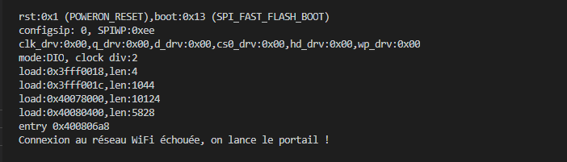
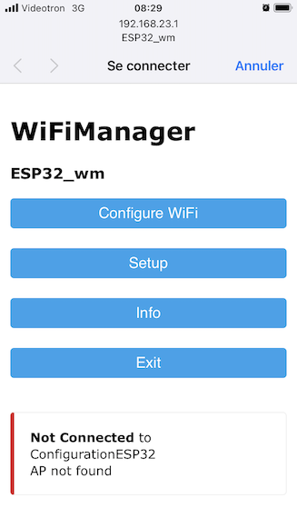
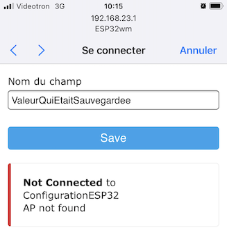
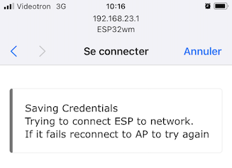
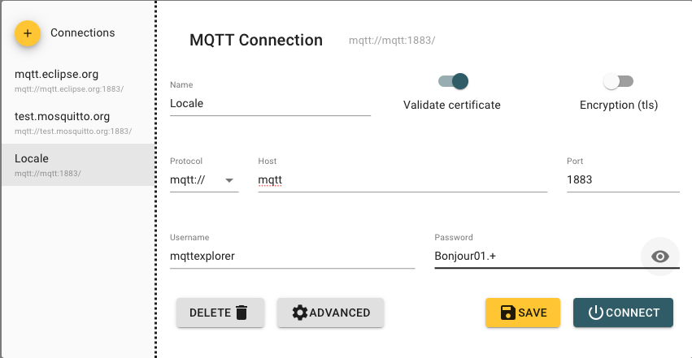
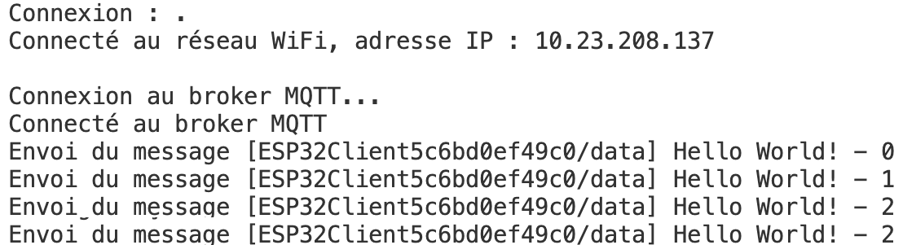
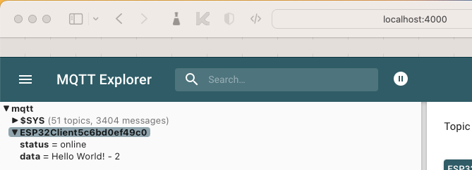
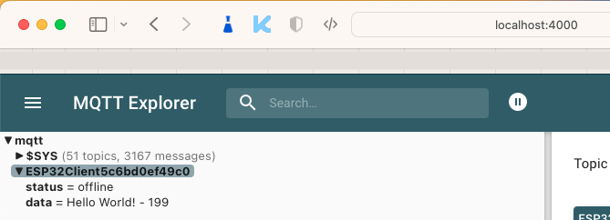
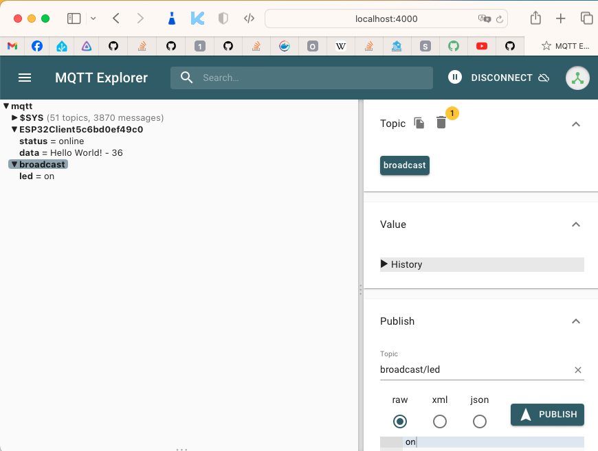
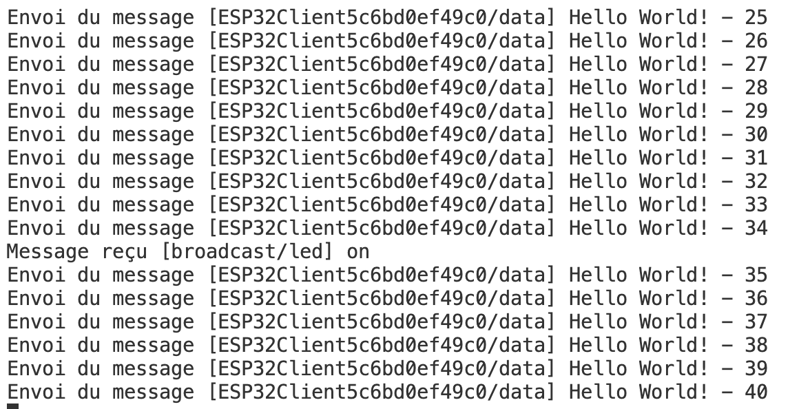

# Module 13 - ESP32 - WiFiManager - MQTT

## Ce qui sera vu

- Configurer et mémoriser un profil Wi-Fi avec la bibliothèque WiFiManager.
- Déclencher le portail de configuration lorsqu'aucun profil valide n'est disponible.
- Réinitialiser le profil depuis le programme et, en extension, avec un bouton.
- Démarrer ou utiliser un broker MQTT dans un environnement Docker déjà connu.
- Publier une mesure de capteur et recevoir des paramètres par MQTT.
- Intégrer la configuration MQTT au portail WiFiManager.

## Prérequis

- Avoir terminé les modules 10 à 12 et savoir connecter l'ESP32, servir une page et diagnostiquer son adresse IP.
- Maîtriser les bases des réseaux, du Web et de Docker acquises dans les cours précédents.
- Connaître le principe publish/subscribe et le vocabulaire broker, client et topic, ou consulter le rappel fourni.
- Savoir installer une bibliothèque PlatformIO et lire un capteur avec l'ESP32.
- Disposer d'un broker préparé ou du script Docker validé par l'enseignant.

Le parcours de configuration WiFiManager suit les étapes suivantes :

1. Constater l'échec de la connexion lorsque l'ESP32 ne possède encore aucun profil.
2. Démarrer un portail de configuration présentant les réseaux Wi-Fi disponibles.
3. Choisir un réseau et s'y authentifier.
4. Sauvegarder le profil pour les prochaines connexions.

## Exercice 1 - Configurez un objet de type ```WiFiManager``` pour la première fois

### Étape 1 - Installer la bibliothèque WiFiManager

- Utilisez les diapositives pour importer WiFiManager. Ne passez pas par la fenêtre d'ajout de bibliothèque de PIO : ajoutez l'adresse du dépôt Git dans `platformio.ini`.
- Dans votre fichier ```main.cpp```, créez un objet de type ```WiFiManager```
- Compilez votre programme pour valider que la bibliothèque est bien installée
- Codez la configuration de votre objet dans la fonction ```setup``` comme illustré dans le cours
- Codez un site web qui répond sur le port 80. Il doit répondre ```Bienvenue sur mon site Web```

### Étape 2 - Configurer un profil client avec  WiFiManager

- Au premier démarrage, la connexion est en échec. C'est normal, parce qu'aucun profil n'a été détecté par l'application



- Dans la liste des réseaux visibles sur votre téléphone, recherchez celui créé par votre application, par exemple `ESP32_wm`.
- Un portail s'ouvre automatiquement
- Si le portail ne s'ouvre pas lors de la connexion au réseau Wi-Fi de l'ESP32, entrez l'adresse IP configurée, par exemple `192.168.23.1`.
- L'option **Configuration WiFi** permet de choisir le profil d'un réseau particulier.



- Sur la liste, choisissez un réseau Wi-Fi pour connecter votre ESP32 (exemple : "CLOCHE_123")
- Entrez les informations de mot de passe
- Sauvegardez le profil





- Sur la console de votre ESP32, notez l'adresse IP (normalement générée par DHCP)
- Assurez-vous que votre téléphone peut rejoindre le réseau Wi-Fi choisi, par exemple `CLOCHE_123`.
- Ouvrez un navigateur web pour vous connecter à l'adresse IP du serveur Web
- Le message  ```Bienvenue sur mon site Web``` devrait apparaître en format texte non formatté.

## Exercice 2 -  Remise à zéro du profil dans WiFiManager

La méthode wm.erase() efface le profil enregistré. Cette méthode permet de changer de réseau à chaque démarrage du programme.

- Activez l'instruction ```wm.erase()```
- Activez l'instruction ```wm.setDebugOutput(true);``` de votre déboggeur d'application

***Cette façon de faire doit être supprimée À LA FIN DES TESTS***

- Compilez et exécutez le programme
- Le message d'invitation au portail revient


- Reprenez l'étape 2 pour un tester un nouveau profil
- NE PAS OUBLIER : placez l'instruction ```wm.erase()``` en commentaires
- NE PAS OUBLIER : placez l'instruction ```wm.setDebugOutput(true);``` en commentaires

## Exercice 3 -  Bouton de remise à zéro (optionnel)

Vous venez de démontrer comment réinitialiser le profil du serveur Web hébergé sur votre ESP32.

Il faut reconnaître que cette façon de faire est peu pratique, car elle exige une recompilation successive.

La façon conventionnelle de faire cette opération consiste à appuyer sur un bouton-poussoir pour remettre à zéro le profil.

- Reliez un bouton poussoir de votre plaquette d'expérimentation sur la borne GPIO 25 de votre Esp32. Ajoutez un fil de retour à la terre (GND)
- Ajoutez le code de programmation du bouton-poussoir (module précédent) qui appellera l'instruction ```wm.erase()``` et l'instruction ```ESP.reset()```lorsque vous appuyez sur le bouton
- Ajoutez un message à la console pour aviser de cette action
- Compilez et exécutez le programme
- Appuyez sur le bouton-poussoir
- Appuyez sur le bouton "reset" pour amorcer le programme depuis le début

Le programme devrait passer en mode équivalente à l'étape 2

## Exercice 4 -  MQTT

### Exercice 4.1 - Mise en place

- Créez votre serveur MQTT à partir de docker-compose :
  - Placez vous dans le répertoire ```AMOC_Module13_MQTT_PrepCours/docker-compose-mosquitto```
  - ```docker-compose up -d```
  - Vous devriez voir deux conteneurs avec la commande ```docker ps```
- Naviguez sur le site http://localhost:4000 pour valider que le serveur est bien en fonction
- Créez une connexion vers votre serveur MQTT dans MQTT Explorer
  - Name : Locale
  - Host : mqtt
  - Nom d'utilisateur : mqttexplorer
  - Mot de passe : Bonjour01.+
  - Cliquez sur "Save" et sur "Connect"



- Reprenez le code AMOC_Module13_MQTT_PrepCours
- Modifiez l'adresse IP du serveur MQTT pour qu'elle corresponde à votre serveur MQTT (ipconfig / ifconfig)
- Envoyez votre code sur l'ESP32
- Vérifiez que l'ESP32 se connecte bien au réseau Wi-Fi et au serveur MQTT.
- Si tout se passe bien, votre moniteur série devrait ressembler à ceci :



- Validez que la connexion est bien établie dans MQTT Explorer et que vous recevez bien les messages :



- Si vous déconnectez votre ESP32, vous devriez voir son état passer à `offline`.



- Utilisez MQTT explorer pour publier un message dans le sujet "broadcast/led" avec le payload RAW "on" pour allumer la DEL de votre ESP32. Testez aussi avec la valeur "off"



- Dans le moniteur série, vous devriez aussi voir les messages reçus par l'ESP32.



- Une fois les expériences effectuées, analysez le code de l'ESP32 pour comprendre comment tout cela fonctionne

### Exercice 4.2 - Diffusion de la température

- Connectez le BME280 sur les broches I2C de votre ESP32
- Publiez sur le sujet `ESP32{id}/temperature` un message contenant la température de la pièce.
- Validez que l'information est reçue sur le serveur MQTT
- Permettez à l'utilisateur de définir une température maximale avec le sujet `ESP32{id}/temperature/max`. Si la température dépasse cette valeur, la DEL interne s'allume; sinon, elle s'éteint.

### Exercice 4.3 - Intégration avec WiFiManager

- Modifiez votre code afin que la connexion Wi-Fi et les paramètres MQTT soient configurés par WiFiManager. Les valeurs doivent être sauvegardées dans un fichier JSON lu au démarrage de l'ESP32 :
  - Adresse IP du serveur MQTT
  - Nom d'utilisateur
  - Mot de passe
  - Sujet de publication
  - Sujet de réception
  - Température maximale de départ
