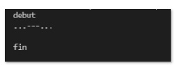
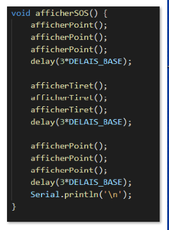
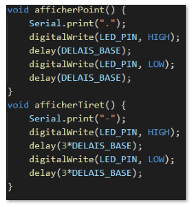
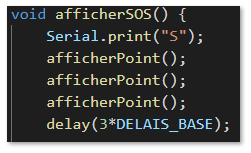
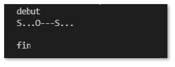
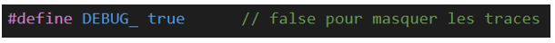
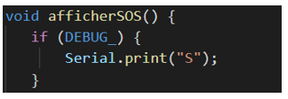
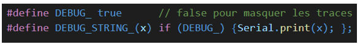
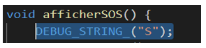

# Partie 1 - Utiliser des macros pour tracer un programme

## Objectifs

- Installer des macros de débogage
- Afficher ou masquer les traces durant les tests
- Supprimer les traces à la fin du débogage

### Étape 1 - Utilisation d'un exemple de programme

Ce tutoriel est basé sur la technique de `"print debugging"` pour aider à tester des programmes. Cette méthode consiste à envoyer des messages à la console à partir de certains endroits choisis dans le code source. Des macros utilisent l'instruction Serial.print() à cet effet.

    
Qu'est-ce qu'une macro en C ?

Voir https://www.programiz.com/c-programming/c-preprocessor-macros

Pour démontrer l'usage du débogueur, le répertoire du tutoriel possède deux applications: exemple1 et exemple2.

L'exemple1 simule les signaux **SOS** du code Morse. La lettre **S** est composée de trois signaux `courts`, nommés `points`. La lettre **O** est composée de trois signaux `longs`, nommés `tirets`. Deux signaux successifs sont séparés par un `silence`. Un silence a une durée de signal `long`. Voyons comment utiliser des macros pour tester ce programme.

Pour tester le programme, deux méthodes sont utilisées : la DEL numéro 13 installée sur le microcontrôleur Arduino et la sortie à la console.

Pour produire cette séquence, le code est :

 

### Étape 2 : Afficher ou masquer les traces pendant le débogage

Pour déboguer le programme, des instructions `Serial.print(<texte>)` sont ajoutées en des points d'intérêt pour tracer le programme à certains endroits.

 

C'est bien? Pas si mal, MAIS, un des objectifs du débogueur est de pouvoir afficher ou masquer facilement les traces durant la période de tests.

La macro  `DEBUG_` est conçue à cet effet.

L'image qui suit implante cette stratégie.

### Étape 3 - Supprimer les traces à la fin du débogage

BIEN! Est-ce suffisant?

NON! Le deuxième objectif n'est pas atteint: faciliter la suppression de toutes les traces, ET UNIQUEMENT LES TRACES.

Pour simplifier ce processus, nous allons introduire la macro dynamique `DEBUG_STRING_(x)`.

    
Qu'est-ce qu'une macro dynamique ?

Une macro dynamique est aussi appelée "pseudo-fonction".
C'est une macro déclarée avec un ou des paramètres spécifiés entre parenthèses. Le précompilateur substitut les paramètres par le texte codé par le programmeur dans le code source.

Avec la macro `DEBUG_STRING_(x)`, le programmeur n'inscrit qu'une ligne de code par macro. Le jeton "x" de la déclaration sera remplacé par le texte contenu dans la macro codée dans le programme. Ce remplacement de texte est effectué par le précompilateur.

A gauche, texte original, à droite, texte généré par le préprocesseur

 

### Supprimer les traces du débogueur

Cette étape est très importante. Les traces doivent être supprimées avant la mise en service du programme. Les traces demandent du temps de traitement indésiré.

Il faut procéder en deux étapes.

- Rechercher et supprimer toutes les macros débutant par `DEBUG_` dans le code source.
- Supprimer les deux directives `DEBUG_` inscrites dans l'entête du programme.

Le programme peut maintenant être compilé et migré dans un environnement d'exploitation.

[< Précédent (Menu)](./README.md) | [Suivant (Partie 2) >](./debug_partie2.md)
