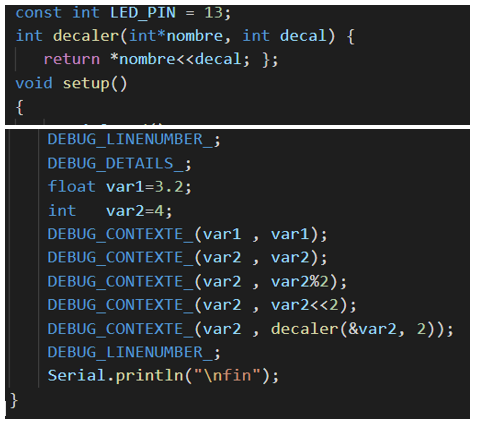
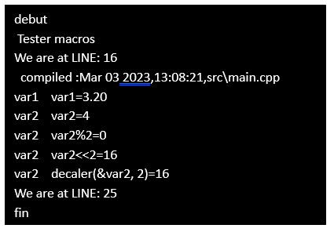
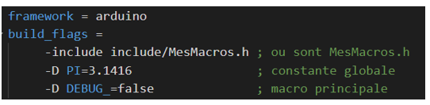

# Partie 2. déboguer des variables et des fonctions

## Objectifs

- Utiliser un fichier d'entête dans le débogage de programmes
- Afficher la valeur de variables, d'expressions ou de fonctions

L'application `Exemple2` servira à démontrer certaines possibilités des macros pour déboguer des programmes.

### Étape 1 - Utiliser le fichier d'entête pour déboguer les programmes

L'application `Exemple2` contient le fichier d'entête `MesMacros.h`. Il regroupe les macros nécessaires au débogage. En regroupant toutes les macros dans un même fichier, son utilisation peut être généralisée dans d'autres applications.

Avec PlatformIO, le fichier d'entête doit être installé dans le répertoire `include` de l'application, au même niveau hiérarchique que le répertoire `src`.

Pour utiliser des macros, le fichier d'entête est déclaré dans le fichier source avec la directive `#include`.

### Étape 2 - Utilisation de certaines macros

La figure suivante illustre l'usage de différentes macros pour déboguer un programme.



La sortie de l'application de l'exemple 2 est :



### Usage des macros

- `DEBUG_LINEMUMBER_`

Cette macro, placée à un endroit précis du code source, affiche le numéro de ligne à chaque passage de l'exécution du programme.

- `DEBUG_STRING_(<une valeur>)`

Le jeton `<une valeur>` peut correspondre à n'importe quelle valeur acceptée par la méthode `Serial.print()` (ou `println()`).

- `DEBUG_CONTEXTE_(<Texte>, <Expression>)`

Cette macro dynamique exige deux paramtères :

1. Texte libre : toute chaîne de caractères servant de documentation
2. Variable ou expression : affiche la valeur d'une variable, d'une expression valide ou le résultat d'une fonction.

### En savoir plus sur les macros

<details>
    <summary>Règles syntaxiques</summary>

Pour présenter le code d'une macro sur plusieurs lignes, il faut marquer la fin de chaque ligne par le caractère ```\```.

Le code d'une macro peut comprendre :

- une autre macro
- instructions du langage
- une structure conditionnelle telle que  *#if ... #else ... #endif*
- un ou plusieurs "jetons" servant d'arguments à une macro dynamique

Dans ce tutoriel, les macros débutent toutes par le préfixe `DEBUG_` et se terminent toutes par le caractère de soulignement. Cette convention facilite le repérage et la suppression des macros lorsque le débogage est terminé.

</details>

### Étape 3 - Déboguer avec PlatformIO

Il peut arriver qu'une macro soit utilisée dans de nombreux fichiers d'une même application. La directive `#include MesMacros.h` devra alors se retrouver dans plusieurs entêtes de fichiers.

Si c'est le cas, PlatformIO offre une solution élégante qui évite cette répétition. C'est l'option `-include` de la directive `build_flags` dans le fichier `Platformio.ini`. Elle s'utilise comme ceci :



La directive `build_flags` évite la transcription répétée de la directive #include dans les fichiers.

[< Précédent (Partie 1)](./debug_partie1.md) | [Suivant (Partie 3) >](./debug_partie3.md)

### Références et définitions

- `build_flag` : https://docs.platformio.org/en/latest/projectconf/sections/env/options/build/build_flags.html#build-flags
- Expression : http://carl.seleborg.free.fr/cpp/cours/chap1/expressions.html
- Macros standard : https://stackoverflow.com/questions/597078/file-line-and-function-usage-in-c
- Macro : https://forum.arduino.cc/t/collection-of-basic-functionilities-how-do-i/1016498
