# Introduction

Dans ce tutoriel, nous verrons comment le protocole I2C est structuré pour permettre l'échange de données entre deux périphériques de la microinformatique. Nous verrons quelques propriétés du protocole. Nous illustrerons le format d'une trame I2C qui permet la connexion et l'échange de données.

Nous utiliseront un exemple avec le microcontrôleur Arduino qui sera branché à un écran à cristaux liquides, nommé LCD. L'écran LCD permet d'afficher du texte ou des animations sur l'écran.

<details>
    <summary>Afficheur LCD</summary>

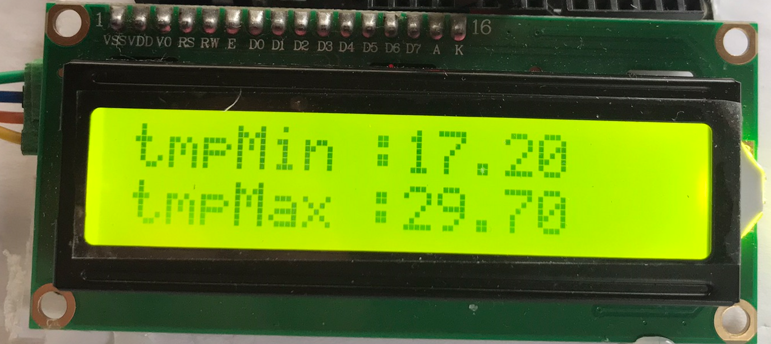

</details>

Le terme ```émetteur``` est attribué au microcontrôleur lorsqu'il envoie un message. L'écran LCD est désigné ```récepteur``` du message.

<details>
    <summary>Périphériques I2C</summary>


</details>

Les diverses étapes expliquées sont:

- Pourquoi le protocole I2C?
- Qu'est-ce qu'un protocole à communication série?
- Qu'est-ce qu'un protocole à mode synchrone?
- Qu'est-ce qu'un protocole à direction semi-duplex?
- Comment sont orchestrés ces échanges?
- Comment une trame I2C est formée?
- Présentation de deux exemples avec Arduino

## Pourquoi le protocole I2C?

Plusieurs technologies permettent l'échange de données dans les systèmes embarqués, avec des avantages et des inconvénients selon la technologie utilisée. Il est possible de choisir entre UART, I2C, SPI, TWI et de nombreux autres. Le modèle d'écran LCD "1602" est un exemple de périphériques programmé sur un microcontrôleur à partir du protocole I2C. Les principales caractéristiques du protocole I2C sont:

- Liaison par deux fils
- Communications sur de courtes distances
- Message court, quelques caractères
- Échange bilatéral de type semi-duplex
- Topologie un-à-un (peer-to-peer)

Le protocole I2C signifie ```Inter-Integrated Circuit­­­```. Il est souvent appelé I-I-C ou I-DEUX-C. Les adeptes du microcontrôleur Arduino rencontrent rapidement ce terme dans leurs montages. Brancher et programmer un afficheur à cristaux liquides est une première expérience facile et amusante. On peut animer du texte, des icônes ou même des animations en quelques secondes.

## Comment cela fonctionne-t-il?

Un message est une suite de caractères qui circulent sur un fil entre le microcontrôleur et un périphérique. Chaque caractère est lui-même reconnu comme un ensemble de ```0``` et de ```1``` en nombre de 8, appelé octet. Dans le jeu de caractère ASCII, la lettre ```M``` équivaut au code binaire ASCII ```0b0100 1101```.

<details>
    <summary>Lettre "M"</summary>

code ASCII du caractère "M" 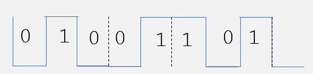

</details>

## Le protocole I2C est un protocole à communication série

Dans un mode de communication en série, les bits de données circulent les uns à la suite des autres sur **un seul lien** entre les périphériques.

Par opposition, le mode de communication en parallèle, les 8 bits circulent simultanément sur 8 liens parallèles. Ce mode nécessite donc une installation plus élaborée.

Avec une communication série, les 8 bits d'un octet sont séparés par l'émetteur, envoyés en série sur un fil et reconstruits par le récepteur. Le circuit électronique qui fait ce travail s'appelle ```registre à décalage```. Il est décrit dans un autre tutoriel.

Le protocole I2C utilise le fil identifié ```SDA­­­``` (serial data line) pour transporter les bits de données. Un bit de valeur ```1``` est codé par une onde carrée de 5V. Un bit de valeur ```0``` équivaut à une tension nulle, d'où les expressions "HAUT" et "BAS" employées souvent.

<details>
    <summary>Bus I2C </summary>

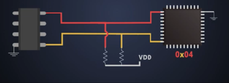

Cet agencement s'appelle bus de communication I2C.

Un fil de mise à la terre (GND) est nécessaire.

</details>

## Le protocole I2C est un protocole à communication synchrone

Dans les protocoles à communication synchrone, les signaux de données circulent à une cadence déterminée par une onde carrée qui est émise par un deuxième fil, identifié ```SCL``` (Serial Clock line). C'est l'horloge de transfert. À chaque coup d'horloge, l'émetteur envoie un bit de l'octet sur le fil ```SDA```.

<details>
    <summary>Synchronisation</summary>

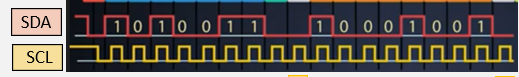

</details>

Le récepteur intercepte les 8 signaux, les compte et les regroupe pour en former un octet. Cette méthode a donc l'avantage de synchroniser l'émetteur et le récepteur dans un décompte des signaux.

Le microcontrôleur est responsable d'alimenter ce fil avec cette onde à une fréquence constante. Dans le cas d'Arduino, cette fréquence est de 10KHz.

<details>
    <summary>Horloge I2C</summary>

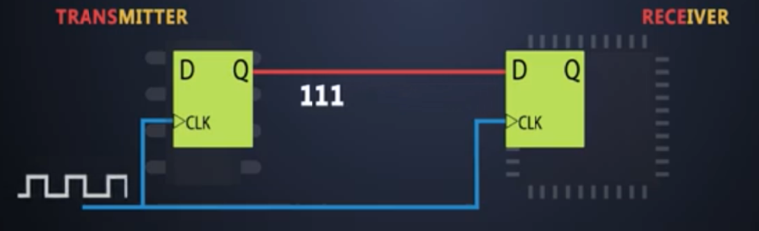

</details>

## Le protocole I2C est un protocole à direction semi-duplex

Le bus I2C ne possède qu'un seul fil de données. Par conséquent, un seul équipement peut envoyer des signaux pendant un certain temps.

### Comment sont orchestrés ces échanges?

Le protocole I2C permet de brancher plusieurs récepteurs sur un même bus. Par contre, le mode semi-duplex exige un échange unidirectionnel durant une période de temps donnée. Le protocole prévoit un mécanisme pour assurer la coordination et éviter les collisions de signaux entre périphériques.

Ce mécanisme est expliqué un peu plus loin.

<details>
    <summary>Périphériques I2C</summary>

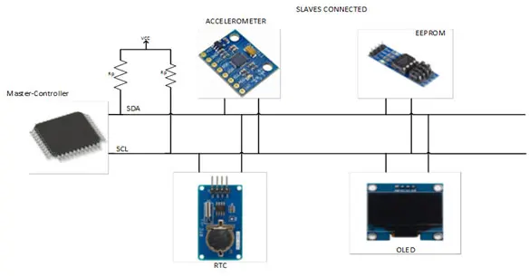

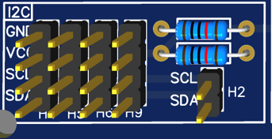


</details>

Chaque périphérique est identifié par une adresse unique. Cette adresse est codée sur 7 bits (une version étendue est possible sur 10 bits). Le LCD "1602" est reconnue à l'adresse ```0X27``` , le senseur de température "BME280" est reconnu à l'adresse ```0X76```. C'est l'industrie de l'électronique qui attribue ces valeurs.

(1) une référence est donnée à la fin.

Pour afficher la température sur un écran LCD, il faut deux échanges. Dans un premier temps, le microcontrôleur agit comme récepteur venant du BME280. Dans un deuxième temps, le microcontrôleur agit comme émetteur pour envoyer un message correspondant de cette température au LCD.

## Trame I2C en détails

Voici le format simplifié d'une trame I2C sur le bus.

<details>
    <summary>Trame I2C</summary>

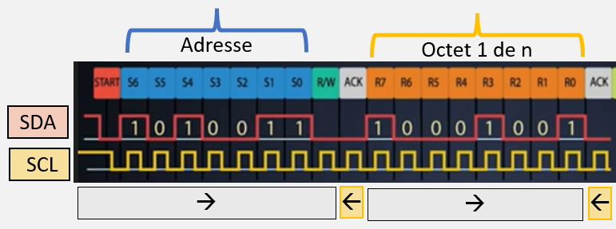

</details>

On note que des bits supplémentaires sont nécessaires. Ceux-ci assurent l'identification, la synchronisation et la direction des signaux.

Une trame I2C est composée des éléments suivants :

- Signal de départ
- Adresse I2C du périphérique destinataire
- Signal de partage du bus R/W
- Accusé de réception ACK venant du destinataire
- Un ou plusieurs octets du message
- Signal de fin de transmission

Voyons le rôle de chaque partie.

### Signal de départ

<details>
    <summary>Signal de départ "START BIT" </summary>

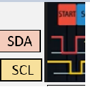

</details>

Pendant les périodes de silence, le fil ```SDA``` émet un signal constant "HAUT". Pour débuter un transfert, le signal passe à l'état "BAS". Ceci démarre les signaux de l'horloge et alerte les récepteurs de compter les bits à venir.

- Adresse I2C du périphérique destinataire
- Signal de partage du bus

<details>
    <summary>AdresseI2C</summary>

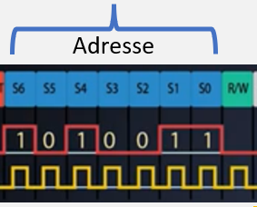

</details>

Suivront 7 bits correspondant à l'adresse du récepteur destinataire du message. L'émetteur envoie ensuite un "bit de direction" (W/R) pour indiquer que le bus est occupé par lui. Un signal de niveau "BAS" représente cet état.

### Accusé de réception ACK/NOACK

<details>
    <summary>Accusé de réception</summary>

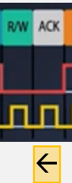

La direction indique un signal envoyé par le périphérique.

</details>

Le périphérique qui découvre que cette adresse est la sienne, émet un accusé de réception par un signal "BAS". L'émetteur peut alors poursuivre l'envoie du message, sans quoi la communication est terminée.

### Octet, un ou multiples, du message

L'émetteur envoie ensuite le premier octet du message et attend un deuxième accusé de réception avant de poursuivre. Et ainsi de suite pour tous les autres octets du message.

### Signal de fin de transmission

<details>
    <summary>Signal de fin de transmission </summary>

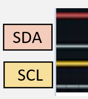

</details>

Pour signaler la fin du message, l'émetteur émet un signal de niveau "HAUT" continu sur le fil SDA jusqu'au prochain message à émettre.

### Résumé

L'image est une capture d'une trame à l'aide d'un analyseur de trames qui suit et enregistre les bits circulant sur le bus.

<details>
    <summary>Capture d'une trame I2C à l'aide d'un analyseur de trames</summary>

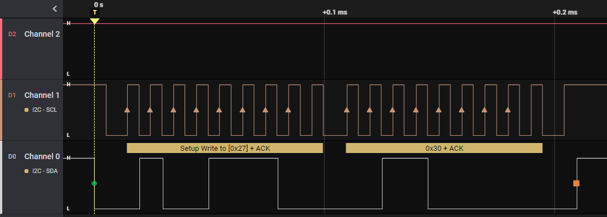

</details>

## Questions bilan

- Pouvez-vous repérer les six parties de la trame?
- Pouvez-vous mesurer la fréquence de transfert?

## Montages expérimentaux

Deux montages sont proposés.

Le premier montage utilise un écran à cristaux liquides pour afficher du texte à l'écran.

https://create.arduino.cc/projecthub/arduino_uno_guy/i2c-liquid-crystal-displays-5b806c

<details>
    <summary>Installation dans PlatformIO</summary>

La configuration suivante doit être ajoutée dans le fichier platformio.ini

```ini
lib_deps =
    marcoschwartz/LiquidCrystal_I2C@^1.1.4
```

</details>

Le deuxième montage illustre plusieurs formes pouvant être affichées.

https://github.com/fdebrabander/Arduino-LiquidCrystal-I2C-library

## Ressources du tutoriel

- https://www.engineersgarage.com/understanding-the-i2c-protocol/

- https://www.circuitbasics.com/basics-of-the-i2c-communication-protocol/

## Informations générales

- https://fr.wikipedia.org/wiki/I2C
- Understanding the I2C Bus - Texas Instruments

## Adresses I2C officielles

- https://learn.adafruit.com/i2c-addresses
