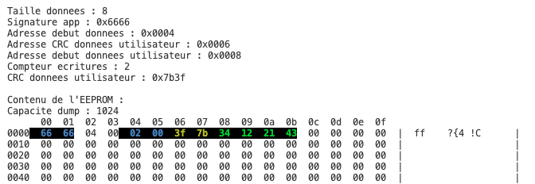

# En bref

## Dans ce dossier

### Débogage

Quelques exemples de code pour déboguer votre code en C++ sans outil supplémentaires (old school). Vous avez un exemple de classe utilitaire de journalisation dans le projet [Utilitaires de développement et démos](https://github.com/PiFou86/420-W48-SF-Utilitaires-Demo).

Un début de tutoriel est disponible dans le projet [Debogage](Debogage/README.md).

### EEPROM

Code exemple de test et utilisation de la mémoire EEPROM avec CRC et déplacement dans la mémoire pour économiser les cycles d'écriture.



Données :

- 0x000000 - 0x000001 = 0x0666 : signature de l'application
- 0x000002 - 0x000003 = 0x0004 : valeur de l'adresse du début des données. Cette valeur est mobile si on dépasse un certain nombre d'écritures
- 0x000004 - 0x000005 = 0x0002 : nombre d'écriture supposée qui est différent de réel car on utilise put et non write
- 0x000006 - 0x000007 = 0xACAA : CRC des données qui suivent
- 0x000008 - 0x00100B = 0x1234, 0x4321, "Chocolatine !" : valeur de la structure à sauvegarder. Notez que c'est un tableau de caractères de capacité fixe et non un String ni un char*

[Lien de simulation WokWi](https://wokwi.com/projects/384484359495267329).

### I2C_Explique

Explication plus avancée et détaillée de l'interface I2C.

### Test4Digits_TM16837

Code exemple de test et utilisation de l'afficheur 4 chiffres TM16837.

### TestBME280

Code exemple de test et utilisation du capteur BME280/BMP280 : attention de bien choisir les morceaux de codes actifs suivant le type de capteur (BMP vs BME).

### TestLCD

Code exemple de test et utilisation de l'afficheur LCD 16x2.

### TestOLED

Code exemple de test et utilisation de l'afficheur OLED 128x64. Ce composant n'est pas dans votre kit de démarrage.

### Autres codes exemples dans des dépôts externes

- [Utilitaires de développement et démos](https://github.com/PiFou86/420-W48-SF-Utilitaires-Demo) : projet contenant des exemples de codes faire du débogage. Au menu, classes de journalisation, console sur le port série pour réaliser des affichages sur ce qui est connecté, la configuration réseau etc.
- [Pool monitoring](https://github.com/PiFou86/pool-monitoring/) : projet personne de monitoring de piscine avec ESP32 et capteurs BME280, DS18B20, etc.

## ESP32

Voici un schéma des broches de l'ESP32 :


(Adapté de : https://randomnerdtutorials.com/esp32-pinout-reference-gpios/  à la plaquette utilisée en cours)

## Problèmes communs

### Compilation

#### Résolution de dépendances

Il est possible que Pio ne trouve pas toutes dépendances des bibliothèques. Pour forcer une recherche approfondie, vous pouvez utiliser le paramètre ```lib_ldf_mode``` avec la valeur ```deep+``` décrit dans la documentation : [lib-ldf-mode](https://docs.platformio.org/en/stable/projectconf/section_env_library.html#lib-ldf-mode).

### Réseau

#### Affichage de la configuration actuelle

N'hésitez pas à afficher votre configuration réseau dans la console afin de valider que vous avez bien les bonnes informations.

Si vous voulez allez plus vite, vous pouvez inclure le code de [Utilitaires de développement et démos](https://github.com/PiFou86/420-W48-SF-Utilitaires-Demo).

### Système de fichiers

SPIFFS a modifié sa façon de transiger avec les répertoires À VALIDER. Une solution est de retourner sur l'ancienne version du module ESP32 (attention que d'autres versions plus récentes ne soient pas installées).

Par exemple, pour forcer la version de la plateforme pour l'ESP32 à la version 3.5 vous pouvez ajouter le texte suivant dans votre fichier platformio.ini :

```ini
[env]
platform = espressif32@~3.5.0
```

Source : https://docs.platformio.org/en/latest/projectconf/section_env_platform.html 

### Consommation d'énergie

L'autonomie énergétique est importante pour les clients. Elle répond aux questions suivantes :

- Durée de charge de la pile :
Pour y arriver, il faut déterminer la consommation moyenne de votre Station Météo, (puisance (courant, tension)) par unité de temps versus la puissance disponible de la pile à pleine capacité). ceci détermine le temps d'autonomie entre 2 chargements

- Méthodes de recharge

**à chercher**

- autres sources de courant : panneaux solaires, éoliennes, etc

### Home assistant

Home assistant est un logiciel open source qui permet de contrôler des objets connectés (envois de commandes, réception de données).

**Si vous ne respectez pas les consignes de votre formateur, vous risquez de ne pas avoir accès à l'ensemble des fonctionnalités de Home Assistant, et vous ne serez pas soutenu dans vos demandes !**

#### Installation

Il est possible de l'installer sur docker, sur un Raspberry Pi ou un autre ordinateur. Il est donc possible de l'installer dans une machine virtuelle accessible sur le réseau.

Dans le cours, nous utilisons une image préconfigurée pour une machine virtuelle. C'est la solution la plus simple pour avoir un environnement de test. **Ne pas installer la version docker pour ce cours** : vous n'aurez pas accès aux add-ons, dont "Mosquitto MQTT".

Vous pouvez utiliser VirtualBox, VMWare, Hyper-V ou un autre logiciel de virtualisation pour l'installer. La configuration réseau doit être faite pour que la machine virtuelle soit accessible sur le réseau local. Le plus simple est de configurer un pont réseau. [La documentation de Home Assistant explique le processus](https://www.home-assistant.io/installation/windows). (Environ 10 minutes)

#### Pont WiFi - Ne pas faire !

Certains couples "Point d'accès" et "Carte réseau WiFi" fonctionnent mal ensemble et ne permettent pas de créer un bridge fonctionnel dans votre outil de virtualisation favori. Il est conseillé (**et obligatoire dans le cours**) d'utiliser un pont sur une interface physique.

Références : 

- https://forums.virtualbox.org/viewtopic.php?t=98133)
- https://www.home-assistant.io/installation/windows : Voir avertissement (Warning)

**Si votre ordinateur ne possède PAS de carte réseau filée Ethernet, consultez votre formateur !**

**En résumer, ne pas utiliser de pont WiFi pour la machine virtuelle, utilisez une vraie carte réseau !**

#### Intégration à MQTT

Home assistant peut être intégré à un serveur MQTT. MQTT est un protocole de messagerie qui permet de transmettre des messages entre des objets connectés.

Madame Michou (personna fictif qui a peu de connaissance en informatique) aimerait que son objet connecté soit facilement intégré à Home Assistant. Pour l'aider, on va utiliser le principe de découverte automatique. Cela permet de configurer automatiquement les objets connectés dans Home Assistant ou tout autre logiciel compatible avec MQTT ("auto-discovery").

[Un résumé des étapes pour intégrer un objet connecté à Home Assistant avec du code pour l'ESP32 est disponible ici](IntegrationMQTT/README.md).
